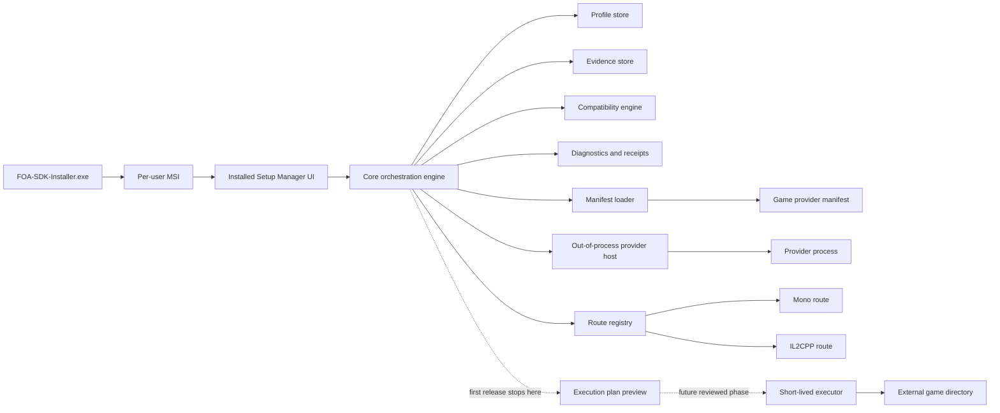
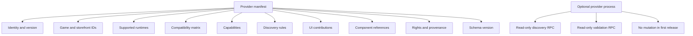
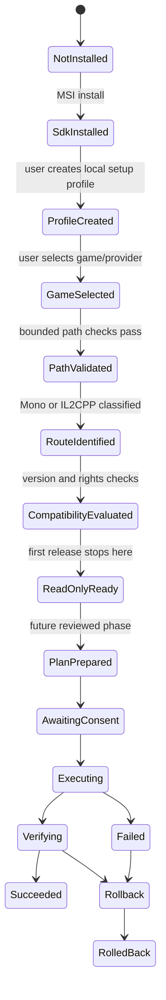
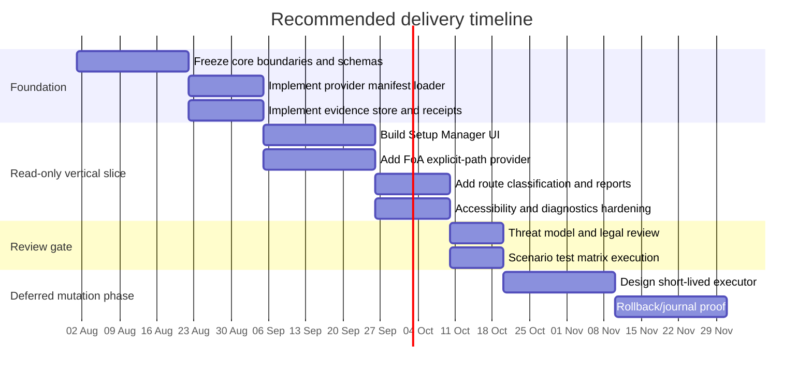

# Deep Research Report on the Multi-Game Installer and Setup Wizard Platform

## Executive summary

The strongest recommendation is to **keep the current FOA-SDK installer architecture for SDK lifecycle ownership, and add a separate installed setup manager built on a reusable core with a thin Windows UI, while keeping all game-specific logic outside the trusted core and out of the MSI**. In practical terms, that means retaining the existing Windows x64 self-contained `FOA-SDK-Installer.exe` plus per-user MSI as the sole authority for installing, repairing, upgrading, and uninstalling FOA-SDK product files, and introducing a separate **Setup Manager** for read-only game discovery, profile creation, compatibility assessment, diagnostics, and execution planning. This fits the repository’s current boundaries: the installer is already defined as MSI-driven, per-user, non-elevated, and explicitly excluded from FoA discovery, deployment, launch, save access, and silent mutation authority. citeturn22view0turn22view3turn22view5turn21view3

The recommended programme architecture is a **hybrid of manifest-first integration plus optional out-of-process providers**, with a **strict capability model**. Declarative manifests should cover identity, compatibility, UI text, supported runtimes, component rules, and discovery heuristics. When executable logic is genuinely needed, it should run **out of process** under a narrow protocol and capability envelope, not as an in-process plug-in. That recommendation follows directly from FOA-SDK’s invariants that public inputs are untrusted, runtime actions belong to adapters, safe display is not deployment authority, and plug-in declarations do not grant runtime or mutation rights. citeturn21view0turn21view1turn21view2turn19view3

For Windows packaging, the research supports **staying with MSI plus a self-contained EXE as the default distribution model for the first safe release**, and **not moving to MSIX as the primary install model yet**. MSI remains the best fit because the project already has a reviewed MSI-based lifecycle design and because the first release does not require package identity features. Burn remains a viable future bootstrapper if the product later needs a chained prerequisite story, but it should be introduced only after the core/provider model is stable. MSIX provides clean install/uninstall, automatic updates, and package identity, but those benefits come with package-identity assumptions and deployment changes that are not required for the stated first-release scope. citeturn18view1turn22view3turn8search0turn23search1turn23search2turn27view0

The FoA-specific conclusion is cautious by necessity. FOA-SDK already records **separate Mono and IL2CPP routes** for FoA `1.23.401`, with different Unity, BepInEx, and Tainted Framework versions, and the repo explicitly prohibits treating those routes as interchangeable. The Mono adapter is tied to BepInEx `5.4.23.3`; the IL2CPP adapter is tied to BepInEx `6.0.0-be.735` and local interop inputs that are fingerprinted and not redistributed. Because BepInEx’s own documentation for both Mono and IL2CPP installation requires extraction into the game root and a first game run to generate configuration files, the first safe release should stop at **validated path selection, route identification, compatibility evaluation, and a non-mutating execution plan**. Deployment, loader installation, and launch should remain out of scope until redistribution, version-compatibility, and rollback evidence are reviewed per route. citeturn24view0turn24view1turn12search0turn25view0turn25view1

## Evidence baseline and repository constraints

The current repository head observed during this research is commit `e9beb347ae02835cb851bcd79e41b1bd2c60a909` on `main`, dated 29 July 2026. At that head, FOA-SDK describes itself as an unofficial, open-source authoring and mod-development platform for *Tainted Grail: The Fall of Avalon*, using O3DE as a governed authoring host while keeping the Unity game runtime outside the editor repository. The repository also states that it is **not** an O3DE source fork, and that generated outputs belong under `foa-build/` or another reviewed output directory rather than the source tree. citeturn5view0turn18view0

The delivery boundary is unusually explicit. The repo states that `Installer/` owns the self-contained Windows installer wizard, installed launcher, packaging source, and installer tests; the wizard verifies and executes one reviewed MSI; and generated EXE/MSI files, staged payloads, logs, and release uploads remain outside the source checkout. It also states that no installer UI or plug-in declaration may silently mutate a game installation, launch FoA, modify saves, sign artefacts, or publish a release. Those constraints are not incidental; they are core project architecture. citeturn18view0turn21view0turn21view3

That matters because the current Windows installer path is already a tightly-scoped lifecycle design. The approved Windows installer workflow says one reviewed Windows x64 build produces a self-contained EXE wizard embedding the exact MSI and hash, a **per-user MSI** with standard Windows Installer behaviour, and a deterministic recovery ZIP. The same document states that the EXE does not replace MSI ownership, requests `asInvoker`, and that Windows Installer remains the sole authority for product-file mutation, repair, upgrade, and uninstall. It also states that public release, code signing, automatic update, FoA deployment, game launch, and save mutation are not approved by that design. citeturn18view1turn13view3

The current installed Tool Wizard is narrower still. The Windows launcher README says the Tool Wizard is a **local readiness step** for workspace, O3DE Editor, Unity conversion project, and local Tainted Grail install path, and is not part of the MSI lifecycle. Its saved local profile marks `conversion_execution_allowed` and `deployment_execution_allowed` as `false`, and the current validation logic checks only that a selected Tainted Grail path contains `UnityPlayer.dll`, `TaintedGrail_Data`, or `TaintedGrail.exe`, while rejecting filesystem roots and paths that traverse symbolic links, junctions, or other reparse points. That is already a useful seed for a multi-game read-only readiness model. citeturn22view1turn20view0turn20view1turn20view2

The repository also bars this research from papering over missing evidence. `Research/README.md` says research records are not runtime authority, must bind repository observations to exact paths and commit IDs, and must treat versions, licences, support status, and runtime details as version-sensitive. The protected-files policy forbids deriving authority from private FoA installs, saves, signing material, or extracted proprietary content without explicit permission, and the legal policy forbids committing game executables, DLLs, or reconstructed proprietary source. citeturn19view0turn19view1turn19view2

## Decision package

The table below answers the decision set from the brief. Where the answer is a design inference rather than a direct source fact, that is stated plainly.

| Decision | Answer | Rationale |
|---|---|---|
| Extend current installer, sit beside it, orchestrate it, or replace it? | **Sit beside it and orchestrate it.** Keep the current SDK installer path intact; add a separate installed Setup Manager. | The repo already defines the EXE+MSI path as the reviewed SDK lifecycle owner and excludes FoA deployment, launch, and mutation. Replacing that would increase change risk with no first-release necessity. citeturn22view3turn22view5turn21view4 |
| Should MSI remain sole owner of SDK product files? | **Yes.** | The approved workflow explicitly states Windows Installer remains the sole authority for product-file mutation, registration, repair, upgrade, and uninstall. That should stay true. citeturn22view3turn8search0 |
| Preferred top-level application shape | **Reusable core + thin Windows UI, delivered beside the existing installer; not a service; not a monolith.** | This is the safest way to separate lifecycle from game logic while supporting automation and future UI changes. The repo already exposes CLI-like surfaces and prohibits runtime authority from UI alone. citeturn22view1turn21view3turn21view1 |
| What belongs in the generic trusted core? | **Profiles, evidence store, compatibility engine, provider host, planning engine, diagnostics, policy, and schema migration.** | Those are cross-game concerns and align with the repo’s existing notions of versioned persistence, evidence, validation, and planning without granting runtime authority. citeturn21view1turn19view3 |
| What belongs in each game integration? | **Identity rules, discovery heuristics, compatibility matrices, route definitions, package metadata, non-mutating checks, UI fragments, and exact evidence requirements.** | The core must not embed FoA-specific paths or route assumptions if a second game is to be added safely. citeturn21view0turn24view0turn24view1 |
| What belongs in the deployment executor? | **Only state-changing writes to external targets, with journalling, rollback metadata, and explicit confirmation.** | Repo security rules require explicit confirmation, rollback planning, bounded writes, and protection against traversal and silent modification. citeturn19view3 |
| What belongs in runtime adapters? | **Game/runtime-native calls, loader coupling, cleanup, and runtime-result verification, kept strictly separate by route.** | FOA-SDK architecture already assigns runtime actions to adapters and keeps Mono/IL2CPP separate. citeturn21view1turn24view0turn24view1 |
| What belongs in launcher layer? | **Nothing in first release beyond optional “open Setup Manager” or “open installed editor”; no FoA launch authority.** | The current design explicitly excludes game launch and the first release must avoid silent launch authority. citeturn22view0turn22view5 |
| What belongs in diagnostics/support? | **Structured receipts, operation IDs, redacted logs, environment facts, provider results, and user-previewable support bundles.** | This is already consistent with repo evidence culture and security guidance on diagnostics. citeturn19view0turn19view3 |
| Declarative manifests, signed packages, compiled plug-ins, or hybrid? | **Hybrid: manifest-first, plus optional out-of-process executable provider.** | Manifest-only is too weak for some bounded detection tasks; in-process plugins violate the repo’s distrust of public inputs and raise authority risk. A hybrid permits declarative defaults and isolates executable logic. This is an inference grounded in repo invariants. citeturn21view0turn21view1turn21view2 |
| How to add a second game without FoA-specific core assumptions? | **Provider package per game, with core-level stable protocol and route taxonomy.** | Game identity, build compatibility, and runtime family should become data/protocol, not hard-coded logic. citeturn21view1turn24view0turn24view1 |
| How to represent durable identity/state? | **Strong typed IDs for game, install, storefront, route, component, profile, plan, journal, and receipt; exact paths preserved; evidence records immutable.** | The repo requires exact identity preservation and versioned persistence. citeturn21view1 |
| Windows elevation model | **No persistent service. No elevation in first release except existing MSI lifecycle. Later, if needed, use a short-lived elevated executor for a single reviewed plan only.** | The current installer is per-user and non-elevated; Windows Installer custom actions default to user privileges, and Microsoft cautions on custom action security. That favours a separate least-privilege executor instead of stretching MSI custom actions into game mutation. citeturn22view0turn22view3turn11search4turn11search14 |
| Smallest safe first release | **Read-only multi-game-ready Setup Manager:** SDK installed-state detection, explicit game selection, bounded discovery, route classification, compatibility report, component rights matrix, plan preview, diagnostics, and support bundle. | That creates genuine value without violating the “no silent mutation/launch/save access” boundary. citeturn22view1turn19view0turn21view3 |
| What must remain read-only in first release? | **All game directories, saves, loaders, runtime adapters, storefront state, interop generation, and launch behaviour.** | Required by the repository’s architecture, protected-files policy, and first-release constraints. citeturn19view1turn19view3turn22view5 |
| Exact evidence needed before FoA deployment/loader install/launch | **Authoritative redistribution and licence proof per component; route-specific compatibility proof on exact FoA versions; rollback-tested executor; user-confirmation receipt; and controlled experiment evidence.** | The Mono and IL2CPP adapters already model external execution gates and “all-false authority” until later review; research rules also require experiments to remain experiments until separately authorised. citeturn24view0turn24view1turn19view0 |

### Recommended architecture in one view

The key design point is that the **installer remains about product ownership**, while the **Setup Manager remains about evidence, planning, and controlled orchestration**. That split matches the repo’s existing Windows installer contract and avoids conflating “path detected” with “authority granted”. citeturn22view3turn21view3turn19view3

## Architecture recommendation and rejected alternatives

### Architecture options comparison

| Option | Fit with repo boundaries | Benefits | Main problems | Recommendation |
|---|---|---|---|---|
| Expand current WinForms installer into monolith | Low | Reuses existing shell and distribution path. citeturn22view2 | Blurs MSI lifecycle with game logic, increases authority risk, and makes future multi-game boundaries harder to enforce. citeturn22view3turn21view3 | Reject |
| Separate Setup Manager beside existing installer | High | Preserves reviewed lifecycle path; clean conceptual split between install and setup; lowest migration risk. citeturn22view0turn22view3 | Requires a second installed UX surface and handoff path. | **Accept** |
| Burn bootstrapper replaces current EXE front door now | Medium | Burn is explicitly designed to chain MSI/EXE/MSP/MSU packages and provide bootstrapper UX. citeturn27view0 | Current repo pins a CPack/WiX MSI pipeline, not a reviewed Burn pipeline; introducing Burn now is an unnecessary packaging rewrite before core/provider contracts stabilise. citeturn22view3turn22view5 | Defer |
| Core CLI plus thin GUI | High | Good for automation, testing, process isolation, and future UI changes. | Slightly more initial architecture work. | **Accept as internal structure of the Setup Manager** |
| In-process plug-in architecture for game providers | Low | Simpler call path. | Contradicts repo distrust of public inputs and raises blast radius of provider bugs. citeturn21view1turn21view2turn19view3 | Reject |
| Manifest-only provider model | Medium | Smallest attack surface. | Too rigid for route-specific detection and compatibility logic. | Reject as complete answer; keep as the default layer |
| Out-of-process provider only, no manifests | Medium | Strong isolation. | Too much executable surface; harder to inspect, diff, and govern. | Reject |
| Hybrid manifest + out-of-process provider | High | Best balance of auditability, extensibility, and containment. | Requires protocol and capability governance. | **Accept** |

### Packaging technologies comparison

| Technology | What the source material says | Relevance here | Recommendation |
|---|---|---|---|
| MSI + embedded self-contained EXE | Windows Installer is the supported MSI service model; FOA-SDK already uses a self-contained WinForms EXE that verifies and invokes a per-user MSI. citeturn8search0turn22view2turn22view3 | Directly matches the current reviewed repo design. | **Primary delivery model** |
| WiX Burn bundle | Burn’s `Bundle` chains packages and provides bootstrapper UX; it supports MSI, EXE, MSP, and MSU packages. citeturn27view0 | Good future fit if FOA-SDK needs to orchestrate multiple reviewed components. | **Future option, not first move** |
| MSIX | Microsoft describes MSIX as the modern Windows package format with clean install/uninstall, automatic updates, and package identity. citeturn23search1turn23search2 | Useful when package identity or Store/enterprise deployment matters, but the first safe slice does not need those capabilities. | Reject for primary first-release packaging |
| Packaging with external location | Microsoft treats this as a way to grant package identity to existing apps while keeping an external install location. citeturn23search10turn23search14 | Potentially useful later if FOA-SDK needs specific Windows APIs that require identity. | Future niche option |
| ClickOnce | Microsoft positions ClickOnce as a deployment path for .NET desktop applications. citeturn8search8 | Not a strong fit for a multi-component, evidence-driven setup platform with MSI ownership and future external-component orchestration. | Reject |

### Why not make MSIX the answer

MSIX is attractive on paper because it promises clean installs, automatic updates, and package identity. But FOA-SDK’s first release explicitly does **not** need background tasks, Store distribution, live tiles, or other identity-dependent Windows features. Microsoft’s own packaging guidance says packaging choice is first driven by whether package identity is needed; where it is not, installer experience and deployment model become the deciding factors. For this project, the existing MSI/EXE model already satisfies the product’s immediate boundary: install the SDK cleanly, keep non-product artefacts external, and avoid silently taking authority over game files. citeturn23search0turn23search1turn23search2turn22view3turn22view4

### Why not jump to WinUI 3 for the Setup Manager

WinUI 3 is Microsoft’s recommended native UI framework for new Windows desktop applications, but unpackaged or packaged-with-external-location apps using the Windows App SDK have additional runtime requirements, including Bootstrapper API initialisation and deployment of the Windows App SDK runtime. Because FOA-SDK already ships a self-contained WinForms EXE and does not currently need package-identity-driven Windows features, there is no sufficiently strong evidence that the first multi-game Setup Manager should absorb that deployment complexity. That does not make WinUI 3 a bad long-term choice; it makes it the wrong first architectural disruption. citeturn9search2turn15search1turn15search4turn15search8

### Provider model recommendation

| Model | Security posture | Evolvability | Governance | Verdict |
|---|---|---|---|---|
| Declarative manifest only | Strongest | Moderate | Easy | Too rigid alone |
| In-process compiled provider | Weakest | High | Hard | Reject |
| Out-of-process provider only | Strong | High | Moderate | Too much executable behaviour by default |
| Hybrid manifest-first plus optional out-of-process provider | Strong | High | Best balance | **Recommended** |

The recommended contract is:

A provider manifest should include at least these fields: provider ID, provider version, schema version, publisher ID, game ID, runtime-route IDs, supported platforms, storefront IDs, capabilities, discovery rules, validation rules, compatibility matrix, local-input requirements, required user consents, rights/provenance declarations, and optional UI contribution descriptors. Any executable provider should communicate over a narrow protocol—**JSON-RPC over stdio is the simplest defensible choice here**—with explicit capability-negotiation and a default-deny policy. That protocol choice is an inference, but it is the most economical way to satisfy the repository’s requirement to treat inputs as untrusted while avoiding service complexity. citeturn21view1turn21view2turn19view3

## FoA integration dossier, operation model, and schemas

### FoA integration dossier

The supported FoA facts in the repository are quite specific. The current Tool Wizard already validates a user-selected Tainted Grail install path by checking for `UnityPlayer.dll`, `TaintedGrail_Data`, or `TaintedGrail.exe`. That is enough to support **bounded, explicit-path validation** in a first release, and it does not require scanning the whole machine or touching game files. The same code already blocks filesystem roots and paths crossing symbolic links, junctions, or reparse points, which is exactly the right defensive posture for any future game-path logic as well. citeturn20view1turn20view2

The repository also already records two distinct FoA runtime routes for game version `1.23.401`. The Mono package is tied to Unity `6000.0.64f1`, BepInEx `5.4.23.3`, Tainted Framework `0.1.33`, and an evidence state labelled `HostLiveLoadValidated`. The IL2CPP package is a separate route tied to Unity `6000.0.64f1`, BepInEx `6.0.0-be.735`, Tainted Framework `0.1.36`, and an evidence state `PackageInstallValidated`. The repo is explicit that these routes are separate and that Mono artefacts and compatibility claims cannot satisfy the IL2CPP route. citeturn24view0turn24view1

That separation also matches primary upstream sources. Unity’s official docs describe Mono as a managed/JIT runtime option and IL2CPP as an ahead-of-time pipeline that converts IL to C++ and compiles native code. BepInEx’s own docs and repo likewise distinguish Mono and IL2CPP support, and the BepInEx repository notes that only Unity Mono currently has stable releases, while BepInEx 5 is in long-term support and development focus has shifted to BepInEx 6. Taken together, that means FOA route selection is not an implementation detail; it is a first-order product decision. citeturn26view0turn26view1turn12search0turn16search7

Two unresolved facts remain load-bearing. First, **redistribution rights for Tainted Framework** were not established from a primary source during this pass, so any bundling or automated installation of it must remain unresolved. Second, **current FoA storefront and branch behaviour** was not verified from an authoritative public source in this pass, so automated storefront discovery should not be part of the first safe slice. Those gaps do not block a useful product; they block only mutation and automation claims. citeturn19view0turn19view2

### Exact evidence and unresolved unknowns for FoA

| Topic | Supported now | Unresolved | Exact gate required |
|---|---|---|---|
| Explicit user-selected FoA install path | Yes: marker-based validation exists. citeturn20view1 | No build/channel certainty from markers alone. | Add typed evidence record with exact path, route guess, file version metadata, and confidence. |
| Mono route identity | Yes: repo-pinned route for `1.23.401`. citeturn24view0 | Whether that route still works on current public distributions. | User-authorised controlled experiment on exact lawful install; record gate, binary fingerprints, and startup evidence. |
| IL2CPP route identity | Yes: repo-pinned route for `1.23.401`. citeturn24view1 | Compatibility of bleeding-edge BepInEx 6 route on current Unity 6/FoA builds. | Controlled experiment plus upstream version review before any deployment claim. |
| Loader installation | No | Redistribution, compatibility, and rollback proof missing. | Legal review + route-specific test pack + reversible executor. |
| Game launch handoff | No | First release forbids launch authority. | Separate design review and user-consent flow. |
| Save access | No | Explicitly out of bounds. | Separate product brief. |

### Operation state model

The operation model should be explicit about where first-release authority ends.

The critical design rule is that **detection does not imply mutation authority**. The system may progress to `ReadOnlyReady` in the first release, and must do so with durable evidence and user-visible reasons. Any state beyond that needs a later-reviewed executor path. That rule is not just good practice; it is already how the repo models readiness versus execution. citeturn20view0turn21view1turn19view3

### Privilege model

The least-privilege model should look like this:

1. **Installer lifecycle** remains with the current self-contained EXE and per-user MSI. No extra elevation beyond what that path already does. citeturn22view0turn22view3
2. **Setup Manager UI and core** run unelevated as the current user. In the first release they perform read-only checks plus writes to FOA-SDK-owned local profile, cache, and evidence locations only. citeturn20view0turn22view1turn19view3
3. **Executable providers** run unelevated and out of process, with default-deny capabilities and no write tokens in the first release. This is a recommended design inference grounded in repo security constraints. citeturn21view2turn19view3
4. **Future deployment executor** is a short-lived child process generated from a reviewed plan. It should request elevation only if the plan targets protected directories and only for the specific write operation. MSI custom actions are not the right place for this because Microsoft documents that custom actions are usually unnecessary, default to user privileges, and require careful security authoring when elevated. citeturn11search9turn11search4turn11search14

### Schema and migration model

FOA-SDK architecture already requires versioned persistence and migration for breaking changes. The recommended Setup Manager schemas should therefore be explicit, additive where possible, and strict about major-version incompatibility. citeturn21view1

| Schema | Purpose | Write authority in first release |
|---|---|---|
| `sdk.setup.profile.v1` | User-selected workspace, provider, install references, preferences | Setup Manager |
| `sdk.game.install.evidence.v1` | Detected markers, file-version facts, route classification, confidence | Core/provider host |
| `sdk.provider.manifest.v1` | Provider identity, capabilities, compatibility, rights metadata | Package author only |
| `sdk.compatibility.matrix.v1` | Supported game versions, routes, component minima/maxima | Provider author only |
| `sdk.operation.plan.v1` | Future reviewed mutation plan with exact target set | Core, future phase |
| `sdk.operation.journal.v1` | Step-by-step mutation journal and inverse ops | Executor only, future phase |
| `sdk.operation.receipt.v1` | Outcome, timestamps, error codes, hashes, restart requirement | Core/executor |
| `sdk.support.bundle.manifest.v1` | Redacted support-bundle contents and consent record | Core |

Migration rules should be conservative. Unknown **major** schema versions should be rejected with a diagnostic, while minor additive changes may be forward-tolerated if explicitly marked safe. IDs should be stable and opaque. Paths should be stored exactly as chosen plus a normalised comparison form, not rewritten destructively. Receipts and evidence should be immutable once written; corrections happen by supersession, not in-place mutation. Those recommendations follow directly from the repo’s insistence on exact identity, evidence preservation, and versioned persistence. citeturn21view1

## Security, legal, UX, testing, and budgets

### Threat model

The repo’s security policy already identifies the right top-level risks: arbitrary code execution, unsafe file writes, traversal, malicious dependency execution, corrupted deployments or saves, silent game modification, validation bypass, and unsafe diagnostics. A multi-game setup platform expands the attack surface mainly through provider inputs, component acquisition, and future executors. citeturn19view3

| Threat | Why it matters here | Primary mitigations |
|---|---|---|
| Malicious provider manifest | Discovery or UI metadata could escalate into authority confusion. | Strict schema validation, capability default-deny, signed provider package metadata later, and no mutation capability in first release. citeturn21view2turn19view3 |
| Malicious executable provider | Code execution risk. | Out-of-process execution, no elevation, signed hash-pinned package later, minimal stdio protocol, timeout and output bounds. |
| Path traversal / reparse-point escape | External game/workspace paths are user-controllable. | Preserve and generalise current path validation rules that reject reparse-point traversal. citeturn20view2turn19view3 |
| Confused deputy between detection and deployment | “Detected” could be mistaken for “safe to change”. | Separate state machine, explicit plan review, separate executor identity, no implicit escalation. citeturn21view1turn20view0 |
| Poisoned component downloads | Tool/loaders may be spoofed or changed. | Authoritative source URLs only, pin version + hash + signature where available, immutable cache, and rights review. citeturn19view2turn19view3 |
| Game-file leakage in logs | Support bundles could expose proprietary paths or content. | Redaction, opt-in support bundle, exclude raw game contents, preview before export. citeturn19view3turn19view1 |
| Unsupported route mixing | Mono artefacts used on IL2CPP or vice versa. | Separate route IDs, separate compatibility matrices, separate local-input rules, no shared satisfaction. citeturn24view0turn24view1 |

### Legal and redistribution matrix

| Component or input | Observed rights position | Delivery recommendation |
|---|---|---|
| FOA-SDK MSI / installer EXE | Project-owned packaging path; still pre-alpha and not a public release by default. citeturn18view0turn18view1 | May be distributed only through repo-reviewed release flow. |
| Embedded .NET runtime in self-contained EXE | Supported by .NET self-contained publishing; app carries runtime files. citeturn28view0 | Acceptable as part of reviewed SDK artefact. |
| Windows App SDK runtime | Microsoft provides redistributable installer/MSIX options for unpackaged apps. citeturn15search0turn15search1turn15search8 | **Only if WinUI/Windows App SDK is adopted later.** Not needed now. |
| WiX / CPack build tools | Repo treats them as pinned build-only tools, not user payload. citeturn22view4 | Build-time only. Do not ship to end users. |
| BepInEx 5 / 6 | Upstream repo states LGPL-2.1; Mono stable, IL2CPP still more fluid. citeturn12search0turn16search7 | Redistribution **possibly feasible but not yet approved here**; require exact package-level compliance review, notices, version pinning, and route-specific validation. |
| Tainted Framework | Public rights position not established in this pass. | **Unresolved. Do not bundle.** |
| Unity `unity-libs`, interop inputs, `Assembly-CSharp.dll`, `TG.Main.dll` | Repo says these are local inputs fingerprinted and never redistributed for IL2CPP. citeturn24view1 | Detect-only, local-only. |
| Game executables, DLLs, assets, saves | Repo legal and protected-files policies forbid committing or deriving authority from them. citeturn19view1turn19view2 | Never redistribute or ship in support bundles. |

### UX page flows and accessibility requirements

The safest UX is a **two-surface model**. Surface one is the existing installer lifecycle wizard. Surface two is the installed Setup Manager. That avoids mixing high-trust product-install flows with lower-trust evidence gathering and future game integration logic. citeturn22view0turn22view1

The first-release Setup Manager flow should be:

The actual page flow should be: **Home → Installed products → Choose game/provider → Select install path or browse → Read-only validation report → Route and compatibility report → Component rights report → Plan preview → Export diagnostics/support bundle**. There should be a separate **Repair/Diagnostics** area that never implies deployment. This directly mirrors the repo’s current distinction between install lifecycle and readiness-only Tool Wizard state. citeturn22view1turn20view0

Accessibility should be treated as a first-class quality gate, not polish. Microsoft recommends Accessibility Insights for Windows, Inspect, and Narrator-based verification. Windows apps should respect high-contrast settings, expose keyboard shortcut metadata, and ensure UI Automation properties are present and correct. That means the Setup Manager acceptance criteria should include keyboard-complete navigation, high-contrast-safe visuals, correct control names and relationships, and accessible presentation of status/state transitions. citeturn14search0turn14search3turn14search8turn14search16turn14search19

### Testing and evidence matrix for the mandatory scenarios

The following matrix is recommended design output rather than existing test evidence. It is derived from the repo boundaries and Microsoft packaging/runtime behaviour.

| Scenario | Expected first-release outcome | Evidence required |
|---|---|---|
| Clean supported Windows machine | Install SDK, open Setup Manager, create profile | MSI receipt, app self-test, profile receipt |
| No game present | Explicit blocker, no discovery claim | Empty detection receipt |
| One valid FoA install | Path validates, route classification attempted | Install evidence record |
| Multiple installs | User chooses one; no silent auto-pick | Per-install evidence records |
| Unsupported or stale game build | Blocked with exact reason | Compatibility verdict report |
| Uncertain Mono/IL2CPP identity | “Unknown route” or “needs more evidence” | Marker + metadata record |
| Existing unmanaged loader/mods | Warning only; no overwrite planning | Inventory summary |
| Moved/partial/junction-backed path | Reject or mark invalid | Path-validation receipt |
| No administrator rights | Full first-release flow still works | Unelevated execution receipt |
| Operation requiring elevation | Not available in first release | Plan marks unavailable authority |
| Offline verified bundle | SDK install and Setup Manager work | Bundle hash receipt |
| Interrupted/corrupted download | Fail closed | Hash mismatch receipt |
| Cancellation before mutation | Safe immediate exit | Cancellation receipt |
| Process termination during mutation | Future phase only | Journal+rollback proof |
| Locked target file / AV interference | Future phase only; plan notes risk | Synthetic test result |
| Insufficient backup space | Future phase only | Preflight storage check |
| Repair after deliberate SDK damage | MSI repair succeeds | Repair receipt, installer log |
| Partial deployment failure and rollback | Future phase only | Executor journal and rollback receipt |
| Uninstall preserving workspace | Must preserve external workspace | Uninstall receipt + sentinel check |
| Incompatible or revoked component | Block with exact component reason | Revocation/rights verdict |
| Second game added | Core remains unchanged aside from manifest/provider registration | Contract compliance tests |
| Non-ASCII / long-path / case-collision | No crashes, correct diagnostics | Path-fixture suite |

Two scenario facts are already partially grounded in the repo. First, the current installer functional-readiness path already proves clean install, repair, uninstall, local Tool Wizard save, and external workspace preservation without touching game files. Second, the current Tool Wizard already rejects reparse-point traversal and records readiness without enabling conversion or deployment. citeturn22view1turn20view0turn20view2

### Performance and reliability budgets

These are recommended target budgets, not measured current performance:

| Metric | Target |
|---|---|
| Setup Manager cold start on supported SSD machine | ≤ 1.5 seconds to interactive shell |
| Provider manifest load | ≤ 100 ms per provider |
| Explicit-path validation | ≤ 500 ms for local SSD path |
| Route classification | ≤ 1 second without external process |
| UI-thread blocking work | No synchronous block over 100 ms |
| Support bundle generation | ≤ 5 seconds excluding user-selected logs |
| Memory usage at idle | ≤ 250 MB private working set |
| Discovery outside chosen roots | Zero; no broad disk scan |
| Error reporting | Deterministic typed code + human-readable remediation |
| Crash recovery | Last operation receipt remains readable and non-corrupt |

These budgets are intentionally modest. They are aimed at keeping the product responsive, diagnosable, and reviewable rather than maximally feature-rich in the first release.

## Phased implementation, rejected-risk register, and source register

### Phased implementation with first safe vertical slice

The right first safe vertical slice is:

**Install SDK → open Setup Manager → load provider manifest → choose FoA → select lawful local install path → validate markers and path safety → classify route if possible → show compatibility/rights report → export support bundle and non-mutating plan preview.**

That slice is genuinely useful because it gives users a governed answer to: “Is my FOA install in a known state for this SDK?” It also respects every key constraint: Windows x64 only, no repository writes, no experiments on private installs during research, no silent mutation, no launch, no save access, least privilege, and route separation. citeturn22view1turn19view1turn19view3turn24view0turn24view1

The next phase should add only **component metadata and rights gating**, not deployment. That means cataloguing candidate prerequisites and loaders with authoritative source, version, hash, signature availability, licence, redistribution status, and support route. Only after that should the project consider a short-lived executor design. Burn, MSIX identity packaging, or a UI-stack migration can all wait until the core/provider/receipt model is stable. citeturn27view0turn23search10turn15search1

### Risk and unknowns register

| Risk or unknown | Impact | Current status |
|---|---|---|
| Tainted Framework redistribution rights unclear | Blocks bundling or auto-install | Unresolved |
| Exact current FoA store/channel metadata not verified from primary source | Blocks confident automatic storefront discovery | Unresolved |
| IL2CPP route stability on current Unity 6/FoA builds | Blocks deployable IL2CPP support | Unresolved |
| Route detection from public markers alone may be ambiguous | Can misclassify install | Mitigate with “unknown route” state |
| Introducing Burn too early | Toolchain churn before core stabilises | Avoid now |
| Switching to WinUI 3 too early | Adds runtime/deployment complexity | Avoid now |
| In-process provider execution | Too much blast radius | Reject |
| Overloading MSI with game mutation | Security and rollback risk | Reject |

The exact evidence gates for resolving the top three unknowns are straightforward. For Tainted Framework, obtain an authoritative upstream repository or release page with licence and redistribution terms. For storefront detection, collect authoritative public docs or user-authorised synthetic fixtures for each storefront manifest you wish to support. For IL2CPP viability, run a controlled experiment on a user-authorised lawful install and record route-specific evidence using the repo’s own gate/result model rather than inferring from build success. citeturn19view0turn24view0turn24view1

### Source register

The register below prioritises primary and official sources. Retrieval date for all sources listed here: **2026-07-29**.

| Publisher | Source | Version or commit | URL |
|---|---|---|---|
| GitHub / `theb0yys/FOA-SDK` | Repository head commit page | `e9beb347ae02835cb851bcd79e41b1bd2c60a909` | `https://github.com/theb0yys/FOA-SDK/commit/e9beb347ae02835cb851bcd79e41b1bd2c60a909` |
| GitHub / `theb0yys/FOA-SDK` | `README.md` | commit `e9beb347ae02835cb851bcd79e41b1bd2c60a909` | `https://raw.githubusercontent.com/theb0yys/FOA-SDK/e9beb347ae02835cb851bcd79e41b1bd2c60a909/README.md` |
| GitHub / `theb0yys/FOA-SDK` | `docs/tainted-grail-sdk/WINDOWS_INSTALLER_AND_ARTIFACT_WORKFLOW_DESIGN.md` | commit `e9beb347ae02835cb851bcd79e41b1bd2c60a909` | `https://raw.githubusercontent.com/theb0yys/FOA-SDK/e9beb347ae02835cb851bcd79e41b1bd2c60a909/docs/tainted-grail-sdk/WINDOWS_INSTALLER_AND_ARTIFACT_WORKFLOW_DESIGN.md` |
| GitHub / `theb0yys/FOA-SDK` | `Installer/Launcher/Windows/README.md` | commit `e9beb347ae02835cb851bcd79e41b1bd2c60a909` | `https://raw.githubusercontent.com/theb0yys/FOA-SDK/e9beb347ae02835cb851bcd79e41b1bd2c60a909/Installer/Launcher/Windows/README.md` |
| GitHub / `theb0yys/FOA-SDK` | `Installer/Launcher/Windows/ToolSetupProfile.cs` | commit `e9beb347ae02835cb851bcd79e41b1bd2c60a909` | `https://raw.githubusercontent.com/theb0yys/FOA-SDK/e9beb347ae02835cb851bcd79e41b1bd2c60a909/Installer/Launcher/Windows/ToolSetupProfile.cs` |
| GitHub / `theb0yys/FOA-SDK` | `docs/tainted-grail-sdk/ARCHITECTURE.md` | commit `e9beb347ae02835cb851bcd79e41b1bd2c60a909` | `https://raw.githubusercontent.com/theb0yys/FOA-SDK/e9beb347ae02835cb851bcd79e41b1bd2c60a909/docs/tainted-grail-sdk/ARCHITECTURE.md` |
| GitHub / `theb0yys/FOA-SDK` | `Plugins/RuntimeAdapters/Mono/README.md` | commit `e9beb347ae02835cb851bcd79e41b1bd2c60a909` | `https://raw.githubusercontent.com/theb0yys/FOA-SDK/e9beb347ae02835cb851bcd79e41b1bd2c60a909/Plugins/RuntimeAdapters/Mono/README.md` |
| GitHub / `theb0yys/FOA-SDK` | `Plugins/RuntimeAdapters/IL2CPP/README.md` | commit `e9beb347ae02835cb851bcd79e41b1bd2c60a909` | `https://raw.githubusercontent.com/theb0yys/FOA-SDK/e9beb347ae02835cb851bcd79e41b1bd2c60a909/Plugins/RuntimeAdapters/IL2CPP/README.md` |
| GitHub / `theb0yys/FOA-SDK` | `Research/README.md` | commit `e9beb347ae02835cb851bcd79e41b1bd2c60a909` | `https://raw.githubusercontent.com/theb0yys/FOA-SDK/e9beb347ae02835cb851bcd79e41b1bd2c60a909/Research/README.md` |
| GitHub / `theb0yys/FOA-SDK` | `docs/protected-files-policy.md` | commit `e9beb347ae02835cb851bcd79e41b1bd2c60a909` | `https://raw.githubusercontent.com/theb0yys/FOA-SDK/e9beb347ae02835cb851bcd79e41b1bd2c60a909/docs/protected-files-policy.md` |
| GitHub / `theb0yys/FOA-SDK` | `docs/tainted-grail-sdk/LEGAL_AND_CONTENT_POLICY.md` | commit `e9beb347ae02835cb851bcd79e41b1bd2c60a909` | `https://raw.githubusercontent.com/theb0yys/FOA-SDK/e9beb347ae02835cb851bcd79e41b1bd2c60a909/docs/tainted-grail-sdk/LEGAL_AND_CONTENT_POLICY.md` |
| GitHub / `theb0yys/FOA-SDK` | `SECURITY.md` | commit `e9beb347ae02835cb851bcd79e41b1bd2c60a909` | `https://raw.githubusercontent.com/theb0yys/FOA-SDK/e9beb347ae02835cb851bcd79e41b1bd2c60a909/SECURITY.md` |
| Microsoft Learn | Windows Installer portal | current doc | `https://learn.microsoft.com/en-us/windows/win32/msi/windows-installer-portal` |
| Microsoft Learn | `ALLUSERS` property | current doc | `https://learn.microsoft.com/en-us/windows/win32/msi/allusers` |
| Microsoft Learn | `MSIINSTALLPERUSER` property | current doc | `https://learn.microsoft.com/en-us/windows/win32/msi/msiinstallperuser` |
| Microsoft Learn | Standard Installer command-line options | current doc | `https://learn.microsoft.com/en-us/windows/win32/msi/standard-installer-command-line-options` |
| Microsoft Learn | Windows Installer error codes | current doc | `https://learn.microsoft.com/en-us/windows/win32/msi/error-codes` |
| Microsoft Learn | Custom action security | current doc | `https://learn.microsoft.com/en-us/windows/win32/msi/custom-action-security` |
| Microsoft Learn | Guidelines for securing custom actions | current doc | `https://learn.microsoft.com/en-us/windows/win32/msi/guidelines-for-securing-custom-actions` |
| Microsoft Learn | .NET application publishing overview | current doc | `https://learn.microsoft.com/en-us/dotnet/core/deploying/` |
| Microsoft Learn | Single-file deployment | current doc | `https://learn.microsoft.com/en-us/dotnet/core/deploying/single-file/overview` |
| Microsoft Learn | Native AOT deployment overview | current doc | `https://learn.microsoft.com/en-us/dotnet/core/deploying/native-aot/` |
| Microsoft Learn | Windows Forms overview | 2025-05-06 doc | `https://learn.microsoft.com/en-us/dotnet/desktop/winforms/overview/` |
| Microsoft Learn | WPF overview | 2026-03-23 doc | `https://learn.microsoft.com/en-us/dotnet/desktop/wpf/overview/` |
| Microsoft Learn | WinUI 3 overview | current doc | `https://learn.microsoft.com/en-us/windows/apps/winui/winui3/` |
| Microsoft Learn | Windows App SDK deployment for unpackaged / external-location apps | 2026-05-29 doc | `https://learn.microsoft.com/en-us/windows/apps/windows-app-sdk/deploy-unpackaged-apps` |
| Microsoft Learn | What is MSIX? | 2026-04-15 doc | `https://learn.microsoft.com/en-us/windows/msix/overview` |
| Microsoft Learn | Packaging overview | 2026-07-16 doc | `https://learn.microsoft.com/en-us/windows/apps/package-and-deploy/packaging/` |
| FireGiant Docs | Burn bundles | current doc | `https://docs.firegiant.com/wix/tools/burn/` |
| FireGiant Docs | What’s new in WiX | current doc | `https://docs.firegiant.com/wix/whatsnew/` |
| Unity Docs | Scripting back ends | Unity 6.5 docs | `https://docs.unity3d.com/6000.5/Documentation/Manual/scripting-backends.html` |
| Unity Docs | IL2CPP scripting back end | Unity 6.5 docs | `https://docs.unity3d.com/6000.5/Documentation/Manual/scripting-backends-il2cpp.html` |
| BepInEx Docs | Installing BepInEx on Mono Unity | build info `f6050e7` | `https://docs.bepinex.dev/master/articles/user_guide/installation/unity_mono.html` |
| BepInEx Docs | Installing BepInEx on Il2Cpp Unity | build info `f6050e7` | `https://docs.bepinex.dev/master/articles/user_guide/installation/unity_il2cpp.html` |
| GitHub / `BepInEx/BepInEx` | Repository README / licence position | current repo view | `https://github.com/BepInEx/BepInEx` |
| GitHub / `BepInEx/BepInEx` | Releases page | current repo view | `https://github.com/bepinex/bepinex/releases` |
| O3DE Docs | Create distributable engine builds | current doc | `https://docs.o3de.org/docs/user-guide/build/distributable-engine/` |
| O3DE Docs | Creating projects on Windows | current doc | `https://docs.o3de.org/docs/welcome-guide/create/creating-projects-using-cli/creating-windows/` |

The evidence base is strong enough to recommend an architecture and a first safe release. It is **not** strong enough to endorse automatic FoA deployment, BepInEx/Tainted Framework redistribution, or IL2CPP launch/setup automation without further controlled evidence and rights review. citeturn19view0turn24view0turn24view1turn25view1
