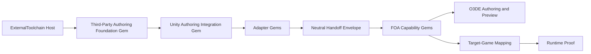
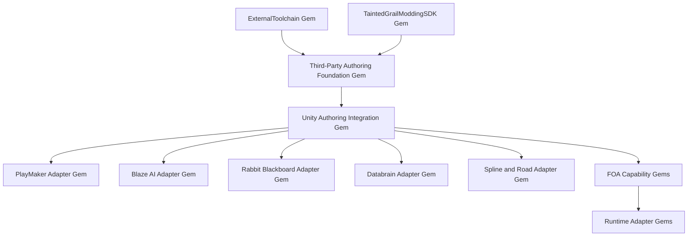
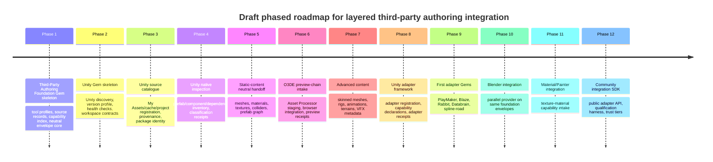

# FOA-SDK Layered Third-Party Authoring Integration Architecture

## Executive summary

FOA-SDK already has the right constitutional direction for third-party authoring integrations: it treats O3DE as the governed authoring host, keeps the Unity game runtime outside the editor repository, separates evidence from authority, and routes optional systems through bounded extension points instead of allowing tools to self-authorise runtime or deployment actions. The repository explicitly positions `Gems/ExternalToolchain` as the bounded external-tool host and `Gems/TaintedGrailModdingSDK` as the owner of FOA identities, validation, evidence, orchestration and UI, while the roadmap’s external-authoring programme says to use ordinary O3DE Tool Gems, not another plug-in loader, and to add distinct provider Gems such as `foa.blender` and `foa.unity-editor`. citeturn2view0turn5view0turn4view0turn3view3

The strongest architecture for the next stage is therefore not “make Unity special”, but “formalise a reusable third-party authoring stack whose first concrete provider is Unity”. In practice, that means introducing a **Third-Party Authoring Foundation Gem** above the existing repository foundations, with the Unity Authoring Integration Gem as the first provider Gem and tool-specific adapter Gems layered beneath it for PlayMaker, Blaze, Rabbit, Databrain, and spline/road systems. This respects the repository’s rule that discovery, qualification, operation enablement, and execution permission are distinct axes, and it aligns with the Gate 0 design, which currently authorises typed handoff envelopes but explicitly does **not** authorise process launch, provider execution, path inspection, project mutation, or runtime actions. citeturn4view0turn5view1turn5view4

For Unity specifically, the recommended operating model is a **hybrid**: source registration from user-local Unity package locations and project roots; **disposable intake sandboxes** for untrusted or newly encountered packages; and an optional **per-FOA-project Unity authoring workspace** for trusted, iterative authoring. The corresponding worker model should also be hybrid: **batch-per-job** for high-risk intake and deterministic validation, an optional **persistent worker** for trusted incremental export, and a **visible Unity Editor** mode for advanced recovery/debugging. Unity’s official tooling supports batch launches with `-batchmode`, `-quit`, `-projectPath`, and `-executeMethod`; Unity Hub and the newer CLI can manage editor installations, but Hub CLI is deprecated and the standalone Unity CLI is still experimental, which makes the Unity Editor command line the safer operational backbone for FOA-SDK automation. citeturn21view0turn25view0turn24search0

The first neutral interchange should use a **shared envelope plus capability-specific payloads**, not one giant universal schema. That matches the repository’s own gating model and O3DE’s asset pipeline better than a monolithic format. For the first qualified geometry path, the repository and O3DE documentation point in the same direction: **FBX plus a canonical sidecar/envelope** should be the first production path, while glTF/GLB remains a strong later candidate once qualification is complete. O3DE documents `.fbx` as its primary scene source format and current glTF support as in development; FOA-SDK’s own Unity/Blender interchange design explicitly selects “FBX-plus-sidecar” first and defers glTF/GLB to a later qualification pass. citeturn20view3turn20view4turn4view0turn3view3

Security and licensing must be first-class, not afterthoughts. Unity packages can execute editor code on launch via `InitializeOnLoad`, participate in import-time callbacks via `AssetPostprocessor`, and bring both managed DLLs and native plug-ins into a project. Unity Safe Mode is useful for compile-failure recovery because it imports only script-related assets and blocks non-script asset import, but Safe Mode is not a sandbox. Meanwhile, Unity’s Asset Store Terms prohibit automated access to the Asset Store except through Unity-provided interfaces, and the EULA distinguishes between non-restricted and restricted assets, allows embedding licensed assets in a “Licensed Product”, and prohibits “forum pooling”. FOA-SDK should therefore avoid direct Asset Store scraping, rely on the user’s licensed local Unity environment and caches, and maintain explicit provenance and redistribution states rather than inferring rights from technical success. citeturn19view5turn19view2turn19view3turn19view4turn19view0turn8view0turn29view0turn29view3turn29view4turn29view5

## Repository baseline and governing constraints

The repository already defines the most important architectural limits. FOA-SDK is not an O3DE source fork; it is a product repository that keeps an exact pinned external O3DE checkout beside the product checkout and routes generated artifacts to `foa-build/`. It explicitly states that O3DE owns engine/host functionality, the Unity game owns runtime interpretation, and cross-engine conversion must occur through deterministic, reviewable file handoff. It also prohibits any silent promotion from editor presence, plug-in declaration, or installer selection into runtime authority, deployment authority, or evidence promotion. citeturn2view0

The architecture document sharpens those constraints into mandatory invariants: editor/runtime separation, exact identity, pack ownership, evidence-before-promotion, usage-specific validation, fail-closed behaviour on missing proof, versioned persistence, explicit runtime-adapter responsibility, and the assumption that public inputs are untrusted. In other words, FOA-SDK already has the constitutional rules required for an external-tool integration system; what it lacks is the next layer of tool-specific orchestration and qualification. citeturn5view0

The repository’s current normative direction for external tools is unusually clear. The roadmap says the external authoring programme is still a proposed Phase 9 line, but it also says Gate 0 exists as a contract-only precursor, that ordinary O3DE Tool Gems should be used, that the existing `ExternalToolchain` host should remain in place, and that separate provider Gems such as `foa.blender` and `foa.unity-editor` should be introduced. It also says the Unity authoring lane must remain separate from runtime adapters, BepInEx/Harmony execution, deployment, game launch, and save mutation. citeturn3view3turn4view0

That means the correct interpretation of the user’s “Foundation Gem + Unity Gem” request is not “replace the current foundations”, but “add a reusable authoring-integration layer that sits cleanly on top of them”. The **Third-Party Authoring Foundation Gem** should therefore depend on the existing `ExternalToolchain` and `TaintedGrailModdingSDK` responsibilities instead of competing with them. `ExternalToolchain` should continue to own provider descriptors, bounded local discovery and generic diagnostics, while the new foundation layer should own the **authoring-specific** abstractions: source registration, capability indexing, native-validation records, neutral envelopes, provenance state, trust state, stale-state handling, and intake orchestration. That division is consistent with the current design note, which says `ExternalToolchain` does not own FOA identities, interchange semantics, provider qualification or runtime permission, while TG SDK Core owns qualification states, interchange identities, schema contracts, canonical serialisation and loss analysis. citeturn4view0turn5view3

A final baseline constraint matters for implementation planning: the repository’s research rules are explicit that research is not implementation authority, and Gate 0’s current authority matrix says process launch, provider discovery/qualification, source publication, interchange conversion and Unity project mutation all belong to later gates. This means the research outcome can and should be broad, but the eventual implementation slices must remain PR-sized and authority-aware. citeturn5view1turn5view4

## Layered integration architecture

The layer stack below maps the full integration path the user requested. The key design decision is that **authority should narrow as data moves right**: earlier layers may inspect and report; later layers may intake and represent; only the last layers may claim target-game mapping or runtime proof. That is exactly the separation FOA-SDK already applies to evidence, validation and runtime adapters. citeturn5view0turn2view0

| Layer | Primary owner | Required output | What it is allowed to claim |
|---|---|---|---|
| Tool discovery | `ExternalToolchain` + Foundation Gem | `ExternalToolProfile` | “This tool/version/path appears to exist here.” |
| Source registration | Foundation Gem | `ThirdPartySourceRecord` | “This user-owned source is registered and fingerprinted.” |
| Capability discovery | Provider Gem | `CapabilityIndex` | “This source appears to contain these candidate domains.” |
| Native inspection | Provider Gem | `NativeInspectionRecord` | “These native objects, references and dependencies were observed.” |
| Classification | Provider Gem + adapter rules | `ClassificationRecord` | “This subject is portable / convertible / adapter-supported / etc.” |
| Native validation | Provider Gem / adapter | `NativeValidationReceipt` | “The source tool accepted or rejected these native constraints.” |
| Neutral handoff | Provider Gem | `NeutralHandoffEnvelope` + payloads | “This portable or translated representation was produced, with losses and provenance.” |
| Established capability intake | FOA capability Gem | `CapabilityIntakeRecord` | “The FOA domain accepted this neutral payload under these rules.” |
| O3DE authoring | O3DE capability/preview services | O3DE source/products + preview receipts | “This O3DE authoring representation or preview exists.” |
| Target-game mapping | Game-profile Gem / runtime adapter planner | `TargetMappingRecord` | “This FOA capability maps to this target-game contract.” |
| Runtime proof | Runtime adapter + evidence system | `RuntimeProofReceipt` | “This mapping was actually exercised and verified in runtime context.” |

This ownership model fits the repository and O3DE literature well. FOA-SDK already separates host, editor foundation, evidence/knowledge, and adapters; the external-tool design note says editor panes should remain thin clients over Framework and ExternalToolchain services; and O3DE’s Gem system is explicitly designed so custom Gems can extend the editor or provide features without forcing everything into one module. citeturn5view0turn4view0turn20view4turn10search8

A practical architectural flow for the first long-lived design is:



The repository’s current external-authoring design also implies an important negative rule: **tool discovery must not become package acquisition or marketplace scraping**. Unity’s Asset Store Terms say users may access the Store only through Unity-provided interfaces unless separately allowed, and explicitly prohibit automated access by scripts, crawlers, or similar technology. That means FOA-SDK should discover Unity-owned content through user-controlled local state — the user’s Unity installations, project roots, My Assets context, UPM caches and `.unitypackage` cache — rather than by scraping the Asset Store website itself. citeturn8view0turn8view1turn8view2turn23view0turn23view3

The layer model also suggests a useful durable naming scheme:

```json
{
  "toolProfile": "foa-external-tool-profile.json",
  "sourceRecord": "foa-third-party-source-record.json",
  "capabilityIndex": "foa-third-party-capability-index.json",
  "nativeInspection": "foa-native-inspection.json",
  "classification": "foa-classification-record.json",
  "nativeValidation": "foa-native-validation.json",
  "neutralHandoff": "foa-neutral-handoff.json",
  "capabilityIntake": "foa-capability-intake.json",
  "targetMapping": "foa-target-mapping.json",
  "runtimeProof": "foa-runtime-proof.json"
}
```

That draft scheme intentionally mirrors the repository’s insistence on separate, reviewable records instead of one magical import result. citeturn5view0turn5view1

## Unity operating models

Unity is the first integration because the official editor and package infrastructure already expose the necessary primitives: editor installations can be managed through Unity Hub and CLI, editor automation can be invoked through command-line arguments, user-owned Asset Store content is mediated through the **My Assets** view in Package Manager, `.unitypackage` content and UPM packages are clearly separated, and Unity’s editor APIs provide enough inspection surface to build deterministic dependency manifests keyed by GUIDs, local file IDs and asset paths. citeturn24search0turn25view0turn21view0turn8view1turn8view2turn23view0turn23view3turn21view1turn21view2turn21view3turn21view4turn21view5turn21view6

The worker-model choice is not only a performance question; it is also a trust-boundary question. Unity can run edit-mode code at launch with `InitializeOnLoad`, re-run static initialisers on domain reload, and execute import hooks through `AssetPostprocessor`. That means a “launch Unity and inspect the asset” operation is a **code-execution event**, not a pure metadata read. citeturn19view5turn19view1turn19view2

| Worker model | Strengths | Weaknesses | Best use |
|---|---|---|---|
| Batch per job | Strongest isolation boundary; deterministic job scope; easy crash containment; easiest to run under sandbox/VM; simplest evidence bundle per job | Highest startup and import cost; poor for iterative authoring; repeated package compilation is expensive | Untrusted intake, first classification, CI-style validation |
| Persistent headless/editor worker | Faster repeated inspections and exports; good for incremental validation and large libraries | Wider blast radius if package code misbehaves; long-lived state can drift; harder recovery after corruption | Trusted packages, repeated neutral exports, per-project authoring |
| Visible editor | Best debugging and user repair experience; native tooling available; ideal for advanced users | Weakest automation boundary; easiest accidental mutation path; poor unattended scalability | Advanced editing, recovery, manual qualification |
| Hybrid | Lets FOA route work by trust tier and job type; best long-term ergonomics | Highest implementation complexity; requires clear state handoff and lock discipline | Recommended default architecture |

The Unity facts that matter here are straightforward: the editor supports command-line automation with explicit arguments; Hub manages installations and the Hub CLI exists but is deprecated; Unity Safe Mode is aimed at compilation recovery, not production authoring; and native plus managed plug-ins are first-class citizens in Unity projects. Taken together, those facts argue against a single persistent worker as the only design, and in favour of a **hybrid trust-tier architecture**. citeturn21view0turn25view0turn19view0turn19view3turn19view4

A similar conclusion applies to the project model.

| Managed-project option | Strengths | Weaknesses | Fit |
|---|---|---|---|
| Single catalogue project | Central cache, fast browsing after warm-up, one import graph | High conflict risk across render pipelines and package versions; grows without bound; compromise of one project compromises all | Useful only as a metadata/index project, not as sole operational model |
| Per-project Unity workspace | Strong pack/profile isolation; best provenance and reproducibility for a mod project | Repeated import cost; bigger disk use; weak reuse across FOA projects | Good as the authoring workspace for curated project content |
| Source registration only | Fastest and safest first step; no invasive import; respects user ownership boundaries | Cannot inspect or validate most Unity-native semantics; no reliable prefab/component introspection without import | Essential as a first layer, insufficient as the whole model |
| Hybrid | Index from source registration, inspect in disposable intake sandboxes, then promote to per-project workspace only when selected | More moving parts | Recommended |

The official package-management model supports this hybrid design. Unity distinguishes Asset Store **asset packages** (`.unitypackage`) from **UPM packages**; UPM packages are stored in the global cache, asset packages live in a separate cache, and both can appear in the My Assets flow. Downloaded asset-package cache locations are documented, and UPM packages have explicit manifests (`package.json`) with version and dependency metadata. That means FOA-SDK can legitimately build a three-stage Unity source strategy: **register** local sources, **inspect/import** selected sources in sandboxes, then **promote** approved selections into a stable project workspace. citeturn22search0turn8view1turn8view2turn23view0turn23view1turn23view2turn23view3

The recommended Unity operational pattern is therefore:

```text
Source registration
→ Local package/project index
→ Disposable intake sandbox for first import and classification
→ Trusted per-project Unity authoring workspace for selected content
→ Neutral handoff into FOA capability intake
```

That model also aligns well with recovery. Unity Safe Mode can be used when a workspace breaks due to compile or package issues; O3DE’s Asset Processor has its own constraints, including unsupported symbolic links for scan directories and cache locations, which means FOA should keep generated roots explicit and repairable rather than relying on symlink tricks between workspaces. citeturn19view0turn20view1

## Neutral contracts and component taxonomy

The repository’s own design note already points toward the correct neutral format strategy: a durable package or directory containing one canonical manifest plus payloads, with explicit identities, provenance, transformations, losses, validation evidence and exact toolchain locks. O3DE’s current scene pipeline still makes FBX the practical first geometry/animation bridge, while glTF remains an important later candidate. In other words, the right model is **shared envelope + capability-specific payloads**, not “one file type to rule them all”. citeturn4view0turn20view3turn20view5

A draft shared envelope should look like this:

```json
{
  "$schema": "https://foa-sdk.example/schemas/neutral-envelope-v1.schema.json",
  "schemaVersion": 1,
  "integrationId": "foa.unity-editor",
  "integrationVersion": "0.1.0",
  "workspaceProfileId": "tg-profile-2022.3",
  "sourceTool": {
    "name": "Unity Editor",
    "versionToken": "2022.3.53f1",
    "packageType": "unitypackage",
    "provider": "Unity Asset Store"
  },
  "source": {
    "sourceRecordId": "src_01J2...",
    "packageId": "unity.assetstore.pathiral.blaze-ai-engine",
    "packageVersion": "3.4.22",
    "publisher": "Pathiral",
    "nativeProjectRoot": "redacted-by-host",
    "nativeAssetPath": "Assets/Enemies/Bandit.prefab",
    "nativeGuid": "3da4d5...",
    "nativeLocalFileId": "100100000"
  },
  "classification": {
    "overall": "adapter-supported",
    "confidence": "qualified-fixture-pending"
  },
  "provenance": {
    "licenceState": "local-authoring-only-until-reviewed",
    "redistributionState": "unknown",
    "sourceFingerprintSha256": "..."
  },
  "transform": {
    "units": "metres",
    "sourceBasis": "Unity",
    "targetBasis": "FOA-Neutral",
    "declarationOnly": true,
    "matrix4x4": [[1,0,0,0],[0,1,0,0],[0,0,1,0],[0,0,0,1]]
  },
  "payloads": [
    { "capability": "prefab", "path": "payloads/prefab/main.prefab.json", "sha256": "..." },
    { "capability": "mesh", "path": "payloads/meshes/body.fbx", "sha256": "..." },
    { "capability": "material", "path": "payloads/materials/body.material.json", "sha256": "..." }
  ],
  "losses": [],
  "warnings": [],
  "nativeValidationReceipt": "receipts/native-validation.json"
}
```

The capability-specific payloads should stay narrow and typed.

| Capability | First practical payload choice | Minimum fields in FOA sidecar |
|---|---|---|
| Mesh | FBX or later-qualified GLB, plus JSON sidecar | topology digest, bounds, pivot, material slots, source GUID/file IDs |
| Skinned mesh | FBX/GLB + skeleton JSON | bind poses, bones, skin weights digest, root bone, blend-shape summary |
| Material | JSON manifest + referenced textures | shader family, channel packing, render mode, texture bindings, unsupported properties |
| Texture | Preserve original where lawful + canonical metadata | colour space, dimensions, compression/original hash, semantic role |
| Animation | FBX/GLB animation clip or sidecar clip JSON | clip name, duration, frame rate, root motion flag, event inventory |
| Prefab | JSON scene graph | hierarchy, transforms, component inventory, references to child payloads |
| Collider | JSON | primitive vs mesh, dimensions, transforms, convex flag, source component |
| VFX | Metadata-first JSON, optional baked textures/meshes | system type, dependencies, preview support, bake status, unsupported nodes |
| ScriptableObject | Adapter-owned JSON only | native type, schema ID, field map, references, serialisation scope |
| Logic graph | Adapter-owned JSON graph | nodes, ports, edges, variables, event bindings, unsupported actions |
| Terrain | Terrain package JSON + raw data | heightmaps, terrain layers, alpha maps, trees/detail summaries |
| Spline / road | JSON spline network + optional generated mesh refs | nodes, tangents, widths, lanes, banking, junction metadata |

The reasons for this split are partly repository-driven and partly engine-driven. O3DE’s Asset Pipeline expects source assets which builders can process into runtime-optimised products; the Scene Processing Gem is centred on FBX settings and Asset Processor staging; and Unity’s own asset APIs expose paths, GUIDs, local file IDs, sub-assets and dependency graphs well enough to populate deterministic sidecars without pretending that every Unity-native construct can become a directly portable scene file. citeturn20view2turn20view5turn21view1turn21view2turn21view3turn21view4turn21view5

A more detailed draft for a prefab payload illustrates the principle:

```json
{
  "$schema": "https://foa-sdk.example/schemas/prefab-payload-v1.schema.json",
  "capability": "prefab",
  "stableAssetId": "asset_bandit_prefab",
  "root": {
    "name": "Bandit",
    "children": [
      {
        "name": "Visual",
        "transform": {
          "localPosition": [0, 0, 0],
          "localRotationQuaternion": [0, 0, 0, 1],
          "localScale": [1, 1, 1]
        },
        "components": [
          {
            "kind": "SkinnedMeshRenderer",
            "classification": "convertible",
            "payloadRef": "payloads/meshes/bandit_body.fbx"
          },
          {
            "kind": "Animator",
            "classification": "convertible",
            "payloadRef": "payloads/animation/bandit_controller.json"
          },
          {
            "kind": "BlazeAI.Behaviour",
            "classification": "adapter-supported",
            "payloadRef": "payloads/adapters/blaze/bandit.behaviour.json"
          }
        ]
      }
    ]
  },
  "dependencies": [
    "Assets/Characters/BanditBody.fbx",
    "Assets/Characters/Bandit.mat",
    "Assets/AI/BanditBlazeProfile.asset"
  ]
}
```

The component-classification taxonomy should then be explicit and deterministic.

| State | Meaning | Promotion rule |
|---|---|---|
| Portable | Can be transferred with no tool-specific semantic dependency beyond accepted format loss | May flow straight to capability intake |
| Convertible | Requires deterministic translation, baking or channel remap | May promote only with loss record |
| Adapter-supported | Semantics preserved only through a reviewed adapter | May promote only through that adapter |
| Authoring-only | Useful in source tool, but not yet qualified for FOA capability or target mapping | May preview or stay registered, but not claim intake readiness |
| Unsupported | Explicitly blocked by format, semantics, safety or licence boundary | No promotion |
| Unknown | Not yet classified or invalidated by version drift | No promotion until reviewed |

That taxonomy is consistent with FOA-SDK’s broader validation model, which already separates what is known, how it is known and what is safe to do. citeturn5view0turn2view1

The Unity-specific adapter rules should be similarly conservative:

| Tool / system | Recommended rule |
|---|---|
| PlayMaker | FSM structure, states, transitions, events, variables and templates are **adapter-supported**; custom Actions are **unknown** until whitelisted; direct runtime calls or opaque script Actions are **authoring-only** or **unsupported** |
| Blaze AI | Behaviour profiles and parameter sets are **adapter-supported**; navigation/runtime execution components remain **authoring-only** until target-game mapping exists |
| Rabbit Blackboard | Blackboard schema, signals, defaults, validations and serialisation metadata are **adapter-supported**; generated runtime code is not portable by itself; Pro/Lite differences must be version-qualified before capability claims |
| Databrain | `DataLibrary` / `DataObject` structures are **adapter-supported**; runtime clones, save/load or add-on semantics stay **authoring-only** unless a capability contract exists; add-ons are separate capability surfaces |
| Spline / road tools | User-authored topology is **adapter-supported**; generated meshes are usually **convertible**; terrain deformation, procedural side objects and runtime traffic logic are **authoring-only** unless explicitly qualified |

Those rules are grounded in the tools’ own public surfaces. PlayMaker explicitly exposes FSMs, variables, events, templates, runtime debugging and custom Actions; Rabbit documents blackboards, signals, source generators, saving/loading and validations; Databrain documents `DataObject`/`DataLibrary` authoring, runtime clones and a large add-on surface including Events, Blackboard, Logic, Inventory and Dialogue; and the Blaze AI Asset Store page clearly places Blaze in the AI/behaviour domain rather than the data/schema domain. citeturn15search2turn15search4turn15search9turn15search16turn13search0turn26search2turn26search5turn26search12turn28search0turn14search1turn14search2turn14search11turn28search5turn17view0

## Security, licensing and provenance

The Unity security model for FOA-SDK must begin from a blunt premise: **importing a Unity package is not a passive file read**. Unity officially supports editor-time startup code via `InitializeOnLoad`, domain-reload initialisation, import-pipeline hooks through `AssetPostprocessor`, managed plug-ins via precompiled DLLs and native plug-ins via unmanaged code libraries. Safe Mode helps when projects fail to compile because it imports only script-related assets and blocks non-script assets, but that is a recovery environment, not a general-purpose sandbox. citeturn19view5turn19view1turn19view2turn19view3turn19view4turn19view0

The threat model should therefore be explicit.

| Threat | Why it matters | Recommended control |
|---|---|---|
| `InitializeOnLoad` editor code | Runs on Unity load / recompile | Treat every first import as code execution; isolate intake |
| `AssetPostprocessor` / scripted importers | Runs during import; may trigger re-import cascades | Use disposable intake sandboxes; capture import logs and resulting mutations |
| Managed DLLs | Precompiled code can be attached and invoked in editor/runtime | Detect and inventory DLLs before trust promotion |
| Native DLLs / plugins | Unmanaged code path | Default to blocked or high-risk trust tier |
| Long-lived worker contamination | One bad import can poison later jobs | Separate high-risk jobs from persistent workers |
| Package/project corruption | Broken compilation/import state | Safe Mode recovery path; disposable clones; one-click rebuild |
| Symlink/path escape | Asset roots and caches can bleed across boundaries | Reject unsafe paths and avoid symlink-based designs |
| Network or credential use in editor code | Third-party code may call external services | Run intake under network-restricted OS policy where possible |

Several of these controls are direct inferences from the official documentation rather than explicit product guidance, but the documentation strongly supports them. Unity documents automatic editor launch code and import callbacks; O3DE’s Asset Processor documentation warns against symbolic links in scan directories and caches; and FOA-SDK’s own architecture treats public inputs as untrusted and missing proof as fail-closed. citeturn19view5turn19view2turn20view1turn5view0

The recommended isolation policy is therefore:

1. **Registration tier** — no Unity launch; only observe user-local paths, package manifests, cache entries and metadata where available.
2. **Intake sandbox tier** — disposable Unity project under a restricted OS account or disposable VM/container; no access to FOA workspace roots, game installs or personal file trees beyond the selected package inputs.
3. **Trusted authoring tier** — persistent per-project workspace only for packages that have passed qualification and whose trust state is explicitly enabled.
4. **Advanced visible tier** — user-invoked Unity Editor session with prominent warnings, repair tools and revalidation on return.

Unity Safe Mode should be treated as a **repair escalation**, not as the default path. If the intake or project workspace fails to compile, FOA should offer: “Open clone in Safe Mode”, “Open original in Safe Mode”, “Discard sandbox and rebuild”, and “Quarantine package”. The official Safe Mode behaviour — minimal UI, no non-script asset import, focus on resolving compilation errors — makes it ideal for this repair branch. citeturn19view0

Licensing and provenance must be just as structured. Unity’s Terms make three constraints especially important. First, Asset Store automation is restricted to Unity-provided interfaces. Second, the standard EULA governs most assets unless separate terms are attached. Third, even non-restricted assets are licensed subject to the EULA’s limits, including the right to distribute them only as incorporated and embedded within a Licensed Product, while Restricted Assets can have different terms and “forum pooling” is expressly prohibited. citeturn8view0turn29view2turn29view0turn29view3turn29view4turn29view5

The correct FOA provenance model is therefore not a binary “redistributable / not redistributable”, but a reviewable state machine:

| Provenance state | Meaning | Recommended UI language |
|---|---|---|
| Redistribution confirmed | Exact rights reviewed for intended FOA output path | “Redistribution reviewed for this output path.” |
| Conditionally allowed | Likely permitted only when embedded or under defined packaging constraints | “May be redistributable only in embedded/compiled output.” |
| Local authoring only | Safe for indexing, preview and authoring in the user’s environment only | “Local use only. Do not publish generated content from this source.” |
| Rights require publisher terms | Standard EULA insufficient or overridden | “Publisher-specific terms must be reviewed.” |
| Licence unclear | Missing or contradictory evidence | “Rights unclear. Publication blocked pending review.” |
| Blocked | Restricted or incompatible rights state | “Publication blocked by licence state.” |

This is also where the repository’s legal policy matters. FOA-SDK already prohibits committing extracted commercial content, unknown-rights content, or material that could reconstruct protected game content, and it requires synthetic or clearly redistributable fixtures. That same stance should apply to third-party authoring integrations. citeturn5view2

## Gem topology, roadmap, fixtures and user flows

The topology below is the most coherent way to combine the repository’s existing foundations with the new requirement.



This topology respects the repository’s current product structure. `Gems/ExternalToolchain` and `Gems/TaintedGrailModdingSDK` remain the always-present product foundations; optional packages remain governed beneath extension points; and runtime adapters stay separate from authoring systems. O3DE Gems are the correct packaging unit for the new system because O3DE documents Gems as the standard way to bundle code and/or assets, extend the editor and distribute modular capability. citeturn2view0turn5view3turn20view4turn10search8

The high-level implementation programme should follow the user’s requested twelve-phase shape, but each phase should land as PR-sized slices with tests and fixture evidence.



The first proof fixture set should be deliberately small but capability-diverse. FOA-SDK’s own legal policy says fixtures must be synthetic or clearly redistributable and unsuitable for reconstructing protected content, so the fixture plan should use synthetic fixtures where possible and user-owned commercial packages only as local qualification inputs, not repository fixtures. citeturn5view2

| Fixture | Purpose |
|---|---|
| Synthetic static mesh prefab | Baseline mesh/material/collider export |
| Synthetic modular building kit | Nested prefab and dependency graph |
| One humanoid character | Skinned mesh, avatar, animation references |
| One non-humanoid creature | Skeleton and animation variance |
| One terrain fixture | `TerrainData` extraction and sidecar structure |
| One particle effect fixture | Particle metadata and optional baking |
| One VFX Graph fixture | Explicit “authoring-only / preview-only” path |
| One prefab with missing scripts | Broken-intake and repair flow |
| One package containing managed DLLs | Trust tier and warning UX |
| One package containing native plug-ins | Blocked/high-risk path |
| One PlayMaker sample | FSM graph export and unsupported custom Action receipts |
| One Rabbit sample | Blackboard schema + signal/validation export |
| One Databrain sample | `DataLibrary` / `DataObject` intake |
| One spline/road sample | Curve topology and generated-mesh split |
| One Blaze sample | AI-profile adapter receipt and animation/nav dependencies |

The **test matrix** should cover four axes at minimum: package type (`.unitypackage`, UPM, local package, existing project asset), trust tier (registered, sandboxed, trusted, blocked), capability (mesh/prefab, animation, terrain, logic, AI, blackboard, data), and outcome (portable, convertible, adapter-supported, authoring-only, unsupported, unknown). That will produce a much more reliable qualification regime than package-by-package anecdotal testing. This is especially important because Unity’s package landscape is heterogeneous, with Asset Store packages available in both `.unitypackage` and UPM forms, and because many packages include assembly definitions, managed plug-ins or other non-content elements that materially affect qualification. citeturn22search0turn23view2turn19view4

The UI/UX should present the complexity as a simple FOA-led flow.

For the **novice flow**, the recommended path is:

```text
Add Content
→ Choose Unity Source
→ Browse registered packages and projects
→ Select asset
→ FOA runs intake in sandbox
→ FOA shows capability, status, warnings and rights state
→ Add to Project
→ FOA imports neutral payload into capability intake
→ Preview in O3DE
```

For the **advanced flow**, the user should be able to:

```text
Select source
→ Open in Unity
→ Edit in managed workspace
→ Save and return
→ FOA detects drift
→ Revalidate
→ Review losses/warnings
→ Promote updated handoff
```

That UI shape fits both the repository’s “thin pane” philosophy and Unity’s own package-management model. The current design note says editor panes should show providers, qualification, package content, validation, losses and blockers without exposing hidden conversion or runtime actions; Unity’s Package Manager already gives users a mental model based on My Assets, download/install/import, and visible project actions. citeturn4view0turn8view1turn23view1

The most useful status labels are:

- **Available**
- **Registered**
- **Needs inspection**
- **Inspected**
- **Portable**
- **Convertible**
- **Adapter required**
- **Authoring only**
- **Unsupported**
- **Blocked by rights**
- **Stale**
- **Repair required**
- **Runtime proof pending**

The failure and repair actions should be equally explicit:

- **Re-run inspection**
- **Open clone in Safe Mode**
- **Open in Unity**
- **Rebuild sandbox**
- **Quarantine package**
- **Show DLLs and native plug-ins**
- **Review rights state**
- **Revalidate target mapping**

Finally, the primary-source priority list for the actual research and implementation programme should be:

1. **FOA-SDK normative repository docs and accepted code contracts** — because the repository explicitly says normative design lives there, not in research notes. citeturn5view4turn2view0turn4view0turn5view1
2. **Unity official documentation** — Editor CLI, Package Manager, My Assets, caches, AssetDatabase, PrefabUtility, Safe Mode, plug-ins, scripting lifecycle. citeturn21view0turn8view1turn8view2turn23view0turn23view3turn21view1turn21view2turn21view3turn21view4turn21view5turn21view6turn19view0turn19view5turn19view3turn19view4
3. **Unity legal documents** — Asset Store Terms, EULA, restricted/non-restricted asset rules and automation restrictions. citeturn8view0turn29view0turn29view1turn29view3turn29view4turn29view5
4. **O3DE official docs** — Gems, Asset Pipeline, Asset Processor, Scene Processing, scene formats. citeturn20view4turn20view2turn20view1turn20view3turn20view5
5. **Qualified official or vendor-maintained third-party docs** — PlayMaker, Rabbit Blackboard, Databrain, and whichever Blaze material is officially available. citeturn15search2turn15search16turn13search0turn26search2turn28search0turn14search1turn17view0
6. **Interchange standards and tool docs** — Khronos glTF, Autodesk FBX SDK, Blender CLI/API, Substance Painter API for later providers. citeturn11search0turn11search8turn11search3turn11search11turn11search1turn11search2

The overall recommendation is therefore clear. FOA-SDK should proceed with a **layered Third-Party Authoring Foundation Gem**, keep `ExternalToolchain` and TG SDK as its constitutional base, make **Unity the first provider Gem**, route PlayMaker/Blaze/Rabbit/Databrain/spline systems through explicit adapter Gems, use a **hybrid trust-tier worker/project model**, and insist on **separate records for discovery, registration, inspection, validation, neutral handoff, capability intake, O3DE representation, target mapping and runtime proof**. That design is broad enough to support Unity-first delivery now and Blender/Painter/community providers later, while remaining faithful to both the FOA-SDK repository and the official Unity/O3DE sources. citeturn4view0turn5view0turn3view3turn20view4turn20view2
