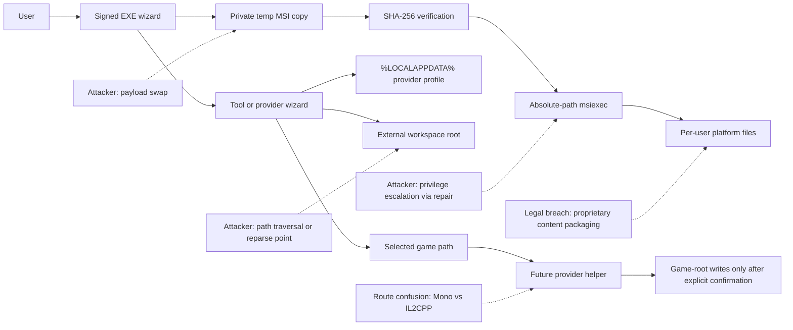
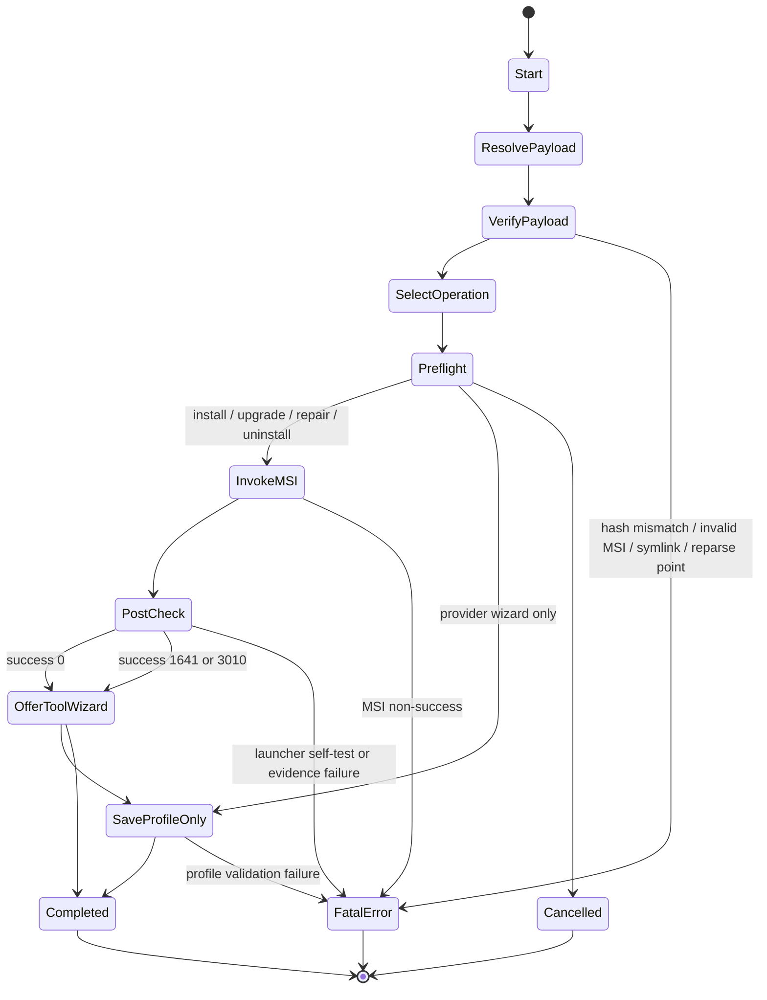
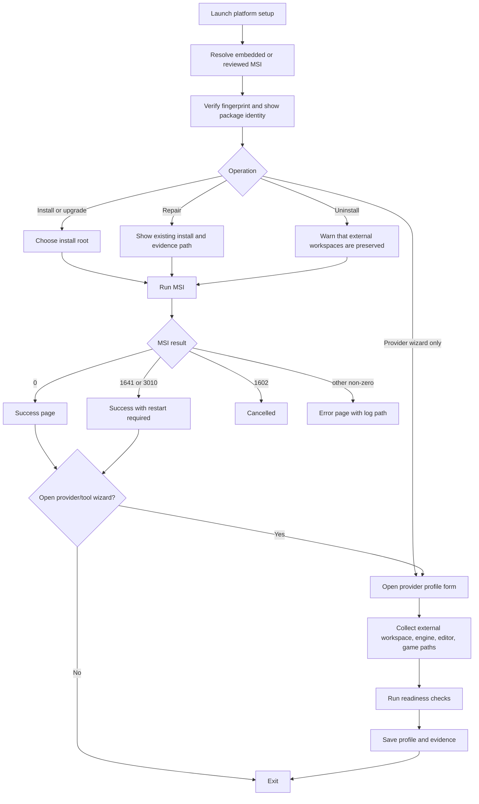

# Windows-only Multi-game Installer and Setup Wizard Platform

## Executive summary

The strongest architecture for the requested platform is an **MSI-first Windows platform installer with a signed, self-contained EXE wizard as the user-facing shell**. Concretely: keep a native Windows desktop launcher/wizard as the orchestration layer, but keep **Windows Installer as the sole lifecycle authority** for product-owned binaries, registration, repair, major upgrade, and uninstall. Put **all provider-specific discovery, game-path selection, readiness checks, and any future game-write operations outside MSI**. For the first safe vertical slice, ship the platform as **per-user**, keep the shell **`asInvoker`**, and make the first FoA integration **readiness-only** rather than game-mutating. That aligns directly with the current FOA-SDK approved installer design, avoids unnecessary admin prompts, preserves MSI repair/rollback value, and keeps the legal/security boundary tight. citeturn39view0turn21view0turn21view1turn20view9turn20view10

The concise recommendation is therefore:

- **Recommend:** self-contained EXE shell + per-user MSI lifecycle + provider contract + separate future executor for privileged or game-mutating tasks. citeturn39view0turn21view1turn20view5turn20view6
- **Reject for the first release:** Burn as the primary lifecycle authority, a pure MSIX replacement, and any installer that directly patches or deploys into game folders during the base install. Burn is valuable when prerequisite chaining becomes dominant, but it widens the privileged bootstrap surface; MSIX offers package identity and clean updates, but packaged/containerised behaviours and Windows App SDK coupling add migration cost without solving the immediate installer problem; direct game mutation in setup would violate the current FOA-SDK boundaries and create harder rollback, privilege, and legal problems. citeturn20view0turn20view1turn19view3turn26view0turn26view1turn22view0turn21view2

On UI technology, the best first-release choice is **not** a rewrite. The repository already specifies a self-contained Windows Forms installer wizard, and WinForms remains a Windows-only, offline-friendly desktop framework. WPF is a credible later migration path if the multi-game UX becomes more complex. An immediate WinUI 3 rewrite is not justified for the first integration because WinUI 3 is delivered through the Windows App SDK, which must be installed or packaged alongside the app, increasing distribution and support complexity while the product’s real risk lies in installer authority and provider boundaries, not in shell chrome. citeturn39view0turn21view1turn19view7turn19view6turn19view5turn26view4turn26view3

One limitation matters: the verbatim text of the “section 2 decisions” and “section 8 acceptance criteria” from the brief was not visible in the accessible prompt context. The decision package below therefore maps those requirements to the **explicit design decisions visible in the FOA-SDK installer design record** plus the deliverables named in the request. Where evidence is missing, the report states the exact experiment or artefact required rather than guessing.

## Decision package

### Recommended decisions

The table below is the decision package I would use to satisfy the implied section-two decision set for a Windows-only multi-game installer platform. The recommendations are either directly grounded in the FOA-SDK approved design and official platform documentation, or they are explicit inferences drawn from that evidence.

| Decision area | Recommendation | Why this is the right call |
|---|---|---|
| Lifecycle authority | **MSI remains the only authority for product-owned files and lifecycle.** | This is already the approved FOA-SDK design. Windows Installer gives standard install/repair/uninstall semantics, ARP/Programs and Features registration, logging, and built-in rollback for MSI-owned changes. Custom logic that directly mutates the system is harder to roll back, so it should stay out of MSI. citeturn39view0turn21view0turn20view7turn20view8turn20view9turn8search17 |
| User-facing shell | **Keep a signed, self-contained desktop EXE shell.** | The approved design already uses a self-contained Windows Forms EXE that embeds or resolves a reviewed MSI and verifies its SHA-256 before invoking `%SystemRoot%\System32\msiexec.exe` by absolute path. Self-contained/single-file deployment is well-supported in .NET, but must be configured explicitly on modern SDKs. citeturn21view1turn25view0turn25view1 |
| UI technology | **Retain WinForms for the first safe slice; structure for later WPF migration if needed; do not rewrite to WinUI 3 now.** | WinForms is already implemented and is easy to ship offline. WPF remains a mature Windows-only desktop option. WinUI 3 is recommended for new Windows desktop apps, but it rides on the Windows App SDK and introduces packaging/dependency choices that do not reduce the core installer risks. citeturn21view1turn19view7turn19view6turn19view5turn26view4turn26view3 |
| Install scope | **Per-user for the base platform.** | The approved design explicitly chooses per-user MSI scope so the editor project and user data stay writable without admin elevation. This also keeps the base install aligned with least privilege. citeturn39view0turn21view1turn20view5turn14search1 |
| Privilege model | **`asInvoker` shell, no silent elevation; future privileged actions isolated in a separate executor/helper.** | The repo already specifies `asInvoker` for the wizard and rejects `runas` or silent elevation. Microsoft’s UAC guidance is clear that execution level should reflect the minimum privilege truly required. Separating later privileged game-write steps prevents the base installer from becoming a de facto admin tool. citeturn21view1turn20view5turn20view6 |
| Provider architecture | **Introduce a versioned provider contract and treat each game integration as a provider package.** | The platform needs one common installer shell but separate game/runtime/storefront rules. FOA already demonstrates why: it has separate Mono and IL2CPP runtime-adapter routes with different BepInEx assumptions and evidence states. citeturn37view2turn22view3turn23view3turn23view1turn23view2 |
| Game-path operations | **Keep all game discovery, provider probing, and future deployment outside MSI.** | The current FOA-SDK boundaries explicitly forbid the installer from discovering/modifying/launching FoA or deploying runtime adapters. That boundary is correct, because MSI rollback is strong for MSI-owned files but not for arbitrary system or game-root mutations. citeturn21view0turn21view1turn21view2turn20view9turn8search17 |
| Storefront support | **Path-first, storefront-aware only where evidence is official and stable.** | GOG publicly documents DRM-free/offline installers and optional Galaxy usage for this game; Steam publicly confirms the game listing but not a stable consumer-facing install-manifest contract suitable for formal support in the evidence set gathered here. So the first support model should be “user picks a path, provider validates it”, with optional store-specific hints rather than manifest dependence. citeturn23view5turn24view0turn24view1turn24view3turn23view4 |
| Update model | **Major-upgrade MSI with stable UpgradeCode; no automatic updater in the first release.** | The approved design already fixes this: stable UpgradeCode, deterministic ProductCode per version, and no auto-update service. That is the right support posture for an evidence-governed tool still pre-alpha. citeturn39view0turn21view0 |
| Supply chain | **Pin toolchain versions, sign EXE/MSI, and explicitly account for WiX release terms.** | The FOA design pins CMake/CPack and WiX versions and verifies hashes. For public distribution, Authenticode signing is required; Microsoft recommends Artifact Signing/Trusted Signing for non-Store distribution. WiX binary releases now also carry Open Source Maintenance Fee/EULA obligations that should be resolved in procurement/compliance rather than ignored. citeturn39view0turn25view2turn25view3turn20view3turn20view4turn27view0turn27view1 |
| Repair design | **Avoid elevated MSI custom actions in the core platform MSI.** | Microsoft’s 2025–2026 Windows Installer hardening narrowed MSI repair scenarios and still requires UAC for repairs involving elevated custom actions. A clean base MSI with no elevated repair-time custom actions materially reduces future support pain. citeturn25view4 |
| Evidence and acceptance | **Treat logs and readiness artefacts as first-class release evidence.** | The current FOA design already requires MSI logs, tool-profile persistence, readiness evidence, and proof that an external workspace sentinel survives repair/uninstall. That is exactly the right acceptance model for a multi-game installer platform. citeturn21view0turn21view1 |

### Rejected alternatives

A **Burn-first** architecture is rejected for the first release, not because Burn is bad, but because it solves the wrong first problem. Burn is strongest when you need prerequisite chaining, conditional package acquisition, and customised bootstrap experiences for many packages. The current platform’s primary requirement is **tight lifecycle authority with minimal privilege**, not prerequisite orchestration. Burn remains a sensible second-phase option if the platform later needs to chain provider-pack MSIs, redistributables, or downloadable payloads at scale. citeturn20view0turn20view1

A **pure MSIX replacement** is also rejected for now. MSIX offers package identity, clean uninstall, and reliable updates, but it also introduces protected install locations, runtime file/registry redirection, and a packaging/distribution model that does not naturally replace the current MSI-as-authority design for a tool whose later provider actions may need unrestricted Win32 access patterns. A sparse-package identity layer is worth revisiting only if Store submission, notifications, or package-identity-gated Windows APIs become core roadmap needs. citeturn19view3turn26view0turn26view1turn26view2

A **direct game-mutating installer** is the worst option and should remain out of scope. It would directly collide with the repository’s security and legal policies, would make rollback weaker, and would turn the installer into a privileged game patcher before the provider model is mature. citeturn21view2turn22view0turn21view0

## Architecture options matrix and provider contract

### Architecture options matrix

The matrix below is an analytical comparison. The ratings are inferences from the FOA-SDK installer design, Windows Installer/MSIX/UAC behaviour, and official WinUI/.NET/WiX documentation. citeturn39view0turn20view0turn20view1turn19view3turn26view0turn26view1turn20view5turn20view6

| Option | Trust boundary | Attack surface | MSI compatibility | Extensibility | Testability | Offline support | Elevation model | Rollback | Signing | Maintainability | Migration cost | CI feasibility | Support burden |
|---|---|---|---|---|---|---|---|---|---|---|---|---|---|
| **EXE shell + per-user MSI authority** | **Narrow**: shell orchestrates, MSI owns lifecycle | **Low–medium** | **Native/full** | **High** through provider manifests and optional provider packs | **High** because shell and MSI can be tested separately | **High** | **Least privilege by default**; only future helpers elevate | **Strong for MSI-owned files**; external data deliberately preserved | **Standard Authenticode on EXE/MSI** | **High** | **Low** because it matches current FOA shape | **High** | **Low–medium** |
| **WiX Burn bundle as primary authority** | Wider bootstrap boundary | Medium–high | High for chained packages | High for prerequisites and multi-package flows | Medium | High | Often more elevation-sensitive depending on payload mix | Medium; rollback spans bundle/package interactions | EXE plus chained payload signing | Medium | Medium–high | Medium | Medium–high |
| **Pure MSI with MSI UI only** | Narrowest | Low | Full | Low–medium | Medium | High | Per-user possible; admin only if scope/actions need it | Strong for MSI-owned files | MSI signing only | Medium | Medium | High | Medium because UX flexibility is limited |
| **WinUI 3 front-end + MSI or sparse identity hybrid** | Medium | Medium | Medium | Medium | Medium | Medium–high | More moving parts: Windows App SDK plus chosen packaging model | Split: packaged shell rollback is strong, provider writes still external | More packaging/signing combinations | Medium | **High** | Medium | Medium–high |

### Recommended platform shape

The recommended shape for the platform is:

1. **Base platform MSI**
   Installs common binaries, provider loader, schemas, logs directory conventions, Start-menu entry, ARP metadata, and a provider registry location. Per-user only in the first release. citeturn39view0turn21view0turn20view7turn20view8

2. **Signed self-contained EXE shell**
   Double-click entry point. It resolves the reviewed MSI payload, verifies integrity, selects install/upgrade/repair/uninstall, launches `msiexec`, shows logs/results, and can open a provider-aware configuration wizard after success. citeturn21view1turn39view0turn25view0

3. **Provider layer**
   One provider contract for each supported game, with game-specific detection, validation, readiness rules, legal notices, and future executor hand-offs. The first provider is **FoA**. Future providers should be versioned independently of the base MSI, even if FoA is baked in for the first slice. This is an inference from the current FOA separation of optional packages, installer boundaries, and runtime-adapter routes. citeturn29view0turn21view0turn22view2turn37view2turn22view3

4. **Future execution helper**
   Not part of base installation logic. A distinct helper/executor, invoked only after explicit confirmation, and only for operations that must inspect or write a protected game path. This preserves least privilege and avoids poisoning MSI repair flows with elevated custom actions. citeturn20view5turn20view6turn25view4

### Multi-game provider contract

A provider contract should be **data-first** and **versioned**. The installer shell should not “know” FoA-specific rules in code beyond loading and validating the contract. The following schema is the minimum useful contract for a multi-game platform.

| Field | Type | Required | Purpose |
|---|---|---:|---|
| `schema_version` | string | Yes | Contract schema version, for example `multi_game_provider.v1`. |
| `provider_id` | string | Yes | Stable ID such as `game.foa`. |
| `display_name` | string | Yes | User-facing game/provider name. |
| `publisher` | string | Yes | Rights-holder/developer identifier for display and notices. |
| `supported_platforms` | array | Yes | Must be `["windows-x64"]` for this platform. |
| `supported_storefronts` | array | Yes | For example `["manual-path", "steam", "gog"]`. |
| `detection_modes` | array of objects | Yes | Ordered detection methods, each with `kind`, `read_only`, `confidence`, `timeout_ms`. |
| `required_markers` | array of objects | Yes | Files/directories/metadata that must exist to treat a path as valid. |
| `runtime_routes` | array of objects | Yes | Supported runtime routes, for example `"mono-bepinex5"` and `"il2cpp-bepinex6"`, each with exact compatibility data. |
| `tool_requirements` | object | Yes | Which external tools or local inputs are required for authoring/conversion/deployment previews. |
| `writes_allowed_by_default` | array | Yes | Explicit roots allowed during readiness-only operation; first slice should be installer config, logs, and external workspace only. |
| `privilege_policy` | object | Yes | Declares whether any operation can request elevation, and under which conditions. |
| `rollback_policy` | object | Yes | Declares what the provider can roll back and what is intentionally out of scope. |
| `evidence_outputs` | array | Yes | Required logs, summaries, fingerprints, and validation receipts. |
| `legal_policy` | object | Yes | Redistribution constraints, prohibited content classes, and required disclaimers. |
| `operations` | array of objects | Yes | Named operations such as `discover`, `validate-path`, `save-profile`, `preview-conversion`, `preview-deployment`, each with exit codes and evidence requirements. |
| `compatibility` | object | Yes | Game versions, runtime routes, framework/tool versions, and support state. |
| `signing_policy` | object | No | Whether provider packs themselves must be signed and how trust is validated. |
| `notes_url` | string | No | Documentation URL for support. |
| `source_commit` | string | Yes | Exact commit of the provider contract source when built into a release. |
| `source_register_entry` | string | Yes | Link to durable research/source register entry. |

A companion persisted profile document should be separate from the provider manifest and should follow the shape already visible in `ToolSetupProfile.cs`: installation root, workspace root, optional O3DE editor path, optional Unity editor path, optional conversion project path, optional game install path, computed readiness booleans, passed checks, blocked checks, preview command strings, and explicit false flags for execution permissions. That exact shape is already implemented for FoA and is a good template for a provider-neutral `provider-profile.local.json`. citeturn40view0

## FoA integration dossier

The FoA dossier below distinguishes between **direct evidence**, **what that evidence means for the platform**, and **what remains unresolved**.

| Topic | Exact evidence | What it means architecturally | Unresolved item and required artefact |
|---|---|---|---|
| Base installer pattern | The approved FOA design explicitly requires one reviewed Windows x64 build to produce a self-contained `FOA-SDK-Installer.exe`, a per-user MSI, a deterministic portable ZIP, a canonical install manifest, and MSI-based lifecycle ownership. citeturn39view0 | This is already the correct platform skeleton for the first multi-game release. FoA should be the first provider on top of that skeleton, not a reason to discard it. | Need the actual brief’s acceptance list mapped line-by-line to this platform skeleton before calling the design fully brief-complete. |
| Privilege/elevation posture | The wizard is defined as Windows Forms, self-contained, `asInvoker`, and per-user; it does not use `runas` or silent elevation. citeturn39view0turn21view1turn20view5 | Keep base installation non-admin. Any future protected-path work belongs in a distinct helper. | Run a patched-Windows repair test matrix on current Windows 11/10 with and without elevated custom actions to prove support posture after the 2025 Windows Installer hardening. citeturn25view4 |
| Tool/profile model | `ToolSetupProfile.cs` already persists workspace root, optional O3DE editor path, optional Unity editor path, optional Unity conversion project path, optional Tainted Grail install path, readiness booleans, passed/blocked checks, preview command strings, and explicit false execution flags. citeturn40view0 | The multi-game platform already has the bones of a provider profile model. Generalise this rather than inventing a new profile concept. | Produce a provider-neutral schema document and add contract tests proving that no provider can silently switch execution flags to `true`. |
| FoA legal boundary | The legal/content policy forbids committing game executables, assets, decompiled proprietary source, credentials, or redistributed proprietary content, while allowing lawful metadata, schemas, patches, and citations. citeturn22view0 | The installer platform must stay content-neutral and must not bundle game files, interop outputs, or private user artefacts. | Formalise a provider-pack review checklist covering every shipped helper, schema, icon, and notice. |
| Runtime route split | The Mono runtime-adapter README identifies an exact pinned Mono route with game `1.23.401`, Unity `6000.0.64f1`, BepInEx `5.4.23.3`, Tainted Framework `0.1.33`, and evidence state `HostLiveLoadValidated`; the IL2CPP README identifies an independent route for FoA `1.23.401` targeting Unity `6000.0.64f1`, BepInEx `6.0.0-be.735`, Tainted Framework `0.1.36`, with evidence state `PackageInstallValidated`. citeturn37view2turn22view3 | The platform cannot treat FoA as having one universal mod-loader path. Runtime route is a first-class provider concern. | Need an authoritative, reproducible end-user runtime-route detector. Required artefact: a signed research note that identifies which public FoA distribution/builds are Mono vs IL2CPP and how to detect that locally without redistributing game content. |
| BepInEx operational implication | Official BepInEx docs say installation is manual, engine-specific, and requires extracting the correct archive into the game root; Mono and IL2CPP have separate install guides, and the BepInEx repo notes that only Unity Mono currently has stable releases. citeturn23view0turn23view1turn23view2turn23view3 | Any future FoA deployment helper must branch on runtime route and present support/risk honestly; it cannot promise one-click deployment without route validation. | Required artefact: a controlled FoA path-validation experiment for supported game builds showing which BepInEx route succeeds and how first-run evidence is captured. |
| Storefronts | The game is officially listed on Steam and GOG. GOG specifically states this title is DRM-free, can be played offline, does not require Galaxy, and can be installed via a fully offline installer. citeturn23view4turn23view5turn24view0turn24view1turn24view3 | GOG is the easiest formally supportable offline source for first-pass readiness workflows. Steam can still be supported by user-selected path, but automated install-state reasoning should stay conservative until the source register contains official enough evidence. | Required artefact: store-specific detection experiments and evidence captures for Steam, GOG Galaxy, GOG offline installer, and any other intended storefront. |
| Unity/O3DE context | The repo positions the SDK as O3DE-hosted authoring with FoA remaining a separate Unity runtime; O3DE’s Windows installer documentation also demonstrates `/layout` for offline installation. Unity’s current support page shows Unity 6 LTS and ongoing updates. citeturn37view1turn29view0turn19view0turn23view7 | The platform should keep O3DE/editor/tooling installation separate from any future Unity/FoA deployment action. An optional offline layout mode for provider packs is a good later feature. | Required artefact: provider-pack layout specification and cache policy. |
| WiX/CMake toolchain | The approved FOA design pins CMake/CPack `4.3.4`, WiX `4.0.4`, and uses CPack’s WiX generator for the MSI; current CMake docs show WiX .NET tools support in the latest generator docs; WiX releases/docs also now include Open Source Maintenance Fee/EULA conditions for binary releases. citeturn39view0turn20view2turn27view0turn27view1 | The first release should not casually change the packaging toolchain. If the multi-game platform upgrades WiX/CMake, that change should be treated as a separate compatibility/procurement decision. | Required artefact: toolchain validation memo covering exact runner images, WiX binary/EULA compliance, reproducibility, and signature verification. |

### FoA-specific recommendation

FoA should be integrated first as a **provider with three modes**:

- **Readiness mode** in the first safe vertical slice: validate paths, save profile, prove external workspace/location rules, and emit evidence. citeturn21view1turn40view0
- **Preview mode** in the second phase: show route-specific previews for conversion/deployment, but keep execution disabled by policy. citeturn40view0
- **Execution mode** only after a separately reviewed helper/executor, runtime-route detector, rollback plan, and legal review exist. citeturn21view2turn22view0turn22view2

That sequencing faithfully matches the repository’s evidence-governed posture and avoids pretending that “installer support” equals “safe game patching support”.

## Threat model and privilege model

### Threat model

The principal attack and failure surfaces are these:

- **Payload tampering** between MSI selection/extraction and `msiexec` launch. The current FOA shell design already mitigates this by copying to a private temp directory, verifying SHA-256, and invoking absolute `%SystemRoot%\System32\msiexec.exe` rather than relying on `PATH`. citeturn21view1turn39view0
- **Path traversal, symlink, junction, or reparse-point escape** on install roots, staging, or external workspace roots. Both the installer design and tool-profile logic already reject unsafe path patterns and existing reparse-point directories. citeturn39view0turn21view1turn40view0
- **Privilege creep** if future provider logic is embedded inside the base installer or MSI. UAC guidance and the repo’s own rules support least privilege and explicit separation instead. citeturn20view5turn20view6turn21view2
- **MSI repair/UAC regressions** if elevated custom actions are introduced. Microsoft’s 2025–2026 servicing changes make this a real support risk. citeturn25view4
- **Runtime-route confusion** for FoA if the platform applies Mono assumptions to an IL2CPP build or vice versa. The repo’s separate adapter packages and BepInEx’s separate docs make that risk explicit. citeturn37view2turn22view3turn23view1turn23view2
- **Publisher trust and download friction** if binaries are unsigned or low-reputation. Authenticode verifies publisher identity and integrity; SmartScreen still depends on reputation over time, so release discipline matters. citeturn25view2turn20view4
- **Redistribution/legal violations** if provider packs accidentally include protected game content, generated interop artefacts, or private user files. The legal/content policy already forbids this and should be codified in provider review gates. citeturn22view0

The key design implication is simple: the **base installer** should only ever own **platform files and user-local configuration**, while any future game-write helper should be **a deliberately separate trust boundary** with its own logs, prompts, rollback hooks, and evidence model. That is the cleanest way to shrink attack surface while keeping the platform extensible. citeturn21view0turn21view2turn20view9turn25view4

### Privilege model

| Process/component | Requested level | What it may write | What it must not write | Elevation behaviour |
|---|---|---|---|---|
| Platform installer EXE | `asInvoker` | Temp payload copy, local logs, user-local config bootstrap | Game roots, Program Files outside MSI, system-wide services/tasks | **Never** auto-elevates. citeturn21view1turn20view5 |
| Base MSI | Per-user install context | MSI-owned platform files, Start Menu entry, ARP metadata | External workspaces, game roots, user auth/data outside declared product scope | No admin required in first slice. citeturn39view0turn21view0 |
| Provider/tool wizard | `asInvoker` | `%LOCALAPPDATA%` provider profile, external workspace folder creation, read-only validation evidence | Silent game mutation, privilege escalation, execution permission flips | No elevation. citeturn21view1turn40view0 |
| Future provider execution helper | Separate binary | Only explicitly approved game-root writes and backup/rollback artefacts | Base platform lifecycle, MSI ownership, hidden background changes | **Explicit prompt only when required by target path or action**, not inherited implicitly from setup. This is a design recommendation grounded in least-privilege guidance. citeturn20view6turn14search1 |

The most important privilege rule is that **installer success must never imply deployment authority**. The FOA repository already states that installation does not grant runtime execution, deployment, signing, save mutation, or publication authority, and that boundary should become a platform-wide invariant for all future game providers. citeturn21view0turn22view2

## Operation model and UX flows

### Operation state machine

This state machine deliberately keeps **provider readiness** and **MSI lifecycle** as separate branches. That mirrors the current FOA wizard design, where the Tool Wizard is a local readiness step and “is not part of the MSI lifecycle”. That split should be preserved in the multi-game platform because it sharply simplifies rollback, privilege, and support reasoning. citeturn21view1turn21view0

### UX flow

The right UX principle is **progressive disclosure**. Installation should answer only platform-lifecycle questions. Provider configuration should answer only provider-readiness questions. Future deployment/execution should be a third, separate flow. This matches the current FoA split between installer, launcher, and Tool Wizard, and it makes support simpler because each screen corresponds to one authority boundary. citeturn21view0turn21view1turn40view0

## Verification, budgets and phased implementation

### Mandatory scenario test matrix

The matrix below uses authoritative MSI exit semantics where Microsoft documents them, preserves the FOA evidence model already defined in the repo, and adds a proposed wrapper namespace for preflight failures that occur before `msiexec` is invoked. MSI codes should be passed through unchanged; wrapper-only preflight failures should live in a separate, documented range such as `20xx`. citeturn28view0turn28view1turn21view1

| Scenario | Expected UI | Expected writes | Evidence to retain | Recovery | Rollback | Expected exit code |
|---|---|---|---|---|---|---|
| Clean install, no prior platform | Install path chooser, fingerprint, progress, success page | MSI-owned per-user platform files; logs; optional provider profile if opened | MSI verbose log, install summary, installed-launcher self-test, provider profile if saved | Re-run repair or uninstall if post-check fails | MSI rollback on install failure | `0` on success; `1603` on fatal MSI failure. citeturn28view0turn20view9 |
| Major upgrade from reviewed prior version | Upgrade confirmation, progress, success page | MSI replacement of prior product-owned files | MSI log, detected prior product code, upgrade summary | Re-run newer installer or uninstall | MSI major-upgrade lifecycle | `0`, `1641`, or `3010` if restart-related. citeturn39view0turn28view0 |
| Repair after deliberate damage to installed launcher | Repair UI, progress, success page | MSI-owned files restored only | MSI repair log, repaired-file proof, self-test result | If repair still fails, uninstall/reinstall | MSI repair/rollback semantics | `0`, `1641`, or `3010`. citeturn21view1turn20view9turn25view4 |
| Uninstall with external workspace present | Clear warning that external workspace is preserved | Remove MSI-owned files only; keep workspace sentinel | Uninstall log, sentinel-preservation proof | Reinstall platform if user changed mind | MSI uninstall only; no workspace deletion | `0` on success. citeturn21view0turn39view0 |
| User cancel before MSI start | Return to previous page or exit cleanly | No lifecycle writes beyond transient UI/log | Cancellation event in wrapper log | Relaunch installer | No rollback needed | Wrapper success/cancel code or MSI `1602` if cancellation occurs after invoke. citeturn28view0 |
| Hash mismatch on embedded or adjacent MSI | Hard failure before install; show mismatch and log path | Temp files/logs only | Hash-failure log including expected/actual fingerprint | Re-acquire reviewed payload | Not applicable; MSI never ran | Proposed wrapper preflight code `2001` |
| External MSI path is symlink/reparse point | Hard failure before install | Temp/log only | Path-validation failure log | User chooses a regular file/path | Not applicable | Proposed wrapper preflight code `2002` |
| Workspace root resolves inside install root | Tool wizard blocks save with clear explanation | No profile save; maybe local validation log | Validation result showing blocked check | User chooses external workspace | Not applicable | Proposed wrapper/profile code `2101` |
| Provider wizard with missing O3DE/Unity/game paths | Save allowed only if schema permits partial profile; readiness remains blocked | `%LOCALAPPDATA%` profile and optional workspace folder only | Saved profile, blocked checks, preview strings | User can reopen wizard later | Not applicable | `0` if profile save succeeds; `2102` if schema/validation fails |
| Protected game path would require admin for future deployment | In first slice: readiness only, no write attempt; later slice: explicit elevation prompt from helper only | No game writes in first slice | Provider readiness result | Re-run dedicated helper as needed | Helper-specific rollback only | First slice `0`; later helper-specific code namespace |
| MSI returns restart-required | Success page explicitly flags reboot requirement | Normal MSI writes plus logs | MSI log and result summary | User reboots, then re-runs if needed | MSI semantics | `1641` or `3010`. citeturn21view1turn28view0 |
| Two MSI operations collide | Clear error that another installation is in progress | No partial platform mutation beyond what MSI has already done | MSI log | Retry after active installer finishes | MSI owns rollback of active transaction | `1618`. This is standard Windows Installer behaviour. citeturn28view0 |

### Proposed performance budgets

These are **proposed engineering budgets**, not observed measurements. They are intended to keep the first release supportable.

| Budget item | Proposed target |
|---|---|
| Cold launch to first interactive frame | **≤ 1.5 s** on SSD-class Windows 11 hardware; **≤ 3 s** on HDD-class fallback hardware |
| Embedded payload resolution and hash verification start | Visible progress within **250 ms** |
| Preflight validation before MSI hand-off | **≤ 2 s** for local checks with no network dependencies |
| Provider path validation | **≤ 1 s per provider** under normal local I/O |
| Profile save | **≤ 150 ms** excluding first-time workspace-directory creation |
| Post-install success screen after `msiexec` returns | **≤ 500 ms** |
| Log discoverability | User can open the latest installer log in **one click** from error/success pages |

The important budget choice is not raw speed but **bounded local behaviour**. The platform should have **no network requirement**, **no background update handshake**, and **no store login dependency** during installation. That is consistent with the FOA design exclusions and with GOG’s explicit offline story for FoA. citeturn39view0turn24view0turn24view3

### Phased implementation

#### First safe vertical slice

The first safe vertical slice should ship these capabilities only:

1. **Base platform install** through the signed self-contained EXE and per-user MSI.
2. **FoA provider baked in** as a provider manifest plus provider-specific UI strings and validations.
3. **FoA readiness wizard only**: save workspace root, O3DE editor path, Unity editor path, Unity conversion project path, and FoA install path; compute readiness; emit evidence.
4. **No game writes, no BepInEx deployment, no FoA launch, no save mutation, no background updater, no telemetry.** citeturn21view0turn21view1turn40view0turn39view0

That slice is safe because it already meets the most valuable end-user outcome: **“install the platform, configure it, and prove the environment is ready”** without crossing into higher-risk runtime mutation.

The minimum test set for that slice is:

- EXE launch and payload verification smoke.
- Clean install.
- Installed launcher self-test.
- Tool/profile save with blocked and ready paths.
- Repair after deliberate damage to one MSI-owned file.
- Uninstall with proof of external-workspace preservation.
- One GOG-offline-path readiness case.
- One manual Steam-path readiness case. citeturn21view1turn24view1turn23view4

#### Second phase

Add **provider-pack loading** and **runtime-route detection**. FoA becomes the test case for route-aware provider logic: Mono vs IL2CPP, exact compatibility strings, and evidence-gated support messages. Do not yet perform deployment. citeturn37view2turn22view3turn23view1turn23view2

#### Third phase

Add a **separate execution helper** for explicitly requested provider actions, with backup/restore hooks, rollback evidence, and elevation only when truly required by the target path. This phase should not be attempted before the route detector, legal review, and rollback model are complete. citeturn21view2turn22view0turn25view4

#### Fourth phase

Revisit **Burn**, **provider-pack MSIs**, or **sparse-package identity** only if the roadmap materially changes toward chained prerequisites, Microsoft Store submission, or package-identity-dependent Windows features. Until then, these are migration costs without first-order product value. citeturn20view0turn26view1turn19view3

### Source register

The register below lists the principal sources used for the decision package. URLs are shown in code format to keep them durable and explicit.

| Source | URL | Commit / version / date | Why it matters |
|---|---|---|---|
| FOA installer workflow design | `https://raw.githubusercontent.com/theb0yys/FOA-SDK/main/docs/tainted-grail-sdk/WINDOWS_INSTALLER_AND_ARTIFACT_WORKFLOW_DESIGN.md` | Approved design; observed 2026-07-29 | Canonical installer architecture, lifecycle authority, toolchain pins, exclusions. citeturn39view0 |
| FOA installer README | `https://raw.githubusercontent.com/theb0yys/FOA-SDK/main/Installer/README.md` | Last-observed file change available via repo history around `805def2` for related installer docs; raw file observed 2026-07-29 | Product-owned boundaries, acceptance/evidence requirements. citeturn21view0turn34view0 |
| FOA Windows launcher README | `https://raw.githubusercontent.com/theb0yys/FOA-SDK/main/Installer/Launcher/Windows/README.md` | Branch `main`, observed 2026-07-29 | EXE shell behaviour, CLI surface, logs, security rules, result handling. citeturn21view1 |
| FOA ToolSetupProfile | `https://github.com/theb0yys/FOA-SDK/blob/main/Installer/Launcher/Windows/ToolSetupProfile.cs` | Branch `main`, observed 2026-07-29 | Existing provider-profile shape and readiness semantics. citeturn40view0 |
| FOA legal/content policy | `https://raw.githubusercontent.com/theb0yys/FOA-SDK/main/docs/tainted-grail-sdk/LEGAL_AND_CONTENT_POLICY.md` | Branch `main`, observed 2026-07-29 | Redistribution and packaging boundaries. citeturn22view0 |
| FOA security policy | `https://raw.githubusercontent.com/theb0yys/FOA-SDK/main/SECURITY.md` | Branch `main`, observed 2026-07-29 | Security defaults and out-of-scope boundaries. citeturn21view2 |
| FOA Mono runtime-adapter README | `https://github.com/theb0yys/FOA-SDK/blob/main/Plugins/RuntimeAdapters/Mono/README.md` | Branch `main`, observed 2026-07-29 | Exact Mono route compatibility and evidence state. citeturn37view2 |
| FOA IL2CPP runtime-adapter README | `https://github.com/theb0yys/FOA-SDK/blob/main/Plugins/RuntimeAdapters/IL2CPP/README.md` | Branch `main`, observed 2026-07-29 | Exact IL2CPP route compatibility and evidence state. citeturn22view3 |
| Windows Installer portal | `https://learn.microsoft.com/en-us/windows/win32/msi/windows-installer-portal` | Microsoft Learn, updated 2025-07-14 | MSI positioning, install contexts, desktop-app focus. citeturn19view2 |
| MSI rollback | `https://learn.microsoft.com/en-us/windows/win32/msi/rollback-installation` | Microsoft Learn, 2021-01-07 | Why MSI should own product lifecycle. citeturn20view9 |
| Restart Manager / repair behaviour | `https://learn.microsoft.com/en-us/windows/win32/msi/using-windows-installer-with-restart-manager` | Microsoft Learn, 2021-01-07 | Restart behaviour and repair semantics. citeturn20view10 |
| MSI command-line and exit behaviour | `https://learn.microsoft.com/en-us/windows/win32/msi/standard-installer-command-line-options` | Microsoft Learn, updated 2025-04-29 | Pass-through exit codes and logging. citeturn28view0 |
| UAC manifests | `https://learn.microsoft.com/en-us/windows/win32/sbscs/application-manifests` | Microsoft Learn, 2024-05-30 | `asInvoker`/`requireAdministrator` model. citeturn20view5 |
| Windows Installer UAC servicing issue | `https://support.microsoft.com/en-us/servicing/os/windows/docs/2025/08/unexpected-uac-prompts-when-running-msi-repair-operations-after-installing-the-august-2025-windows-s` | KB 5067315; updated through 2026-03-26 | Repair-time support risk from elevated custom actions. citeturn25view4 |
| .NET single-file deployment | `https://learn.microsoft.com/en-us/dotnet/core/deploying/single-file/overview` | Microsoft Learn | Self-contained/single-file shell behaviour. citeturn25view0 |
| .NET deployment change | `https://learn.microsoft.com/en-us/dotnet/core/compatibility/sdk/8.0/runtimespecific-app-default` | Microsoft Learn | Explicit self-contained configuration requirement on modern SDKs. citeturn25view1 |
| WinForms overview | `https://learn.microsoft.com/en-us/dotnet/desktop/winforms/overview/` | Microsoft Learn, 2025-05-06 | First-slice UI technology baseline. citeturn19view7 |
| WinUI 3 overview | `https://learn.microsoft.com/en-us/windows/apps/winui/winui3/` | Microsoft Learn | Rejected first-slice rewrite target. citeturn19view5 |
| Packaging overview | `https://learn.microsoft.com/en-us/windows/apps/package-and-deploy/packaging/` | Microsoft Learn, 2026-07-16 | MSIX vs external location vs unpackaged comparison. citeturn26view1 |
| MSIX overview | `https://learn.microsoft.com/en-us/windows/msix/overview` | Microsoft Learn, 2026-04-15 | Why MSIX is valuable but not first-choice here. citeturn19view3 |
| MSIX containerisation | `https://learn.microsoft.com/en-us/windows/msix/msix-containerization-overview` | Microsoft Learn, 2026-04-15 | Protected install location and runtime redirection model. citeturn26view0 |
| WiX Burn docs | `https://docs.firegiant.com/wix/tools/burn/searches/` | FireGiant/WiX docs | Burn capabilities and system-search model. citeturn20view1 |
| WiX/FireGiant landing page | `https://www.firegiant.com/wixtoolset/` | Official WiX landing page | Bundle/custom UX positioning. citeturn20view0 |
| WiX OSMF/EULA | `https://docs.firegiant.com/wix/osmf/` | Official WiX docs | Binary-release compliance/procurement constraint. citeturn27view0 |
| BepInEx install docs | `https://docs.bepinex.dev/articles/user_guide/installation/index.html` | Official docs | Manual install model. citeturn23view0 |
| BepInEx Mono guide | `https://docs.bepinex.dev/master/articles/user_guide/installation/unity_mono.html` | Official docs | Mono route deployment assumptions. citeturn23view1 |
| BepInEx IL2CPP guide | `https://docs.bepinex.dev/master/articles/user_guide/installation/unity_il2cpp.html` | Official docs | IL2CPP route deployment assumptions. citeturn23view2 |
| Tainted Grail Steam page | `https://store.steampowered.com/app/1466060/Tainted_Grail_The_Fall_of_Avalon/` | Steam store page, observed 2026-07-29 | Official Steam listing and release presence. citeturn23view4 |
| Tainted Grail GOG page | `https://www.gog.com/en/game/tainted_grail_the_fall_of_avalon` | GOG store page, observed 2026-07-29 | Official offline/DRM-free install facts. citeturn24view0turn24view3 |

Overall, the evidence supports a clear conclusion: **build the platform around MSI authority, provider contracts, and strict privilege separation; ship FoA first as a readiness-centric provider; and postpone richer bootstrap, packaged-app identity, or direct deployment logic until they are justified by concrete second-phase requirements and validated evidence**. citeturn39view0turn21view0turn21view1turn22view2turn26view1
