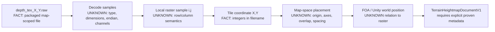
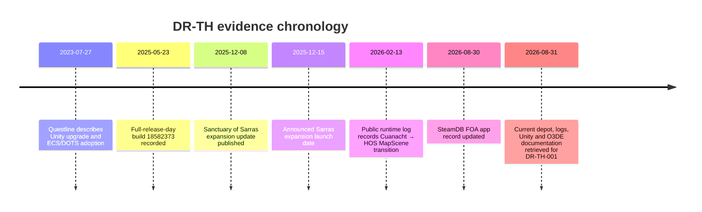

# FOA-SDK Vanilla Terrain Deep Research

**Research brief:** DR-TH-001  
**Research date:** 31 August 2026, Europe/London  
**Scope:** Public evidence only  
**Repository mutation:** **NOT_RUN**  
**Private installation inspection:** **NOT_RUN**  
**Commercial asset extraction/decompilation:** **NOT_RUN**

## Executive summary

### Executive conclusion

**`INSUFFICIENT_EVIDENCE`**

The research establishes with high confidence that current Fall of Avalon PC game data contains three discrete, tiled `.raw` collections under:

```text
Fall of Avalon_Data/
└── StreamingAssets/
    └── DepthTextures/
        ├── CampaignMap_Cuanacht/
        ├── CampaignMap_Forlorn/
        └── CampaignMap_HOS/
```

and that those collections contain **316 Cuanacht files, 399 Forlorn files and 148 HOS files** in the presently exposed depot listing. Those counts are high-confidence **INFERENCES** from the contiguous one-file-per-line manifest ranges, not explicit counts published by the developer. The files use the systematic name `depth_tex_X_Y.raw`, have sparse integer-pair inventories, and SteamDB displays every observed file as approximately `1.37 MiB`. citeturn21view0turn20view2turn19view3turn20view3

However, **no public evidence located establishes that these files are the authoritative terrain heightfield**. More importantly, no public evidence establishes their sample type, exact byte length, dimensions, endianness, channel layout, compression/header rules, vertical conversion, tile overlap, metre spacing, raster orientation or transformation from the filename's `X_Y` pair to Unity world coordinates. The `.raw` suffix and rounded `1.37 MiB` display size are insufficient to derive any of those facts. **[UNKNOWN]** citeturn21view0turn20view3

This is not merely a missing minor parameter. The game ships several parallel world-data systems: hashed Addressables bundles; per-map `PathfindingCache/CampaignMap_*.bytes`; and other streamed world data. The four `CampaignMap_*` identifiers, including Sarras, occur in the PathfindingCache, while the current `DepthTextures` block contains only Cuanacht, Forlorn and HOS. The current depot also contains an Addressables hierarchy with `AddressablesLink/link.xml` and many hashed `StandaloneWindows64/*.bundle` files. citeturn18view5turn24view1turn18view4

A public FOA log is particularly useful for **identity**, but not terrain decoding: it records `MapScene init 'CampaignMap_Cuanacht'`, later `Scene(CampaignMap_Cuanacht)`, then transitions to `MapScene init 'CampaignMap_HOS'` and `Scene(CampaignMap_HOS)`. That is direct public runtime evidence that at least Cuanacht and HOS are map-scene identifiers, rather than merely folder labels. It does **not** connect `DepthTextures` to the terrain implementation. **[FACT]** citeturn25view0

The game is publicly identified as Unity-based, and Questline has itself discussed moving the project to newer Unity versions and using ECS/DOTS. Unity's documentation establishes the generic Unity world coordinate system as left-handed, with +X right, +Y up and +Z forward. Unity also documents what would be available **if** the authoritative source were `TerrainData`: heightmap resolution, sample spacing, total terrain size and world-height APIs. But no public source found connects FOA's `depth_tex_X_Y.raw` files to `TerrainData`. Applying `TerrainData` semantics to them would therefore be a **HYPOTHESIS**, not a decoding specification. citeturn23search3turn22view2turn22view3turn22view4

Accordingly, the vanilla-importer decision is:

> **Recommendation D — Insufficient evidence. Do not implement a production FOA `DepthTextures` decoder or promote these files as the vanilla terrain source yet.**

This does **not** undermine the zero-configuration Highmap Importer design. It means the SDK should eventually own the unresolved format/provider contract rather than passing uncertainty to the user. The correct failure mode today is “vanilla terrain source not yet proven”, **not** a form asking the user for bit depth, byte order, dimensions, scale and transforms.

**Research status: PARTIAL.**  
**DepthTextures authoritative-terrain claim: UNKNOWN.**  
**Exact decoder: BLOCKED by missing public evidence.**  
**Exact world-space reconstruction: BLOCKED by missing public evidence.**

## Evidence base and vanilla-map inventory

The current public depot listing is important because it gives a direct inventory without inspecting the user's machine. SteamDB is not Valve or Questline—it explicitly describes itself as an unaffiliated hobby project—so its manifest presentation is **secondary evidence derived from Steam depot metadata**, rather than first-party developer documentation. Nevertheless, it exposes concrete current paths and filenames suitable for inventory claims. citeturn22view0

The release-day build record for **23 May 2025**, build `18582373`, confirms a concrete build at the time of the game's full release, although SteamDB says no official notes exist for that build beyond changed-file data. The present manifest now exposes the `DepthTextures` collections directly. citeturn22view0turn23search3

### Per-map source inventory

| Map/source-scoped key | Current `DepthTextures` presence | Tile inventory | Observed index bounding range | Topology | Other public world-data evidence | Classification |
|---|---:|---:|---|---|---|---|
| `CampaignMap_Cuanacht` | Yes | **316** files | X `0..25`; Y `0..16` | Sparse | `PathfindingCache/CampaignMap_Cuanacht.bytes`; public runtime log explicitly calls it a `MapScene` and `Scene` | **FACT** for paths/ranges; **INFERENCE** for calculated count |
| `CampaignMap_Forlorn` | Yes | **399** files | X `0..23`; Y `0..23` | Sparse | `PathfindingCache/CampaignMap_Forlorn.bytes` | **FACT** for paths/ranges; **INFERENCE** for calculated count |
| `CampaignMap_HOS` | Yes | **148** files | X `0..13`; Y `0..13` | Sparse | `PathfindingCache/CampaignMap_HOS.bytes`; public runtime log explicitly calls it a `MapScene` and `Scene` | **FACT** for paths/ranges; **INFERENCE** for calculated count |
| `CampaignMap_Sarras` | **No corresponding folder observed in current DepthTextures block** | `0` observed | N/A | N/A | `PathfindingCache/CampaignMap_Sarras.bytes`; Sarras expansion publicly announced for December 2025 | **FACT** for current manifest observation; terrain-source alternative **UNKNOWN** |

The Cuanacht directory begins at manifest line 135, its `.raw` entries occupy lines 136–451, and the Forlorn directory begins immediately after at line 452. Thus `451 - 136 + 1 = 316` Cuanacht files. The listing demonstrates `X=0` and `Y=16` at its start, `X=10,Y=0`, and later X values through at least `25`; because the displayed directory block is exhaustive and filename-sorted, its observed bounding range is `X=0..25`, `Y=0..16`. The missing combinations show that this is a sparse occupancy, not a full `26 × 17` rectangular tile set. **[FACT/INFERENCE]** citeturn21view0turn21view1turn20view2

Forlorn occupies manifest lines 453–851, yielding `399` files. Its listing reaches `X=23` before lexicographically returning to the `X=2` group, while `Y=0` is present in the `X=10` group and `Y=23` is present in `depth_tex_9_23.raw` and `depth_tex_11_23.raw`. Thus its observed bounding box is `0..23 × 0..23`, again with many unoccupied coordinates. **[FACT/INFERENCE]** citeturn20view2turn18view0turn20view1turn19view3

HOS occupies manifest lines 853–1000, yielding `148` files. The listing starts at `depth_tex_0_0.raw`; X reaches `13`, and Y reaches `13`, while line 1001 transitions to the unrelated `StreamingAssets/DrakeMR` folder. The HOS set is therefore also sparse inside its observed `0..13 × 0..13` bounding box. **[FACT/INFERENCE]** citeturn21view2turn21view3turn20view3

For Sarras, the important result is negative but specific: the current `DepthTextures` sequence ends after HOS and moves on to `DrakeMR`; no `CampaignMap_Sarras` DepthTextures directory appears there. Yet the same current depot contains pathfinding caches for **all four** keys, including `CampaignMap_Sarras.bytes`, and Questline's December 2025 update publicly announced the Sanctuary of Sarras expansion. Therefore Sarras clearly participates in FOA's broader map/world systems, but **its authoritative terrain source cannot be inferred from the absence of a DepthTextures directory**. **[FACT/UNKNOWN]** citeturn20view3turn18view5turn22view1

One useful numerical description of the sparsity, without attaching any world-space meaning to it, is:

| Collection | Bounding cells | Present files | Absent coordinate combinations | Occupancy |
|---|---:|---:|---:|---:|
| Cuanacht | `26 × 17 = 442` | 316 | 126 | 71.5% |
| Forlorn | `24 × 24 = 576` | 399 | 177 | 69.3% |
| HOS | `14 × 14 = 196` | 148 | 48 | 75.5% |

These percentages are mathematical **INFERENCES** from the manifest-derived bounds and counts. They prove only that the filename coordinate inventory is sparse; they do not prove whether absent coordinates mean ocean, unloaded terrain, no depth volume, no terrain tile, or something else. citeturn21view0turn20view1turn21view3

## Findings against the brief's research questions

### Source role

**Conclusion: `UNKNOWN`.**

**[FACT]** The files reside below a directory literally named `StreamingAssets/DepthTextures`, grouped by `CampaignMap_*` and named `depth_tex_X_Y.raw`. citeturn21view0turn19view3

**[FACT]** FOA also has substantial independent world-data systems. The current depot contains four map-keyed PathfindingCache files, and its `aa` directory contains `AddressablesLink/link.xml` plus a large number of hashed Windows Addressables bundles. citeturn18view5turn24view1turn18view4

**[FACT]** Questline has publicly stated that significant portions of the game use Unity ECS/DOTS. Public runtime logs also expose namespaces such as `Awaken.ECS.DrakeRenderer`, demonstrating that streamed/open-world runtime systems are not limited to ordinary `UnityEngine.Terrain` semantics. citeturn22view2turn25view0

**[UNKNOWN]** No public source found identifies the class, shader, component, ECS system or other consumer that reads `DepthTextures`. No public source says they are exported from `TerrainData`, collision heightfields, world geometry, navigation, water, occlusion, rendering, streaming, map rendering or another system.

Therefore the strongest claim warranted is:

> `DepthTextures` are a map-scoped tiled raw-data system. Their exact semantic role is unproven.

Calling them “heightmaps” because the directory contains the word “Depth” would be **unsupported inference**.

### Binary encoding

**Conclusion: no exact binary-format specification can presently be produced.**

| Binary property | Result | Classification | Basis |
|---|---|---|---|
| File suffix | `.raw` | **FACT** | Current depot filenames |
| SteamDB displayed size | `1.37 MiB` for observed tiles | **FACT** | Current depot presentation |
| Exact byte count | Unknown | **UNKNOWN** | `1.37 MiB` is a rounded display, not exact byte metadata exposed in the evidence used |
| Header presence/layout | Unknown | **UNKNOWN** | No bytes or format documentation |
| Compression | Unknown | **UNKNOWN** | No bytes or format documentation |
| Sample type | Unknown | **UNKNOWN** | Could not be established publicly |
| Bits per sample | Unknown | **UNKNOWN** | Could not be established publicly |
| Signedness | Unknown | **UNKNOWN** | Could not be established publicly |
| Endianness | Unknown | **UNKNOWN** | Could not be established publicly |
| Channel count/order | Unknown | **UNKNOWN** | Could not be established publicly |
| Width × height | Unknown | **UNKNOWN** | Could not be established publicly |
| Row-major/other ordering | Unknown | **UNKNOWN** | Could not be established publicly |
| Padding/alignment | Unknown | **UNKNOWN** | Could not be established publicly |
| Sentinel/NoData values | Unknown | **UNKNOWN** | Could not be established publicly |
| Normalisation | Unknown | **UNKNOWN** | Could not be established publicly |

The manifest supports the first two facts only. citeturn21view0turn20view3

It would be technically possible to construct attractive guesses by dividing an approximate 1.37 MiB by two or four bytes per sample and looking for near-square dimensions. That procedure is explicitly rejected here. Multiple sample encodings, dimensions, headers and row structures can fit an approximate display size, and the user explicitly required unspecified bytes to remain **UNKNOWN**.

There is therefore **no implementation-safe decoder pseudocode** beyond:

```text
open file
→ exact byte format UNKNOWN
→ stop
```

### Vertical mapping

**Conclusion: `UNKNOWN`.**

There is no public evidence establishing that a stored value in `depth_tex_X_Y.raw` is an elevation at all. Consequently none of these quantities can presently be populated:

```text
minHeightMetres
maxHeightMetres
verticalOffset
verticalScale
normalisation
seaLevelDatum
per-map vertical range
per-tile vertical range
```

The only correct FOA-specific formula is therefore symbolic:

\[
H_{\mathrm{FOA}} = F_{\mathrm{depth}}(s,\;map,\;tile,\;i,\;j)
\]

where \(F_{\mathrm{depth}}\) is **UNKNOWN**.

Unity's generic `TerrainData` API does show what a true Unity terrain source could provide: `heightmapScale.x` and `.z` are sample spacing, `heightmapScale.y` is the terrain's full height range, `size` is the terrain's total world size, and `GetHeight` returns terrain height in world-space units relative to the Terrain's position. **[FACT about Unity; not a fact about FOA DepthTextures.]** citeturn22view4

Thus the following is only a **HYPOTHESIS / conditional reconstruction path**, not a result of this research:

\[
H_\mathrm{world}
=
Y_\mathrm{TerrainTransform}
+
H_\mathrm{TerrainData}(i,j)
\]

**if and only if** a later evidence lane proves that FOA's authoritative source is Unity `TerrainData` or that the raw tiles are a lossless export of it. No such link was found.

### Horizontal and world mapping

**Conclusion: partially observable naming topology; physical mapping `UNKNOWN`.**

The filename grammar can be described exactly:

```text
depth_tex_<integer X>_<integer Y>.raw
```

within the three observed map-specific folders. **[FACT]** citeturn21view0turn20view1turn21view3

What cannot be established is what either integer means. In particular, there is no public evidence proving that:

```text
filename X == Unity world X tile
filename Y == Unity world Z tile
```

nor that either increases in the positive direction of a Unity axis. Tile physical size, local sample dimensions, edge overlap, world origin and raster row orientation are all unknown.

Accordingly an exact transformation such as

\[
X_w = X_0 + (X_t W + i)\Delta x
\]

\[
Z_w = Z_0 + (Y_t H + j)\Delta z
\]

cannot yet be instantiated. Every parameter and even the axis interpretation of \(X_t,Y_t\) remains unproven.



The diagram deliberately contains no fabricated scaling or axis arrows; the manifest proves the file and integer pair, not the arrows after them. citeturn21view0turn20view1

### Coordinate system

**Conclusion: generic engine coordinates are known; `DepthTextures` coordinate semantics are not.**

**[FACT]** FOA is publicly identified as a Unity title, and Questline's own development update discusses adopting newer Unity versions and implementing ECS/DOTS. citeturn23search3turn22view2

**[FACT]** Unity's official manual states that Unity uses a **left-handed** coordinate system with +X right, +Y up and +Z forward. citeturn22view3

**[UNKNOWN]** There is no evidence that the two filename coordinates, raw row/column axes or stored values are expressed directly in that Unity world basis. Therefore an FOA `sourceToCanonicalTransform` cannot safely be constructed merely from Unity's generic engine axes.

There is also a noteworthy **CONTRADICTED** upstream documentation issue on the O3DE side. O3DE's current Scene Format Support page says O3DE is **right-handed, Z-up**, with one metre as its base world unit. Its current Actors-tab page says O3DE is **left-handed, Z-up**. Both agree on Z-up and metre units, but they contradict one another on handedness. citeturn22view6turn22view7

For this FOA-SDK work that contradiction reinforces the correct architectural requirement: `TerrainHeightmapDocumentV1` should carry an explicit, reviewed source-to-canonical transformation rather than infer one from generic documentation.

**Coordinate-conversion specification presently supported:**

```text
Known source-engine world basis:
    Unity X = right
    Unity Y = up
    Unity Z = forward
    handedness = left-handed

DepthTextures raster → Unity world:
    UNKNOWN

FOA-SDK canonical basis:
    use repository's explicit canonical contract

DepthTextures → FOA-SDK matrix:
    UNKNOWN until raster→world relationship is proven
```

### Tile inventory

**Conclusion: `PASSED` for public package inventory; `FAILED` for world geometry inventory.**

The exact current inventory evidence is the per-map table above. All three tile sets are sparse. Sarras has no equivalent directory in the current `DepthTextures` block even though Sarras has a current `CampaignMap_Sarras.bytes` pathfinding cache. citeturn18view5turn20view3

The **total stitched raster dimensions** remain unknown because tile sample width/height and border-overlap semantics are unknown. Even if each set's filename bounding rectangle is known, calculating a raster width as `(maxX + 1) × guessedTileWidth` would be unjustified.

Likewise **world dimensions are unknown** because horizontal sample spacing and tile physical footprint are unknown.

### Relationship to other FOA world data

**Conclusion: coexistence is proven; semantic joins are unknown.**

**[FACT]** Current package data includes an Addressables structure:

```text
StreamingAssets/aa/
├── AddressablesLink/
│   └── link.xml
└── StandaloneWindows64/
    ├── <hash>.bundle
    ├── <hash>.bundle
    └── ...
```

citeturn24view1turn18view4

**[FACT]** Current package data also contains:

```text
StreamingAssets/PathfindingCache/
├── CampaignMap_Cuanacht.bytes
├── CampaignMap_Forlorn.bytes
├── CampaignMap_HOS.bytes
└── CampaignMap_Sarras.bytes
```

citeturn18view5

**[FACT]** Public FOA runtime logging exposes `Awaken.TG.Main.Scenes.SceneConstructors.MapScene`, `Awaken.ECS.DrakeRenderer`, save/load world restoration and the `CampaignMap_Cuanacht`/`CampaignMap_HOS` scene transition. citeturn25view0

**[UNKNOWN]** No public evidence discovered connects any Addressables bundle, pathfinding cache, Leshy/static data, ECS system or map scene to a particular `depth_tex_X_Y.raw` interpretation. It remains plausible that one of these data systems contains the missing origin, scale or terrain source, but that is a **HYPOTHESIS** requiring a different evidence lane.

### Map identity

**Conclusion: source-scoped identity is strong; exact universal/native identity remains map-dependent.**

For Cuanacht and HOS, a public runtime log makes the evidence unusually strong:

```text
MapScene init 'CampaignMap_Cuanacht'
Loaded: Scene(CampaignMap_Cuanacht)

MapScene init 'CampaignMap_HOS'
Loaded: Scene(CampaignMap_HOS)
```

The same log stack identifies `Awaken.TG.Main.Scenes.SceneConstructors.MapScene`. Therefore **`CampaignMap_Cuanacht` and `CampaignMap_HOS` are directly evidenced runtime map-scene identifiers. [FACT]** citeturn25view0

For Forlorn and Sarras, the current public package inventory proves `CampaignMap_Forlorn` and `CampaignMap_Sarras` as source-scoped map keys in the PathfindingCache, but this research did not locate equivalent runtime `MapScene init` evidence for them. Their exact identity role beyond those packaged systems should therefore remain **UNKNOWN rather than promoted by analogy**. citeturn18view5

The safe identity model is consequently:

```text
CampaignMap_Cuanacht
    runtime MapScene identity: FACT
    DepthTextures folder identity: FACT

CampaignMap_HOS
    runtime MapScene identity: FACT
    DepthTextures folder identity: FACT

CampaignMap_Forlorn
    DepthTextures folder identity: FACT
    PathfindingCache identity: FACT
    runtime MapScene role: UNKNOWN in this research

CampaignMap_Sarras
    PathfindingCache identity: FACT
    DepthTextures identity: NOT OBSERVED
    runtime MapScene role: UNKNOWN in this research
```

## Reconstruction contract and importer decision

### Exact binary-format specification

A production decoder specification cannot responsibly be produced from the public evidence. The exact specification obtained by this research is therefore a **negative specification** defining what is and is not established:

```text
FOA DepthTextures public binary contract

Container:
    raw file                                         FACT

Filename:
    depth_tex_<X>_<Y>.raw                            FACT

X:
    non-negative integer in observed current sets   FACT
    semantic axis                                   UNKNOWN

Y:
    non-negative integer in observed current sets   FACT
    semantic axis                                   UNKNOWN

Displayed size:
    approximately 1.37 MiB on SteamDB               FACT

Exact bytes:
    UNKNOWN

Header:
    UNKNOWN

Compression:
    UNKNOWN

Raster width:
    UNKNOWN

Raster height:
    UNKNOWN

Channels:
    UNKNOWN

Sample representation:
    UNKNOWN

Bits per sample:
    UNKNOWN

Signedness:
    UNKNOWN

Byte order:
    UNKNOWN

Storage order:
    UNKNOWN

Padding:
    UNKNOWN

Sentinel / missing-value encoding:
    UNKNOWN

Normalisation:
    UNKNOWN
```

The file-name and displayed-size facts derive directly from the current depot listing. citeturn21view0turn20view3

### Spatial reconstruction specification

The maximum defensible spatial specification is:

```text
map collection
    → sparse set S of integer filename pairs (X,Y)

Cuanacht:
    S ⊂ [0,25] × [0,16]
    |S| = 316

Forlorn:
    S ⊂ [0,23] × [0,23]
    |S| = 399

HOS:
    S ⊂ [0,13] × [0,13]
    |S| = 148

Sarras:
    no DepthTextures S observed in current depot
```

**[FACT/INFERENCE]** citeturn21view0turn20view1turn21view3

The following required reconstruction values remain **UNKNOWN**:

```text
tile sample width
tile sample height
tile horizontal world size
tile vertical/world-depth size
X/Y tile-axis meaning
world origin
coordinate sign
tile overlap/border duplication
row-zero orientation
sample-position convention
horizontal metres/sample
vertical metres/unit
missing-tile semantics
```

Therefore there is no valid equation from:

```text
(tile X, tile Y, sample i, sample j, stored value)
```

to:

```text
(Unity world X, Unity world Y, Unity world Z)
```

at present.

### Vertical conversion formula

The only FOA-specific formula supported is deliberately unresolved:

\[
h_\mathrm{world} = F_\mathrm{unknown}(s)
\]

or, allowing possible tile/map-specific parameters:

\[
h_\mathrm{world}
=
F_\mathrm{unknown}
(s,\;X_t,\;Y_t,\;map)
\]

**[UNKNOWN].**

Unity's documented `TerrainData` model provides a useful **future validation target**, because true `TerrainData` exposes heightmap resolution, horizontal sample spacing, total size and world-space height APIs. It is not evidence that FOA's DepthTextures use those values. citeturn22view4

### Vanilla-importer recommendation

**D — Insufficient evidence.**

Do **not**:

```text
DepthTextures/*.raw
        ↓
assume U16
        ↓
guess square resolution
        ↓
guess little-endian
        ↓
guess Unity X/Z tile layout
        ↓
ask user for min/max height
        ↓
publish terrain revision
```

That would turn unsupported hypotheses into persisted SDK data.

The correct eventual architecture remains:

```text
Edit Vanilla Map
       ↓
FOA vanilla source provider
       ↓
identify authoritative source
       ↓
versioned format recogniser
       ↓
deterministic decoder
       ↓
deterministic spatial/vertical mapping
       ↓
TerrainHeightmapDocumentV1
       ↓
workspace-owned editable revision
```

At present, the provider must fail closed before the decoder step because the authoritative source and decoding contract are not proven.

This outcome is compatible with the desired zero-configuration UX: uncertainty belongs in research/provider implementation, **not in user-facing prompts**.

## FOA-SDK field-resolution matrix

The matrix below maps the fields required by the brief to what can actually be inferred for a vanilla `DepthTextures` route today. “Yes” means deterministically derivable without technical user input; “No” means the source-specific value cannot currently be justified from public evidence.

| `TerrainHeightmapDocumentV1` field | Can SDK infer it now? | Resolution / evidence source | Confidence | Classification |
|---|---|---|---|---|
| `mapId` | **Partial** | `CampaignMap_Cuanacht` and `CampaignMap_HOS` have direct runtime MapScene evidence; Forlorn/Sarras have packaged source-scoped keys. Exact SDK/native-ID promotion remains policy-dependent. citeturn25view0turn18view5 | High for source-scoped refs | **FACT / UNKNOWN** |
| `displayName` | **Yes, from catalogue** | Not encoded by raw tiles; should come from SDK catalogue rather than binary interpretation. | High as SDK responsibility | **CATALOG_DERIVED** |
| `sourceKind` | **No, semantically** | Path is `DepthTextures/*.raw`, but whether the source kind is “terrain height”, derived depth, or another format is unknown. citeturn21view0 | High that unresolved | **UNKNOWN** |
| `sourceObjectIdentifier` | **Yes, source-scoped** | Map folder + filename pair are deterministic public locators. citeturn21view0 | High | **SOURCE_DERIVED** |
| `width` | **No** | No public format metadata or exact bytes. | High | **UNKNOWN** |
| `height` | **No** | No public format metadata or exact bytes. | High | **UNKNOWN** |
| `bitsPerSample` | **No** | `.raw` does not define sample precision. | High | **UNKNOWN** |
| `byteOrder` | **No** | No public evidence. | High | **UNKNOWN** |
| `sampleSpacingXMetres` | **No** | No proven filename-to-world or sample-to-world mapping. | High | **UNKNOWN** |
| `sampleSpacingYMetres` | **No** | No proven filename-to-world or sample-to-world mapping. | High | **UNKNOWN** |
| `minHeightMetres` | **No** | Depth value semantics and terrain datum unknown. | High | **UNKNOWN** |
| `maxHeightMetres` | **No** | Depth value semantics and terrain datum unknown. | High | **UNKNOWN** |
| `handedness` | **No for the raster source** | Unity world is generically left-handed, but raw tile coordinate semantics are unproven. citeturn22view3 | High | **FACT for Unity / UNKNOWN for DepthTextures** |
| `upAxis` | **No for the raster source** | Unity world uses +Y up, but no public evidence maps raw dimensions/value to Unity axes. citeturn22view3 | High | **FACT for Unity / UNKNOWN for source** |
| `forwardAxis` | **No for the raster source** | Unity world uses +Z forward; raw tile axis mapping unknown. citeturn22view3 | High | **FACT for Unity / UNKNOWN for source** |
| `rowZeroOrientation` | **No** | No raster-format documentation or byte inspection. | High | **UNKNOWN** |
| `samplePosition` | **No** | Grid vertex vs cell centre not established. | High | **UNKNOWN** |
| `sourceToCanonicalTransform` | **No** | Requires raw→world axis/origin proof; additionally current O3DE docs contradict one another on handedness. citeturn22view6turn22view7 | High | **UNKNOWN / CONTRADICTED upstream** |
| Canonical tile IDs | **Yes after decoding contract exists** | Filename pairs provide deterministic source coordinates, but canonical terrain placement cannot yet be assigned. citeturn21view0 | Medium | **PARTIAL** |
| Source provenance/hash | **Yes once source is lawfully available to provider** | Path identity is public; actual content hashing would require access to source bytes and was outside this public-evidence pass. | High | **DETERMINISTIC AT IMPORT TIME** |
| `ProfileBinding` | **Yes from active SDK profile** | Not a raw-file property; provider/runtime responsibility. | High | **PROFILE_DERIVED** |
| Revision lineage | **Yes** | SDK-generated workflow metadata; not FOA-format dependent. | High | **SDK_DERIVED** |
| Authority state | **Yes** | SDK policy/workspace state; not FOA-format dependent. | High | **SDK_DERIVED** |

The critical pattern is clear: **identity and workflow metadata are largely automatable now; physical interpretation of the raw terrain candidate is not.** Nothing in the unresolved column should become a normal user-entered form.

O3DE's own terrain requirements explain why those unknowns matter. Its Terrain World component defines minimum/maximum terrain height and a Height Query Resolution measured as the distance between height sample positions in metres; its documentation also states that the renderer quantises terrain height to 16-bit values over the selected min/max range. Thus an importer cannot correctly project unknown FOA samples merely by loading “some raw image”. citeturn22view5

## Evidence register, chronology and unresolved proof

### Evidence register

| Claim ID | Exact supported claim | Source URL | Publisher / origin | Source date | Retrieval date | Evidence type | Confidence |
|---|---|---|---|---|---|---|---|
| `DEPOT-CURRENT` | Current depot exposes `StreamingAssets/DepthTextures/CampaignMap_Cuanacht`, `CampaignMap_Forlorn`, `CampaignMap_HOS` and their `depth_tex_X_Y.raw` files. citeturn21view0turn20view2turn19view3 | `https://steamdb.info/depot/1466062/apps/` | SteamDB presentation of Steam depot metadata | Current state; app record updated 30 Aug 2026 | 31 Aug 2026 | Public depot-manifest mirror | High |
| `DEPOT-COUNT-C` | Cuanacht's contiguous manifest block contains 316 raw entries. citeturn21view0turn20view2 | `https://steamdb.info/depot/1466062/apps/` | SteamDB | Current | 31 Aug 2026 | Manifest-derived inference | High |
| `DEPOT-COUNT-F` | Forlorn's contiguous block contains 399 raw entries and reaches X=23/Y=23. citeturn20view1turn19view3 | `https://steamdb.info/depot/1466062/apps/` | SteamDB | Current | 31 Aug 2026 | Manifest + arithmetic | High |
| `DEPOT-COUNT-H` | HOS's contiguous block contains 148 raw entries, reaches X=13/Y=13, and is followed by `DrakeMR`. citeturn21view3turn20view3 | `https://steamdb.info/depot/1466062/apps/` | SteamDB | Current | 31 Aug 2026 | Manifest + arithmetic | High |
| `DEPOT-SARRAS` | No `CampaignMap_Sarras` directory is observed in the current DepthTextures block; Sarras does have a PathfindingCache entry. citeturn20view3turn18view5 | `https://steamdb.info/depot/1466062/apps/` | SteamDB | Current | 31 Aug 2026 | Manifest observation | High |
| `PATH-MAPS` | Current depot contains pathfinding caches for Cuanacht, Forlorn, HOS and Sarras under the same `CampaignMap_*` naming family. citeturn18view5 | `https://steamdb.info/depot/1466062/apps/` | SteamDB | Current | 31 Aug 2026 | Public manifest | High |
| `ADDR-001` | Current depot contains `StreamingAssets/aa/AddressablesLink/link.xml` and hashed `StandaloneWindows64/*.bundle` files. citeturn24view1turn18view4 | `https://steamdb.info/depot/1466062/apps/` | SteamDB | Current | 31 Aug 2026 | Public manifest | High |
| `BUILD-RELEASE` | Build 18582373 is dated 23 May 2025; SteamDB says no official patch notes exist besides changed files for that build. citeturn22view0 | `https://steamdb.info/patchnotes/18582373/` | SteamDB | 23 May 2025 | 31 Aug 2026 | Build-history metadata | High |
| `SARRAS-ANNOUNCE` | Questline/Awaken Realms' published update announced Sanctuary of Sarras for 15 December 2025. citeturn22view1 | `https://steamdb.info/patchnotes/21099119/` | Questline/Awaken Realms notes mirrored by SteamDB | 8 Dec 2025 | 31 Aug 2026 | First-party update text via mirror | High |
| `ENGINE-001` | FOA is identified as using Unity; SteamDB additionally detects Unity Entities/Burst/IL2CPP technology. citeturn23search3 | `https://steamdb.info/app/1466060/patchnotes/` | SteamDB technology metadata | Record updated 30 Aug 2026 | 31 Aug 2026 | Technology metadata | High |
| `ENGINE-002` | Questline publicly said a significant part of FOA runs on Unity ECS/DOTS. citeturn22view2 | `https://steamdb.info/patchnotes/11804901/` | Questline/Awaken Realms update text via SteamDB | 27 Jul 2023 | 31 Aug 2026 | First-party development statement via mirror | High |
| `MAPSCENE-001` | Public FOA game log records `MapScene init 'CampaignMap_Cuanacht'`, `Scene(CampaignMap_Cuanacht)`, and equivalent HOS map-scene events. citeturn25view0 | `https://steamcommunity.com/app/1466060/discussions/3/824857476142790518/` | Steam Community user-posted FOA runtime log | Runtime timestamps 13 Feb 2026 | 31 Aug 2026 | Public runtime log | High for logged strings; medium provenance |
| `UNITY-COORD` | Unity documents a left-handed basis: +X right, +Y up, +Z forward. citeturn22view3 | `https://docs.unity3d.com/2021.3/Documentation/Manual/QuaternionAndEulerRotationsInUnity.html` | Unity Technologies | Unity 2021.3 documentation | 31 Aug 2026 | Primary technical documentation | High |
| `UNITY-TERRAIN` | `TerrainData` stores heightmaps; its heightmapScale gives sample spacing and height range, and `GetHeight` provides a world-unit height relative to terrain position. citeturn22view4 | `https://docs.unity3d.com/6000.5/Documentation/ScriptReference/TerrainData.html` | Unity Technologies | Unity 6000.5 documentation | 31 Aug 2026 | Primary technical documentation | High |
| `O3DE-TERRAIN` | O3DE Terrain World uses min/max height and a height-sample query resolution measured in metres. citeturn22view5 | `https://docs.o3de.org/docs/user-guide/components/reference/terrain/world/` | Open 3D Engine Contributors | Current 2026 docs | 31 Aug 2026 | Primary technical documentation | High |
| `O3DE-COORD-R` | O3DE Scene Format Support says O3DE is right-handed, Z-up, with one metre per base world unit. citeturn22view6 | `https://docs.o3de.org/docs/user-guide/assets/scene-settings/scene-format-support/` | Open 3D Engine Contributors | Current documentation | 31 Aug 2026 | Primary technical documentation | High for what page says |
| `O3DE-COORD-L` | O3DE Actors documentation instead says O3DE is left-handed, Z-up. citeturn22view7 | `https://docs.o3de.org/docs/user-guide/assets/scene-settings/actors-tab/` | Open 3D Engine Contributors | Current documentation | 31 Aug 2026 | Primary technical documentation | High for contradiction |

The evidence chronology is:



The dated events are supported by the corresponding build/update, runtime-log and app-record evidence above. citeturn22view2turn22view0turn22view1turn25view0turn23search3

### Unknowns and required follow-up

The central unanswered claim remains:

> **Are `StreamingAssets/DepthTextures/CampaignMap_*/depth_tex_X_Y.raw` files terrain geometry data at all, and if so what runtime code/metadata defines their interpretation?**

The following proof is still required before the route can be locked:

| Required proof | Current state | Why it blocks implementation |
|---|---|---|
| Producer/consumer of `DepthTextures` | **UNKNOWN** | Cannot establish semantic role |
| Exact file byte length | **UNKNOWN** | Rounded public size cannot define format |
| Sample representation and bit depth | **UNKNOWN** | Cannot decode values |
| Endianness | **UNKNOWN** | Cannot decode multi-byte samples |
| Tile raster width/height | **UNKNOWN** | Cannot construct grid |
| Header/compression/padding | **UNKNOWN** | Cannot parse file safely |
| X/Y filename semantics | **UNKNOWN** | Cannot place tile |
| Edge overlap / duplication | **UNKNOWN** | Cannot stitch tiles correctly |
| Horizontal spacing | **UNKNOWN** | Cannot produce metric terrain |
| World/map origin | **UNKNOWN** | Cannot preserve FOA placement |
| Vertical scale and offset | **UNKNOWN** | Cannot reconstruct elevation |
| Stored-value semantics | **UNKNOWN** | “depth” may not equal elevation |
| Raster row orientation | **UNKNOWN** | Terrain could be mirrored/flipped |
| Grid sample semantics | **UNKNOWN** | Vertex vs cell-centre matters |
| Sarras equivalent source | **UNKNOWN** | Three-map mechanism is not universal |
| Link to Unity `TerrainData` | **UNKNOWN** | Generic Unity terrain rules cannot yet be applied |
| Link to Addressables/world-streaming metadata | **UNKNOWN** | Possible metadata/source route remains unproven |
| Exact source→FOA-SDK transform | **UNKNOWN** | Depends on unresolved source axes and world mapping |

No public evidence found in this research establishes these properties. The searches did, however, find strong package, runtime-identity and engine-level evidence, which is why the result is **PARTIAL rather than FAILED**. citeturn21view0turn25view0turn22view3turn22view4

The most important architectural conclusion is therefore:

> **[FACT]** FOA-SDK can already deterministically catalogue the existence and source-scoped identity of the Cuanacht, Forlorn and HOS DepthTextures collections from public package structure, and can strongly bind Cuanacht/HOS to runtime MapScene identities. citeturn18view5turn25view0  
> **[UNKNOWN]** It cannot yet interpret those collections as terrain.  
> **[HYPOTHESIS]** The missing proof may reside in the game's public-observable runtime/type metadata or in metadata associated with its Addressables/world-streaming systems, but that was not established by DR-TH-001.  
> **[DECISION]** `INSUFFICIENT_EVIDENCE`; **Importer recommendation D**; do not guess, do not ask the end user to supply the unknown technical fields, and do not promote `DepthTextures` to authoritative vanilla heightmaps until the source role and complete reconstruction contract are proven.
