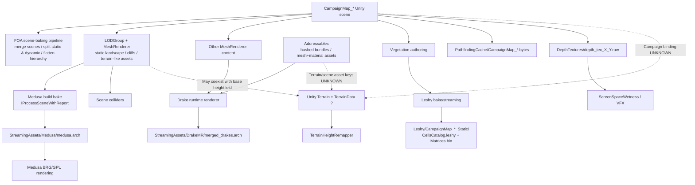
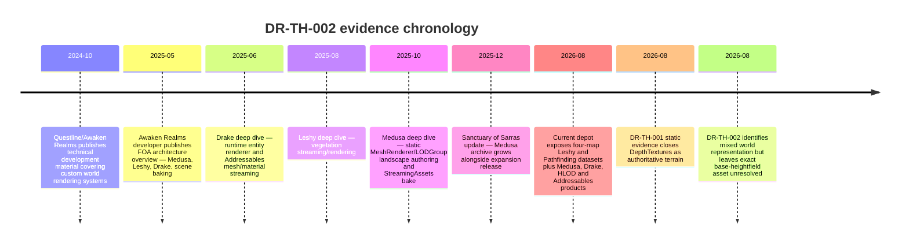

# FOA-SDK Campaign Terrain Deep Research

**Research brief:** `DR-TH-002`  
**Research date:** 31 August 2026, Europe/London  
**Scope:** public evidence plus the accepted static/decompilation evidence supplied in DR-TH-001  
**Repository mutation:** `NOT_RUN`  
**Live game/runtime validation:** `NOT_RUN`  
**Private installation inspection:** `NOT_RUN`  
**Commercial scene/bundle extraction:** `NOT_RUN`

## Executive conclusion

### Primary classification

**`MIXED_REPRESENTATION`**

### Highmap-specific conclusion

**Authoritative editable heightfield source: `INSUFFICIENT_EVIDENCE`**

### Research disposition

**`DR-TH-002: PARTIAL`**

The new evidence substantially narrows Fall of Avalon's world-authoring architecture, but it does **not yet identify a deterministic heightmap/TerrainData source object for any of the four campaign maps**.

The strongest public first-party developer evidence says Fall of Avalon's final technology stack contains several independent world systems: **Medusa** for static environment assets “like cliffs and terrains”, **Leshy** for vegetation, **Drake** for runtime ECS rendering, **HLODs**, Addressables, and a **scene-baking system** that merges scenes and then separates dynamic from static content. The developer who published the technical series identifies himself as a Unity/Unreal developer at Awaken Realms. **[FACT — FIRST-PARTY DEVELOPER]** citeturn18search0turn19search2

Medusa is the most important discovery for DR-TH-002. Its dedicated technical write-up says its authoring inputs are ordinary Unity `LODGroup` + `MeshRenderer` objects, manually placed by level designers. At scene processing time, Medusa bakes those objects into an optimised data structure using Unity's `IProcessSceneWithReport`; that data is written separately under `StreamingAssets` and loaded using `AsyncReadManager`. Colliders remain ordinary scene-side colliders. Medusa is explicitly described as a system for fully static meshes, initially cliffs, while the author's broader FOA architecture description explicitly includes **terrains** among the static environment assets handled by Medusa. **[FACT — FIRST-PARTY DEVELOPER]** citeturn21search0turn18search0

That means the following relationship is now strongly evidenced:

```text
level-designer Unity scene objects
        │
        │ LODGroup + MeshRenderer
        ▼
static landscape / cliff / terrain-like geometry
        │
        │ IProcessSceneWithReport
        ▼
Medusa bake
        │
        ▼
StreamingAssets / Medusa runtime data
        │
        ▼
GPU rendering
```

The **runtime Medusa product is not the authoring source**. It is a build-time derivative of scene-authored mesh geometry. Medusa's own author states that its runtime data is immutable for the scene and does not support modification. **[FACT — FIRST-PARTY DEVELOPER]** citeturn21search0

At the same time, the accepted static evidence from `TG.Main(3).dll` proves that FOA's codebase also contains `Awaken.TG.EditorOnly.TerrainHeightRemapper`, which directly accesses:

```text
Terrain.transform.position.y
Terrain.terrainData.size.y
```

**[FACT — STATIC ASSEMBLY, supplied DR-TH-001 evidence]**

This is genuine evidence that `UnityEngine.Terrain` / `TerrainData` participates somewhere in FOA's development/codebase. Unity documents `TerrainData` as the structure containing terrain heightmaps and exposes the resolution, terrain size and per-sample scale needed for deterministic reconstruction. **[FACT — OFFICIAL ENGINE DOCUMENTATION]** citeturn25search4turn35search11

But the missing link is critical:

> **No public/static evidence obtained in DR-TH-002 binds a `CampaignMap_*` scene to a specific `Terrain` or `TerrainData` object.**

Therefore it would still be an unsupported leap to conclude:

```text
CampaignMap_Cuanacht
        ↓
Unity TerrainData
        ↓
known heightmap
```

Likewise, Medusa proves that terrain-like landscape geometry can be mesh-authored, but it does not prove that **every point of the walkable base ground** in HOS, Cuanacht, Forlorn or Sarras is represented by Medusa meshes.

The most defensible model is therefore:

```text
FOA CampaignMap
│
├── static mesh landscape / cliffs / some "terrains"
│      Unity MeshRenderer/LODGroup authoring
│                ↓
│             Medusa
│
├── other ordinary / ECS-rendered scene meshes
│                ↓
│              Drake
│
├── vegetation
│                ↓
│              Leshy
│
├── navigation
│                ↓
│       PathfindingCache
│
├── wetness/VFX top-down depth
│                ↓
│          DepthTextures
│
├── HLOD representations
│
└── Unity Terrain/TerrainData
       proven to exist somewhere in codebase
       CampaignMap binding UNKNOWN
```

That is why the result is **`MIXED_REPRESENTATION` rather than `MESH_WORLD_AUTHORITATIVE` or `UNITY_TERRAINDATA_AUTHORITATIVE`**.

For the Highmap Importer specifically, **production vanilla reconstruction remains blocked**. The SDK still lacks the exact authoritative source object, source dimensions/resolution, world bounds, height range and per-map topology needed by `TerrainHeightmapDocumentV1`. FOA-SDK itself explicitly requires those values rather than allowing them to be guessed. fileciteturn5file0L2-L2 fileciteturn6file0L2-L2

## World-source architecture established by the research

### DepthTextures are closed as the terrain-source route

The accepted DR-TH-001 static report remains the starting baseline.

`TG.Main(3).dll` establishes this exact chain:

```text
Awaken.TG.Graphics.PrecipitationController.Update()
    ↓
Awaken.TG.Graphics.VFX.TopDownDepthTexturesLoadingManager
    ↓
StreamingAssets/DepthTextures/<scene>/depth_tex_X_Y.raw
    ↓
Awaken.Utility.Files.FileRead.ToNewBufferAsync<byte>()
    ↓
ComputeBuffer
    ↓
wetnessTexturesArrayDataSetShader
    ↓
four-layer RenderTexture
    ↓
Awaken.TG.Graphics.VFX.ScreenSpaceWetness
    +
Awaken.TG.Graphics.VFX.Binders.VFXTopDownDepthBinder
```

**[FACT — STATIC ASSEMBLY]**

No terrain-writing API exists in that chain. The files are a top-down wetness/VFX representation. Their producer may have sampled world geometry, but their consumer contract proves they are **derived rendering support**, not the authoritative terrain source.

`TopDownDepthTextureBaker` survives only as a stub in the supplied player assembly, so its original geometry inputs remain **UNKNOWN — STATIC ASSEMBLY**.

This removes all of the earlier temptation to make:

```text
depth_tex_X_Y.raw
```

the vanilla Highmap Importer's source.

### Medusa is the strongest landscape-source lead

The developer's system overview defines Medusa as a custom system for static environment assets including **cliffs and terrains**. **[FACT — FIRST-PARTY DEVELOPER]** citeturn18search0

The dedicated Medusa article then supplies the actual authoring/runtime contract. Medusa was originally built for cliffs and evolved into a highly specialised renderer for always-visible, completely static meshes. Its source objects remain ordinary Unity rendering primitives, specifically `LODGroup` and `MeshRenderer`, so level designers can continue manually authoring them. During Unity scene processing, the objects are transformed into a separate optimised file; meshes and materials remain referenced, while colliders are left intact in the scene. **[FACT — FIRST-PARTY DEVELOPER]** citeturn21search0

The current public depot manifest independently exposes:

```text
Fall of Avalon_Data/
└── StreamingAssets/
    └── Medusa/
        └── medusa.arch
```

with the current manifest showing `medusa.arch` at approximately `10.20 MiB`. **[FACT — PUBLIC PACKAGE METADATA, secondary Steam mirror]** citeturn34view3

This produces an important source-versus-product distinction:

| Layer | Evidence state | Role |
|---|---|---|
| Unity `LODGroup` + `MeshRenderer` objects | **FACT — developer evidence** | Medusa authoring input |
| Unity object transforms | **FACT generically; specific campaign values UNKNOWN** | Authoritative placement before bake |
| Mesh assets | **FACT — Medusa directly references meshes** | Geometry |
| Material assets | **FACT — Medusa directly references materials** | Rendering |
| Scene colliders | **FACT — developer evidence** | Physical geometry preserved separately |
| `medusa.arch` | **FACT — developer + package evidence** | Optimised runtime rendering derivative |
| `medusa.arch` as editable highmap | **CONTRADICTED** | Not an authoring terrain document |
| Per-map Medusa object inventory | **UNKNOWN** | Archive/index has not been inspected |
| Whether all base ground uses Medusa meshes | **UNKNOWN** | Not established by available evidence |

The most significant remaining ambiguity is the word **“terrains”** in the developer's system overview. Because the dedicated Medusa article establishes mesh-based authoring, it is strong evidence that at least some FOA landscape assets described internally as terrain are **mesh geometry rather than Unity heightfields**. It does not prove that all continuous campaign ground is mesh-only. **[INFERENCE — FIRST-PARTY DEVELOPER]** citeturn18search0turn21search0

### Leshy can be ruled out as terrain authority

The FOA developer describes Leshy as the game's custom **vegetation streaming and rendering** system; his Unity Discussions post likewise describes the article specifically as a vegetation-streaming/rendering implementation built around `BatchRendererGroup`. **[FACT — FIRST-PARTY DEVELOPER]** citeturn18search0turn27search2

The public depot contains a very useful per-map identity structure:

```text
StreamingAssets/Leshy/
├── CampaignMap_Cuanacht_Static/
│   ├── CellsCatalog.leshy
│   └── Matrices.bin
├── CampaignMap_Forlorn_Static/
│   ├── CellsCatalog.leshy
│   └── Matrices.bin
├── CampaignMap_HOS_Static/
│   ├── CellsCatalog.leshy
│   └── Matrices.bin
└── CampaignMap_Sarras_Static/
    ├── CellsCatalog.leshy
    └── Matrices.bin
```

All four currently exist. Their manifest sizes differ substantially; for example Cuanacht's `Matrices.bin` is about `20.89 MiB`, HOS about `10.86 MiB`, Sarras about `10.11 MiB`, while Forlorn is about `1.88 MiB`. **[FACT — PUBLIC PACKAGE METADATA]** citeturn34view0turn34view1turn34view2

Those files are highly useful as **per-map source-scoped identity evidence**, but the developer evidence identifies Leshy's semantic domain as vegetation, not ground elevation. **[FACT — FIRST-PARTY DEVELOPER + PUBLIC PACKAGE METADATA]** citeturn27search2turn34view0

Therefore:

```text
Leshy → vanilla terrain/highmap
```

is **FAILED**.

### Drake and HLOD are rendering derivatives, not heightfield authority

A FOA developer describes Drake as a runtime entity-rendering system that streams meshes and materials through Addressables. **[FACT — FIRST-PARTY DEVELOPER]** citeturn27search3

The current public manifest contains:

```text
StreamingAssets/
├── DrakeMR/
│   └── merged_drakes.arch
├── EntityScenes/
│   └── scene_info.bin
└── HLODs/
    └── hlods.arch
```

with the current `merged_drakes.arch` shown at about `10.76 MiB`, `scene_info.bin` at `196 B`, and `hlods.arch` at about `41.73 MiB`. **[FACT — PUBLIC PACKAGE METADATA]** citeturn34view5turn34view0

The supplied static inspection of `HLOD.dll` also found the exact runtime path construction around:

```text
Unity.HLODSystem.Streaming.HLODLoadManager.InitEntitiesData()

StreamingAssets/HLODs/hlods.arch
```

and no static `TerrainData`, heightmap or `DepthTextures` dependency. **[FACT — STATIC ASSEMBLY]**

These systems may render or simplify geometry whose original authoring source was terrain or mesh, but their runtime products are not, on current evidence, editable terrain authority.

### Addressables are probably part of the missing source graph, but exact terrain keys are unknown

The current depot contains:

```text
StreamingAssets/aa/
├── AddressablesLink/
│   └── link.xml
└── StandaloneWindows64/
    ├── 001a039e07d15454a81665f9b566f9ad.bundle
    ├── ...
    └── many other hash-named .bundle files
```

**[FACT — PUBLIC PACKAGE METADATA]** citeturn37view0turn37view1

The manifest search did **not** expose plain paths named `catalog.json` or `settings.json`; that is an observation about this manifest presentation, not proof that no Addressables catalogue information exists internally. **[FACT — PUBLIC PACKAGE METADATA / limitation noted]** citeturn37view2turn37view3

The developer's Drake description independently establishes that FOA uses Addressables to stream meshes and materials. **[FACT — FIRST-PARTY DEVELOPER]** citeturn27search3

Therefore the following remains plausible:

```text
CampaignMap scene
      ↓
mesh/TerrainData references
      ↓
Addressables dependency/key
      ↓
bundle asset
```

but the **exact Addressables key, GUID, bundle hash and object ID for terrain are all `UNKNOWN`**.

### Unity TerrainData remains a serious but unbound candidate

The supplied static assembly report found:

```text
Awaken.TG.EditorOnly.TerrainHeightRemapper
```

and exact accesses to:

```csharp
Terrain.transform.position.y
Terrain.terrainData.size.y
```

**[FACT — STATIC ASSEMBLY]**

This is stronger than simply saying “FOA is a Unity game”: it demonstrates project-specific code deliberately operating on Unity `Terrain` / `TerrainData`.

Unity's own API documentation states that `TerrainData` stores heightmaps and that the `Terrain` component renders that data. The API exposes `heightmapResolution`, `heightmapScale`, total `size` and height queries—precisely the family of metadata FOA-SDK would need if a campaign-map TerrainData asset can be identified. **[FACT — OFFICIAL UNITY DOCUMENTATION]** citeturn25search4turn35search6turn35search11

There is one further supporting development-tool lead: the supplied `MeshToTerrain(1).dll` identifies Infinity Code's Mesh To Terrain package, while the package's official documentation says the tool converts 3D terrain models into Unity Terrains and can split models into multiple Terrain objects. **[FACT about the third-party tool; FOA usage UNKNOWN]** citeturn35search2turn35search5

However, the supplied DLL itself contains only helper/documentation stubs and does not contain the actual conversion implementation. **[FACT — STATIC ASSEMBLY]**

The evidence therefore supports:

> **[HYPOTHESIS]** FOA's authoring workflow may have used mesh-authored landscape data and Unity Terrain objects together, possibly including mesh→Terrain conversion for some content.

It does **not** support:

> **[FACT]** CampaignMap terrain is stored as Unity TerrainData.

That claim remains blocked.

## Per-map authoritative-source assessment

The public package structure demonstrates that all four campaign regions participate in multiple map-scoped systems. Current Leshy and pathfinding data exist for every map:

```text
CampaignMap_Cuanacht
CampaignMap_Forlorn
CampaignMap_HOS
CampaignMap_Sarras
```

The current `PathfindingCache` contains correspondingly named files of roughly `37.81 MiB`, `54.63 MiB`, `34.55 MiB`, and `52.12 MiB`, respectively. These are map-associated navigation products, not demonstrated terrain sources. **[FACT — PUBLIC PACKAGE METADATA]** citeturn34view3turn34view4

### Per-map source summary

| Map | Established map-scoped evidence | Strongest terrain/world-source candidate | Exact authoritative terrain source | Classification | Highmap readiness |
|---|---|---|---|---|---|
| **Horns of the South / `CampaignMap_HOS`** | `CampaignMap_HOS_Static` Leshy data; `CampaignMap_HOS.bytes` pathfinding; accepted DR-TH-001 runtime MapScene evidence; DepthTextures VFX collection | Scene-authored static landscape meshes processed by Medusa **plus possible Unity TerrainData** | **UNKNOWN** | `MIXED_REPRESENTATION` | **BLOCKED** |
| **Cuanacht / `CampaignMap_Cuanacht`** | `CampaignMap_Cuanacht_Static` Leshy data; `CampaignMap_Cuanacht.bytes`; accepted runtime MapScene evidence; DepthTextures VFX collection | Scene-authored Medusa landscape meshes **plus possible Unity TerrainData** | **UNKNOWN** | `MIXED_REPRESENTATION` | **BLOCKED** |
| **Forlorn Swords / `CampaignMap_Forlorn`** | `CampaignMap_Forlorn_Static`; `CampaignMap_Forlorn.bytes`; DepthTextures collection | Scene-authored Medusa landscape meshes **plus possible Unity TerrainData** | **UNKNOWN** | `MIXED_REPRESENTATION` | **BLOCKED** |
| **Sanctuary of Sarras / `CampaignMap_Sarras`** | `CampaignMap_Sarras_Static`; `CampaignMap_Sarras.bytes`; no current DepthTextures collection observed | Scene-authored Medusa landscape meshes **plus possible Unity TerrainData** | **UNKNOWN** | `MIXED_REPRESENTATION` | **BLOCKED** |

The package evidence for all four Leshy and Pathfinding identities is direct. citeturn34view0turn34view2turn34view3 The Medusa association is currently **system-level rather than per-object/per-map proof**: the public manifest exposes one global `medusa.arch`, not `CampaignMap_HOS.medusa` and so on. The developer evidence says that Medusa processes static environment meshes including terrain-like assets, but its internal archive index has not been inspected. citeturn18search0turn21search0turn34view3

Sarras adds one useful correlation. The 8 December 2025 update associated with the Sanctuary of Sarras expansion increased `StreamingAssets/Medusa/medusa.arch` by about `836.27 KiB`. **[FACT — PUBLIC PACKAGE CHANGE METADATA]** citeturn35search1

It is reasonable to infer that at least some new static environment data associated with that release entered Medusa, but because that update also contained other patch content, assigning the entire archive delta specifically to Sarras terrain would be unsupported. **[INFERENCE — MEDIUM CONFIDENCE]** citeturn35search1

### Source identity is ahead of source geometry

For all four maps, FOA-SDK can already maintain a catalogue entry without falsely claiming an exact terrain asset:

```text
displayName:
    Cuanacht

sourceScopedRefs:
    CampaignMap_Cuanacht
    Leshy/CampaignMap_Cuanacht_Static
    PathfindingCache/CampaignMap_Cuanacht.bytes

authoritativeTerrainRef:
    UNKNOWN
```

That structure fits the repository's existing `CatalogRecord` model, which deliberately separates `displayName`, aliases, source-scoped references and `nativeRefExact`. fileciteturn7file0L2-L2

This is important because **map identity is not the current blocker anymore**. The blocker is the identity of the actual terrain object/geometry within that map.

## Source relationships and reconstruction fitness

The combined evidence supports the following model. Solid lines represent evidenced relationships; dotted lines represent unresolved candidate relationships.



The developer's system description establishes Medusa, Leshy, Drake and scene baking as separate FOA systems; Medusa's dedicated article establishes its Unity mesh-authoring/bake path. citeturn18search0turn21search0turn27search3 Current package metadata corroborates separate Medusa, Leshy, Drake, HLOD, EntityScenes and Pathfinding outputs. citeturn34view0turn34view3turn34view5

### Why a single heightmap may not represent the whole vanilla world

The Medusa evidence means FOA's landscape includes important mesh-authored static geometry. Cliffs are explicitly identified as Medusa's original use case and as a landscaping tool. **[FACT — FIRST-PARTY DEVELOPER]** citeturn21search0

A conventional heightfield has one elevation for a given horizontal sample position. It cannot intrinsically encode arbitrary overhangs, cave roofs, arches or multiple stacked surfaces. O3DE's terrain architecture is likewise fundamentally height-data-based: terrain regions supply height values over authored regions, and physics can consume them as heightfields. **[FACT — OFFICIAL O3DE DOCUMENTATION]** citeturn36search5turn36search10

Therefore the Highmap Importer should not be designed around the assumption:

```text
vanilla map == one heightmap
```

The safer emerging model is:

```text
editable terrain base
    +
static landscape meshes
    +
cliffs / caves / rock formations
    +
vegetation
    +
roads / structures / other scene content
```

**[INFERENCE — HIGH CONFIDENCE]** from the proven mixed FOA rendering/world systems and O3DE heightfield constraints. citeturn18search0turn21search0turn36search5

That does **not** undermine the Highmap Importer. It clarifies its domain:

> The Highmap Importer should edit the **heightfield/base terrain layer**, while other world-authoring services preserve and later expose static landscape meshes and dependent systems separately.

The missing proof is exactly which source supplies that base terrain layer in each `CampaignMap_*`.

### If TerrainData is eventually bound, reconstruction becomes straightforward

If a future static-asset evidence pass proves:

```text
CampaignMap_Cuanacht
    → Terrain object
    → TerrainData asset
```

then Unity already exposes most of the required source contract. `TerrainData` stores the heightmap; `heightmapScale` supplies per-sample scale; `size` supplies total terrain dimensions; and its resolution properties define the sample grid. **[FACT — OFFICIAL UNITY DOCUMENTATION, conditional application to FOA]** citeturn25search4turn35search11

Conceptually:

```text
TerrainData height sample
        ↓
normalised Unity terrain height
        ↓
TerrainData.size.y
        ↓
Terrain.transform.position.y
        ↓
Unity world Y
```

The supplied `TerrainHeightRemapper` evidence is consistent with this model because it computes the current vertical interval from `Terrain.transform.position.y` and `Terrain.terrainData.size.y`. **[FACT — STATIC ASSEMBLY]**

But applying that formula to a campaign map now would still be premature because **the CampaignMap→TerrainData relationship remains UNKNOWN**.

### If meshes are the base terrain source, a new provider is required

If the next evidence pass instead proves that the actual ground surface is mesh-authored, the source pipeline becomes:

```text
Unity scene mesh geometry
    ↓
world transforms
    ↓
select authoritative ground surfaces
    ↓
deterministic vertical sampling
    ↓
heightfield raster
    ↓
TerrainHeightmapDocumentV1
```

That is not compatible with the currently authorised local image/RAW importer directly. WA-TH-001 explicitly lists mesh-to-raster conversion as deferred and currently limits the accepted route to user-selected PNG/TIFF/RAW inputs. fileciteturn6file0L2-L2

Such a result would require a separately reviewed **FOA mesh/world provider**, including deterministic rules for resolution, sampling, overlapping geometry, holes and non-heightfield geometry.

## TerrainHeightmapDocument field-resolution matrix

FOA-SDK's current `TerrainHeightmapDocumentV1` contains explicit `MapIdentity`, `SourceBinding`, `Grid`, `SampleEncoding`, `VerticalMapping`, `CoordinateSpace`, tile and provenance structures. The grid requires width/height and metric sample spacing; coordinate space requires handedness, axes, row orientation, sample semantics and a source-to-canonical transform. fileciteturn5file0L2-L2

WA-TH-001 additionally fixes the canonical V1 payload as unsigned 16-bit little-endian row-major tiles and expressly forbids guessing raw dimensions, byte order, world scale or vertical range. fileciteturn6file0L2-L2

In the table below:

**H** = high confidence  
**M** = medium confidence  
**L** = low confidence

“Canonical” means the SDK can determine the **output document representation**, even though the native FOA source representation remains unknown.

| `TerrainHeightmapDocumentV1` field | HOS | Cuanacht | Forlorn | Sarras | Basis |
|---|---|---|---|---|---|
| **`mapId`** | **Yes (H)** as SDK/source-scoped `CampaignMap_HOS`; exact terrain-object ID unknown | **Yes (H)** as `CampaignMap_Cuanacht`; exact terrain-object ID unknown | **Yes (M/H)** as source-scoped `CampaignMap_Forlorn` | **Yes (M/H)** as source-scoped `CampaignMap_Sarras` | Cross-system package identity; accepted Cuanacht/HOS MapScene evidence. Leshy/pathfinding provide all-four source-scoped refs. citeturn34view0turn34view3 |
| **`displayName`** | **Yes (H)** — Horns of the South | **Yes (H)** — Cuanacht | **Yes (H)** — Forlorn Swords | **Yes (H)** — Sanctuary of Sarras | Catalogue responsibility; not derived from terrain bytes. Repository distinguishes display identity from exact native refs. fileciteturn7file0L2-L2 |
| **`sourceKind`** | **No (H that unresolved)** | **No** | **No** | **No** | Campaign base could be TerrainData, scene mesh, or a mixture. Medusa proves mesh-based landscape exists but not base-ground ownership. citeturn18search0turn21search0 |
| **`sourceObjectIdentifier`** | **No (H)** | **No** | **No** | **No** | No exact TerrainData GUID, mesh object ID, scene object reference or Addressables key has been established. |
| **`width`** | **No (H)** | **No** | **No** | **No** | TerrainData resolution has not been bound; a mesh source would require a rasterisation policy. |
| **`height`** | **No (H)** | **No** | **No** | **No** | Same blocker as width. |
| **`bitsPerSample`** | **Yes for canonical output (H): 16** | **Yes (H)** | **Yes (H)** | **Yes (H)** | WA-TH-001 canonical document payload is unsigned U16. Native source encoding remains unknown. fileciteturn6file0L2-L2 |
| **`byteOrder`** | **Yes for canonical output (H): little-endian** | **Yes (H)** | **Yes (H)** | **Yes (H)** | Canonical V1 rule; native source storage remains unknown. fileciteturn6file0L2-L2 |
| **`sampleSpacingXMetres`** | **No (H)** | **No** | **No** | **No** | Requires TerrainData scale or deterministic mesh rasterisation resolution. Unity could provide it if TerrainData is proven. citeturn35search11 |
| **`sampleSpacingYMetres`** | **No (H)** | **No** | **No** | **No** | Same. |
| **`minHeightMetres`** | **No (H)** | **No** | **No** | **No** | Exact authoritative source bounds/terrain transform not known. |
| **`maxHeightMetres`** | **No (H)** | **No** | **No** | **No** | Same. |
| **`handedness`** | **Partial (H)** — Unity authoring basis can be known; exact source object still unbound | **Partial** | **Partial** | **Partial** | FOA's candidate authoring objects are Unity objects; Unity is left-handed. The source object identity/packing must still be bound before persistence. citeturn36search0 |
| **`upAxis`** | **Partial (H)** — Unity +Y | **Partial** | **Partial** | **Partial** | Applies if source is scene/TerrainData geometry, which evidence strongly suggests at authoring level but has not yet bound per-map source objects. |
| **`forwardAxis`** | **Partial (H)** — Unity +Z | **Partial** | **Partial** | **Partial** | Unity documentation identifies +Z as forward. citeturn36search0 |
| **`rowZeroOrientation`** | **No (H)** | **No** | **No** | **No** | Not meaningful until an authoritative raster is found or a mesh→raster convention is approved. |
| **`samplePosition`** | **No (H)** | **No** | **No** | **No** | Vertex/cell-centre semantics depend on source/provider. |
| **`sourceToCanonicalTransform`** | **No (H)** | **No** | **No** | **No** | Requires exact source object transforms and the approved FOA→O3DE mapping. Generic Unity axes alone are insufficient. |
| **tile/chunk topology** | **No (H)** | **No** | **No** | **No** | Leshy/DepthTexture/pathfinding chunking belongs to other subsystems. No authoritative terrain-tile inventory has been found. |
| **provenance** | **Partial (H)** | **Partial** | **Partial** | **Partial** | Research evidence, map-scoped refs and assembly hashes can be bound now; final source-container/subresource hashes require access to the actual source asset. |

### Map-specific implications

For **HOS**, the accepted static/runtime evidence makes `CampaignMap_HOS` a strong scene-level identity. Current package metadata also supplies `CampaignMap_HOS_Static` vegetation and `CampaignMap_HOS.bytes` navigation. None identifies the terrain asset itself. **[FACT/UNKNOWN]** citeturn34view0turn34view3

For **Cuanacht**, the identity evidence is equally strong and its Leshy data is particularly large, but that size concerns vegetation transforms rather than terrain resolution. **[FACT]** citeturn34view0

For **Forlorn**, package identity is strong across DepthTextures, Leshy and PathfindingCache, but no public runtime/decompilation evidence obtained here names an exact TerrainData or static-ground asset. **[FACT/UNKNOWN]** citeturn34view0turn34view3

For **Sarras**, the new research improves the situation substantially relative to DR-TH-001: current package data confirms both `CampaignMap_Sarras_Static` Leshy data and `CampaignMap_Sarras.bytes`, and the Sarras-era update changed `medusa.arch`. This supports Sarras participating in the same broad mixed world architecture even though it lacks the observed DepthTextures system. **[FACT + INFERENCE]** citeturn34view2turn34view4turn35search1

### O3DE projection remains blocked on precisely the right fields

O3DE's Terrain World requires an explicit minimum/maximum terrain height and a **Height Query Resolution measured in metres between height samples**. The renderer's height precision is quantised over the chosen min/max range, so an arbitrary or guessed range changes effective vertical precision. **[FACT — OFFICIAL O3DE DOCUMENTATION]** citeturn36search1

O3DE terrain regions can receive height data from gradients, while terrain bounds and source positioning determine their spatial footprint. **[FACT — OFFICIAL O3DE DOCUMENTATION]** citeturn36search3turn36search5

Therefore the fields still marked `No` above are not bureaucratic metadata; they are exactly the information needed to reconstruct the map correctly.

## Evidence register and chronology

### Evidence register

| Claim ID | Claim | State | Evidence lane | Source | Confidence / limitation |
|---|---|---|---|---|---|
| `TH2-DEPTH-01` | `DepthTextures` are loaded by `TopDownDepthTexturesLoadingManager` and consumed by wetness/VFX, not terrain construction. | **FACT** | STATIC ASSEMBLY | Supplied `TG.Main(3).dll`, SHA-256 `749aabbf...3982` | **High**; static, not live runtime |
| `TH2-MEDUSA-01` | FOA uses Medusa for static environment assets including cliffs and terrains. | **FACT** | FIRST-PARTY DEVELOPER | KamilVDono system overview; profile identifies Awaken Realms developer. citeturn18search0turn19search2 | **High** |
| `TH2-MEDUSA-02` | Medusa's authoring objects are plain `LODGroup + MeshRenderer`; level designers manually author them. | **FACT** | FIRST-PARTY DEVELOPER | Medusa deep dive. citeturn21search0 | **High** |
| `TH2-MEDUSA-03` | Medusa uses `IProcessSceneWithReport`, writes a separate StreamingAssets product, and loads it through `AsyncReadManager`. | **FACT** | FIRST-PARTY DEVELOPER | Medusa deep dive. citeturn21search0 | **High** |
| `TH2-MEDUSA-04` | Medusa runtime data is immutable for the loaded scene; colliders remain ordinary scene content. | **FACT** | FIRST-PARTY DEVELOPER | Medusa deep dive. citeturn21search0 | **High** |
| `TH2-MEDUSA-05` | Current game package contains `StreamingAssets/Medusa/medusa.arch`. | **FACT** | PUBLIC PACKAGE METADATA | SteamDB current depot mirror. citeturn34view3 | **High for path; SteamDB is secondary** |
| `TH2-MEDUSA-06` | The global Medusa archive contains authoritative editable terrain. | **CONTRADICTED as stated** | DEVELOPER ARCHITECTURE | Medusa is a baked runtime product, not authoring source. citeturn21search0 | **High** |
| `TH2-TERRAIN-01` | FOA code contains `Terrain`/`TerrainData` awareness through `TerrainHeightRemapper`. | **FACT** | STATIC ASSEMBLY | Supplied `TG.Main(3).dll` | **High static confidence** |
| `TH2-TERRAIN-02` | A particular CampaignMap uses TerrainData as its base terrain. | **UNKNOWN** | — | No binding evidence found | Critical blocker |
| `TH2-UNITY-01` | Unity `TerrainData` stores heightmap data and provides terrain size/sample-scale information. | **FACT** | OFFICIAL ENGINE DOCS | Unity API. citeturn25search4turn35search11 | **High**, conditional FOA applicability |
| `TH2-M2T-01` | Infinity Code Mesh To Terrain converts 3D terrain models into Unity Terrain and can split models into several terrains. | **FACT** | THIRD-PARTY TOOL DOCUMENTATION | Infinity Code. citeturn35search2turn35search5 | **High for tool function** |
| `TH2-M2T-02` | FOA campaign terrain was generated with Mesh To Terrain. | **UNKNOWN** | STATIC + TOOL DOC | Package presence only | Presence does not prove use |
| `TH2-LESHY-01` | Leshy is FOA's vegetation streaming/rendering system. | **FACT** | FIRST-PARTY DEVELOPER | Developer overview/Unity Discussion. citeturn18search0turn27search2 | **High** |
| `TH2-LESHY-02` | Current package has `CampaignMap_*_Static/{CellsCatalog.leshy,Matrices.bin}` for all four maps. | **FACT** | PUBLIC PACKAGE METADATA | Current depot. citeturn34view0turn34view2 | **High for paths** |
| `TH2-LESHY-03` | Leshy is authoritative terrain geometry. | **CONTRADICTED** | FIRST-PARTY DEVELOPER | Leshy is vegetation. citeturn27search2 | **High** |
| `TH2-DRAKE-01` | Drake manages runtime renderer entities and streams meshes/materials through Addressables. | **FACT** | FIRST-PARTY DEVELOPER | Unity Discussions. citeturn27search3 | **High** |
| `TH2-PACK-01` | Package contains `merged_drakes.arch`, `EntityScenes/scene_info.bin`, `hlods.arch`. | **FACT** | PUBLIC PACKAGE METADATA | Current depot. citeturn34view0turn34view5 | **High for paths** |
| `TH2-ADDR-01` | Current package contains `aa/AddressablesLink/link.xml` and many hashed `.bundle` files. | **FACT** | PUBLIC PACKAGE METADATA | Current depot. citeturn37view0turn37view1 | **High for paths** |
| `TH2-ADDR-02` | Exact Addressables terrain key/GUID/bundle is known. | **UNKNOWN** | — | Manifest exposes no semantic terrain mapping | Critical source-identity blocker |
| `TH2-PATH-01` | Pathfinding caches exist for all four CampaignMap keys. | **FACT** | PUBLIC PACKAGE METADATA | Current depot. citeturn34view3turn34view4 | **High** |
| `TH2-SCENE-01` | FOA has a scene-baking system that merges scenes, splits dynamic/static parts and flattens hierarchy. | **FACT** | FIRST-PARTY DEVELOPER | Developer system overview. citeturn18search0 | **High** |
| `TH2-SARRAS-01` | Sarras-era patch enlarged `medusa.arch` by ~836 KiB. | **FACT** | PACKAGE CHANGE METADATA | Sarras patch. citeturn35search1 | **High for delta** |
| `TH2-SARRAS-02` | That entire Medusa delta is Sarras terrain. | **UNKNOWN / unsupported** | — | Update contains multiple changes | Must not promote |
| `TH2-REP-01` | FOA campaign world uses a mixture of static meshes, vegetation, derived rendering systems, navigation and possibly Unity TerrainData. | **INFERENCE** | MULTI-SOURCE | Developer architecture + static evidence + package inventory. citeturn18search0turn21search0turn34view3 | **High** |
| `TH2-HIGHMAP-01` | A production vanilla Highmap provider can currently identify the exact base-terrain source for any of the four maps. | **UNKNOWN / not established** | — | Source object/GUID/resolution absent | **Blocking** |

### Chronology



The 2024 official technical update discusses FOA's custom rendering technologies including Medusa/Leshy. citeturn31search0 The 2025 sequence is directly visible in the developer's technical series. citeturn19search2turn21search0turn27search2turn27search3 The Sarras archive change and current package layout are recorded by the public depot metadata. citeturn35search1turn34view0turn34view3

## Remaining blockers and concrete evidence actions

DR-TH-002 has reduced the research problem from “find the terrain somewhere in the whole game” to one much narrower question:

> **Inside a `CampaignMap_*` authoring scene, what object or asset owns the continuous base-ground elevation: `TerrainData`, mesh geometry, or a mixture of both?**

That is now the decisive unknown.

### Blocker register

| Remaining blocker | State | What would resolve it |
|---|---|---|
| Exact campaign `Terrain` object inventory | **UNKNOWN** | Static scene/type metadata enumerating `UnityEngine.Terrain` components per CampaignMap |
| Exact `TerrainData` references/GUIDs | **UNKNOWN** | Scene dependency or serialized asset-reference metadata |
| `TerrainData.heightmapResolution` per map/tile | **UNKNOWN** | TerrainData metadata |
| Terrain transform positions | **UNKNOWN** | Scene object metadata |
| TerrainData `size` / height range | **UNKNOWN** | TerrainData metadata |
| Terrain-neighbour topology | **UNKNOWN** | Terrain component neighbour refs / transforms |
| Whether base ground is mesh-only on any map | **UNKNOWN** | Scene object inventory + collision/renderer classification |
| Which Medusa objects represent “terrains” versus cliffs/rocks | **UNKNOWN** | Medusa bake source/index metadata |
| Medusa archive scene segmentation | **UNKNOWN** | `medusa.arch` index/schema or Medusa loader decompilation |
| Addressables terrain keys/GUIDs | **UNKNOWN** | Addressables catalogue/index metadata |
| Addressables bundle containing candidate TerrainData/mesh assets | **UNKNOWN** | Key→bundle dependency index |
| Exact `GroundBounds.CalculateGameBounds()` source | **UNKNOWN** | Decompile owning assembly/type |
| Per-map world bounds | **UNKNOWN** | GroundBounds or scene metadata |
| Campaign use of `TerrainHeightRemapper` | **UNKNOWN** | Editor assembly/source/callers |
| Campaign use of Mesh To Terrain | **UNKNOWN** | Editor project metadata/tool invocation evidence |
| Heightfield fitness | **UNKNOWN per map** | Determine whether base ground is TerrainData or vertically sampled mesh |
| Exact source→O3DE transform | **UNKNOWN** | Source objects + transforms + reviewed canonical basis |
| Vanilla provider type | **BLOCKED** | Depends on all above |

### Highest-value next static evidence action

The best next report is **not** another broad web search.

It is a tightly scoped static **CampaignMap scene object/type inventory**.

For each of:

```text
CampaignMap_HOS
CampaignMap_Cuanacht
CampaignMap_Forlorn
CampaignMap_Sarras
```

the report should answer only:

```text
How many UnityEngine.Terrain components?
    ↓
What TerrainData objects do they reference?
    ↓
What are their asset IDs/GUIDs/object IDs?
    ↓
What are each Terrain's Transform positions?
    ↓
What is TerrainData.size?
    ↓
What is heightmapResolution?
    ↓
What is heightmapScale?
    ↓
What TerrainCollider references exist?
    ↓
What LODGroup/MeshRenderer landscape objects coexist?
```

A result such as:

```text
CampaignMap_Cuanacht
    Terrain count: 64

Terrain:
    position = ...
    terrainData = GUID/object ...
    TerrainData.heightmapResolution = 1025
    TerrainData.size = (512, 600, 512)

...
```

would almost immediately convert Cuanacht's current unresolved matrix into a deterministic `TerrainHeightmapDocumentV1` provider because Unity's TerrainData API already gives the necessary heightfield concepts. **[Conditional inference based on official Unity API]** citeturn25search4turn35search11

Conversely:

```text
Terrain count: 0
ground colliders/renderers: Medusa-tagged mesh objects
```

would decisively move the design towards a mesh/world provider.

### Decompile the Medusa implementation next

The supplied assemblies did not expose the actual Medusa implementation. The next assembly search should look for:

```text
Medusa
medusa.arch
IProcessSceneWithReport
AsyncReadManager
BatchRendererGroup
StreamingAssets/Medusa
LODGroup
MeshRenderer
```

The target report should capture:

```text
ASSEMBLY
NAMESPACE
TYPE
METHOD

archive open path
scene identifier
entry/index structure
mesh asset reference
material reference
local/world transform
bounds
collider relation
source object identifier
```

The first-party developer article tells us these relationships exist conceptually; the decompiled implementation should expose the actual durable identifiers and archive structure. **[FACT for conceptual system, proposed evidence action for implementation details]** citeturn21search0

Most importantly, search for any selection/filter logic deciding **which MeshRenderers become Medusa objects**. If that logic uses tags, layers, components or marker types with names such as terrain/landscape/cliff, it may let the SDK distinguish base terrain meshes from decorative static environment assets.

### Inspect the Addressables index, not arbitrary bundle payloads

The next Addressables evidence should be **metadata-first**.

The current package clearly contains hundreds of hash-named bundles, but filenames alone reveal no semantic terrain identity. citeturn37view0turn37view1

The high-value report is:

```text
Addressable key
    ↓
internal asset GUID/object
    ↓
bundle hash
    ↓
dependencies
    ↓
asset type
```

Search specifically for:

```text
CampaignMap_HOS
CampaignMap_Cuanacht
CampaignMap_Forlorn
CampaignMap_Sarras

TerrainData
Terrain
terrain
landscape

scene names
Medusa mesh refs
```

This is materially more useful than extracting random bundle contents.

### Decompile GroundBounds

The accepted DepthTextures evidence exposed:

```text
GroundBounds.CalculateGameBounds()
```

and showed that it returns the map's world-space `Bounds`, which are subsequently used for X/Z chunking and vertical near/far range.

That makes `GroundBounds` a valuable metadata lead even though DepthTextures themselves are irrelevant to terrain authority.

The next static report should capture:

```text
full GroundBounds namespace/type
CalculateGameBounds()
all fields
all callers
source objects queried
serialized config references
per-map overrides
```

If it derives bounds from Terrain objects, that would be extremely strong evidence. If it derives them from a global scene box/configuration asset, it still gives the eventual provider deterministic world extents.

### Follow `TerrainHeightRemapper`

This is probably the most targeted assembly lead now.

Search callers/references of:

```text
Awaken.TG.EditorOnly.TerrainHeightRemapper
```

and report:

```text
all fields
all methods
all serialized references
all editor menus/tools
all Terrain assignments
any scene filters
any CampaignMap references
any height remapping formulae
any TerrainData mutation calls in related editor assemblies
```

The player DLL only proves the helper survives. The actual editor-only assembly or original tooling could reveal the entire terrain-authoring workflow.

### Treat Mesh To Terrain as a lead, not evidence of campaign construction

Infinity Code's documentation confirms exactly what the plugin does: model geometry can be converted into Unity Terrain, including multi-terrain output. citeturn35search2turn35search5

Therefore a **targeted search of editor assembly metadata** for:

```text
InfinityCode.MeshToTerrain
MeshToTerrain
MeshToTerrainBoundsHelper
TerrainHeightRemapper
```

is worthwhile.

But unless a campaign scene, editor tool, build script or source asset directly references that workflow:

```text
FOA used Mesh To Terrain to create CampaignMap terrain
```

must remain `UNKNOWN`.

### Serialized GameConstants is now secondary, not primary

Inspecting the shipped serialised `GameConstants` remains useful for:

- `GroundBounds`,
- depth-texture support parameters,
- potentially global world dimensions,
- terrain/environment constants.

But after DR-TH-001, `depthTextureStreamingParams` is no longer on the critical Highmap path.

It should be investigated **after** CampaignMap Terrain/TerrainData and Medusa source-object inventory.

### Recommended evidence sequence

The maximum-information order is:

| Priority | Evidence action | Expected decision unlocked |
|---|---|---|
| **Highest** | CampaignMap scene component/type inventory: `Terrain`, `TerrainCollider`, `MeshRenderer`, `LODGroup` | Determines `TerrainData` versus mesh versus mixed base |
| **Highest** | Resolve exact `TerrainData` refs and metadata if present | Could immediately unlock deterministic heightfield provider |
| **High** | Decompile actual Medusa assembly/system | Identifies landscape mesh source objects and scene binding |
| **High** | Addressables catalogue/index metadata | Resolves source asset GUID/key/bundle identity |
| **High** | Follow `TerrainHeightRemapper` in editor assemblies | Reveals FOA terrain authoring workflow |
| **Medium** | Decompile `GroundBounds.CalculateGameBounds()` | Resolves map bounds/origin |
| **Medium** | Inspect Medusa archive index/schema only | Confirms per-map membership and mesh IDs |
| **Medium** | Trace Mesh To Terrain references in editor metadata | Tests mesh→Terrain authoring hypothesis |
| **Low for Highmap** | Recover `TopDownDepthTextureBaker` and wetness shaders | Useful later for regenerating derived wetness data, not terrain source |

The existing terrain gate presently prohibits direct FOA scene/asset/bundle input as an implementation path, so any static commercial-asset metadata inspection beyond the evidence already supplied needs to remain a separately authorised research lane rather than silently becoming importer behaviour. fileciteturn6file0L2-L2

### Final DR-TH-002 decision

The research supports locking the following facts into design context:

```text
DepthTextures
    = derived wetness/VFX
    = NOT vanilla terrain authority

Leshy
    = vegetation
    = NOT vanilla terrain authority

PathfindingCache
    = derived navigation
    = NOT vanilla terrain authority

HLOD
    = derived LOD rendering
    = NOT vanilla terrain authority

Drake
    = runtime renderer / mesh-material streaming
    = NOT proven vanilla terrain authority

Medusa
    = static environment rendering
    = includes cliffs and terrain-like assets
    = authoring source is Unity MeshRenderer/LODGroup geometry
    = runtime archive is derivative, not editable source

Unity Terrain/TerrainData
    = definitely exists somewhere in FOA code/tooling
    = CampaignMap binding NOT YET PROVEN

Campaign world representation
    = MIXED_REPRESENTATION

Exact editable CampaignMap heightfield source
    = UNKNOWN
```

The Highmap UI design therefore remains unchanged:

```text
Highmap Importer

Edit Vanilla Map
Import New Map
```

But the internal vanilla provider should **not yet be locked to either TerrainData or Medusa**.

The next evidence threshold is very precise:

> **Prove the component/asset inventory of one `CampaignMap_*` scene.**

Once that tells us whether the base surface is `TerrainData`, mesh geometry, or both, the remaining Highmap architecture should collapse rapidly. Until that happens, `width`, `height`, spacing, vertical bounds, topology and source transformation must remain **provider-side blockers—not questions presented to the user**.

**DR-TH-002 overall:** `PARTIAL`  
**World representation:** `MIXED_REPRESENTATION`  
**Medusa static-landscape source family:** `CONFIRMED`  
**Medusa runtime archive as editable terrain:** `REJECTED`  
**Unity Terrain/TerrainData presence in FOA tooling:** `CONFIRMED`  
**CampaignMap→TerrainData binding:** `UNKNOWN`  
**Per-map authoritative heightfield:** `UNKNOWN`  
**Deterministic vanilla `TerrainHeightmapDocumentV1` reconstruction:** `BLOCKED`  
**Zero-configuration Highmap UX:** `SUPPORTED / UNAFFECTED`
