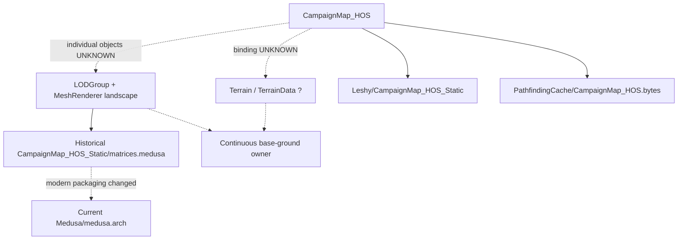
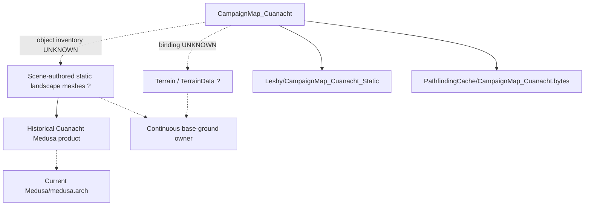
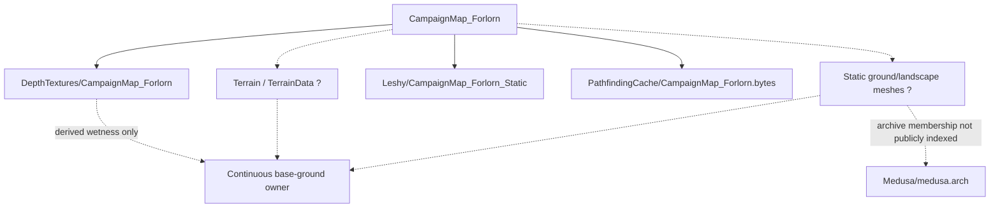
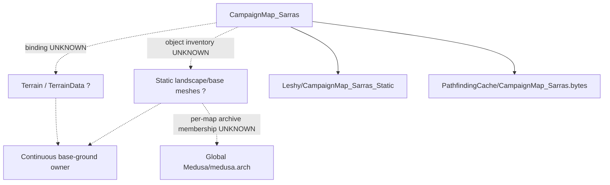
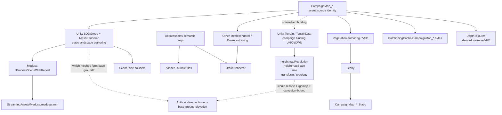
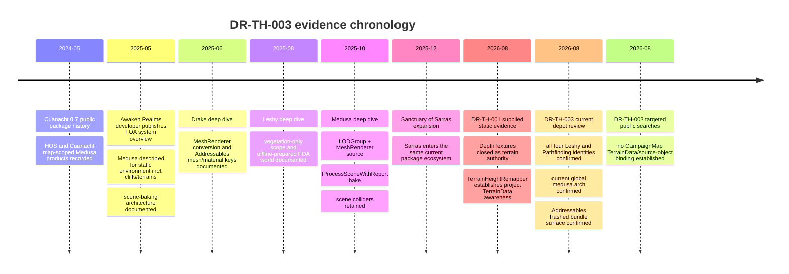

# DR-TH-003 — CampaignMap Scene Component and Source-Asset Inventory

## Executive summary

**Research date:** 31 August 2026, Europe/London  
**Research ID:** `DR-TH-003`  
**Execution status:** `COMPLETED`  
**Evidentiary outcome:** `INSUFFICIENT_EVIDENCE`  
**Repository mutation:** `NOT_RUN`  
**Live runtime validation:** `NOT_RUN`  
**Private-installation inspection:** `NOT_RUN`  
**Commercial scene/bundle extraction:** `NOT_RUN`

The decisive result is negative but useful: **none of the four `CampaignMap_*` regions can yet be promoted to `TERRAINDATA_BASE_CONFIRMED`, `MESH_BASE_CONFIRMED`, or `MIXED_BASE_CONFIRMED` from public evidence plus the supplied DR-TH-001 static/decompilation evidence alone.** `[FACT — combined evidence assessment]`

For all four maps, the required DR-TH-003 decision is therefore:

```text
CampaignMap_HOS       → INSUFFICIENT_EVIDENCE
CampaignMap_Cuanacht  → INSUFFICIENT_EVIDENCE
CampaignMap_Forlorn   → INSUFFICIENT_EVIDENCE
CampaignMap_Sarras    → INSUFFICIENT_EVIDENCE
```

The reason is precise: public package metadata exposes strong **map-scoped derived products** for all four maps, and first-party developer material establishes FOA's mesh-authoring/rendering architecture, but neither source exposes the serialized `CampaignMap_*` scene component inventories required to identify the object that owns continuous base-ground elevation. `[FACT — STATIC_ASSET_METADATA + PUBLIC_DOCUMENTATION]` citeturn26view0turn26view4turn21view0

At system level, the earlier `MIXED_REPRESENTATION` model remains well supported. An Awaken Realms developer describes Medusa as handling static environment assets and, in the system overview, explicitly includes cliffs and terrains; the dedicated Medusa article says its authoring objects are ordinary Unity `LODGroup` and `MeshRenderer` objects, with colliders remaining in the scene while rendering data is baked separately into `StreamingAssets`. `[FACT — PUBLIC_DOCUMENTATION]` The same developer identifies Leshy as vegetation streaming/rendering and Drake as an entity renderer whose meshes and materials are streamed through Addressables. citeturn18search0turn19view0turn21view0turn20view0turn21view3

The supplied DR-TH-001 static report independently establishes project-specific Unity `Terrain`/`TerrainData` awareness through `Awaken.TG.EditorOnly.TerrainHeightRemapper`. `[FACT — STATIC_ASSEMBLY, supplied evidence; not independently re-decompiled in this public-only pass]` That keeps `TerrainData` as a genuine candidate for the base-ground layer. However, **there is still no binding between that type and a `CampaignMap_*` scene, no terrain count, no TerrainData GUID/object ID, no heightmap resolution, no terrain size, and no tile transform/topology for any map.** `[UNKNOWN — STATIC_ASSET_METADATA]`

Unity's own TerrainData API confirms why those missing values would be decisive: `heightmapResolution` gives heightmap dimensions, `heightmapScale` supplies X/Z sample spacing and the overall Y range, `size` gives total terrain size, and `holesResolution` gives the holes grid; `GetHeights` exposes the height samples. `[FACT — PUBLIC_DOCUMENTATION]` citeturn28view2

The new research does add one useful historical Medusa fact. Public package-change metadata from the May 2024 Cuanacht update records **map-scoped Medusa products for HOS and Cuanacht**, including `CampaignMap_HOS_Static/matrices.medusa` and corresponding Cuanacht Medusa data. `[FACT — STATIC_ASSET_METADATA]` Current builds instead expose one global `StreamingAssets/Medusa/medusa.arch`. `[FACT — STATIC_ASSET_METADATA]` This strengthens the evidence that Medusa processing was associated with specific campaign-map scenes, but it still does not identify which scene objects were base terrain rather than cliffs or other static landscape meshes. citeturn27search0turn27search2turn26view4

The Highmap conclusion therefore remains:

> **The exact vanilla base-heightfield source is not discoverable from the permitted evidence lanes used in DR-TH-003.**

`TerrainHeightmapDocumentV1` reconstruction remains blocked on exactly the fields it should be blocked on: source owner, resolution, sample spacing, vertical range, map/tile transforms and topology. `[FACT — evidence assessment]`

### Decision summary

| Map | Scene-scoped identity | TerrainData binding | Mesh-base binding | DR-TH-003 decision | Highmap vanilla provider |
|---|---|---:|---:|---|---|
| HOS | **FACT** as source-scoped `CampaignMap_HOS` identity | **UNKNOWN** | **UNKNOWN** | **`INSUFFICIENT_EVIDENCE`** | **BLOCKED** |
| Cuanacht | **FACT** as source-scoped `CampaignMap_Cuanacht` identity | **UNKNOWN** | **UNKNOWN** | **`INSUFFICIENT_EVIDENCE`** | **BLOCKED** |
| Forlorn | **FACT** as source-scoped `CampaignMap_Forlorn` identity | **UNKNOWN** | **UNKNOWN** | **`INSUFFICIENT_EVIDENCE`** | **BLOCKED** |
| Sarras | **FACT** as source-scoped `CampaignMap_Sarras` identity | **UNKNOWN** | **UNKNOWN** | **`INSUFFICIENT_EVIDENCE`** | **BLOCKED** |

The source-scoped identities are directly corroborated by current public Leshy and PathfindingCache paths for all four maps. `[FACT — STATIC_ASSET_METADATA]` citeturn26view0turn26view4

## Evidence baseline and exact source findings

### Accepted supplied static evidence

The following DR-TH-001 findings are consumed as **supplied static evidence**, not as live-runtime proof and not as independently repeated decompilation in this research pass. `[FACT about evidence provenance — STATIC_ASSEMBLY]`

The supplied assembly hashes are:

| Assembly | SHA-256 | Lane |
|---|---|---|
| `TG.Main(3).dll` | `749aabbfbec121bb69bda0ae226223154406d2c990df3312ad12365d513fa982` | `STATIC_ASSEMBLY` |
| `HLOD.dll` | `32bfbf78eb0c8359d81ca1234a1802a2a9627448d5c794af46d3f3b21b7bdd42` | `STATIC_ASSEMBLY` |
| `MeshToTerrain(1).dll` | `eb4f02ba366dec1e78fe16b2ab4607bfb0e5c193d816ed6296d44a4fb21fd2b3` | `STATIC_ASSEMBLY` |

The supplied report reconstructs this consumer path:

```text
PrecipitationController
    ↓
TopDownDepthTexturesLoadingManager
    ↓
Application.streamingAssetsPath
    / DepthTextures
    / gameObject.scene.name
    / depth_tex_X_Y.raw
    ↓
FileRead.ToNewBufferAsync<byte>
    ↓
ComputeBuffer
    ↓
wetnessTexturesArrayDataSetShader
    ↓
4-layer RenderTexture
    ↓
ScreenSpaceWetness
    +
VFXTopDownDepthBinder
```

`[FACT — STATIC_ASSEMBLY, supplied DR-TH-001 evidence]`

The same evidence establishes:

```text
GroundBounds.CalculateGameBounds()
    ↓
bounds.min.xz / bounds.max.xz
    ↓
DepthTextures chunk-grid anchoring
```

but does **not** expose the implementation of `CalculateGameBounds()`. `[FACT + UNKNOWN — STATIC_ASSEMBLY]`

The supplied assembly report also identifies:

```text
Awaken.TG.EditorOnly.TerrainHeightRemapper

CurrentLow =
    Terrain.transform.position.y

CurrentHigh =
    CurrentLow
    + Terrain.terrainData.size.y
```

`[FACT — STATIC_ASSEMBLY, supplied DR-TH-001 evidence]`

That is project-specific evidence that ordinary Unity `Terrain` and `TerrainData` objects existed in FOA code/tooling. `[FACT — STATIC_ASSEMBLY]` It does **not** prove that any `CampaignMap_*` uses them. `[UNKNOWN — STATIC_ASSEMBLY/STATIC_ASSET_METADATA]`

The supplied `MeshToTerrain(1).dll` contains only helper/documentation stubs and no terrain conversion implementation. `[FACT — STATIC_ASSEMBLY, supplied evidence]` Therefore actual campaign use of Infinity Code's Mesh To Terrain remains `UNKNOWN`.

### First-party world-authoring evidence

The developer source has unusually high evidentiary value because its author's public profile identifies him as a Unity/Unreal developer at Awaken Realms. `[FACT — PUBLIC_DOCUMENTATION]` citeturn19view0

The project-system overview says the final FOA stack includes Addressables, Leshy, Medusa, Drake, scene baking and HLODs; it characterises Leshy as the vegetation system and Medusa as a system for static environment assets including cliffs and terrains. `[FACT — PUBLIC_DOCUMENTATION]` citeturn18search0

The dedicated Medusa article resolves the authoring side much more precisely:

```text
plain Unity LODGroup + MeshRenderer objects
                ↓
        IProcessSceneWithReport
                ↓
       optimised Medusa data
                ↓
       file in StreamingAssets
                ↓
         AsyncReadManager
                ↓
       immutable scene GPU data

scene colliders:
    retained separately / unchanged
```

`[FACT — PUBLIC_DOCUMENTATION]` citeturn21view0turn21view1

Medusa began as a renderer for cliffs and evolved into a specialised renderer for fully static meshes. Its developer explicitly describes cliffs as a landscaping tool and says the manual level-designer workflow is preserved with `MeshRenderer` authoring. `[FACT — PUBLIC_DOCUMENTATION]` citeturn21view0

That proves **scene-authored mesh landscape exists in FOA's authoring model**. `[FACT — PUBLIC_DOCUMENTATION]` It does not prove that every continuous ground surface is such a mesh. `[UNKNOWN — PUBLIC_DOCUMENTATION]`

Drake has a different role. Its developer says it converts renderer work into an Entities-based renderer while preserving physics/other systems and uses Addressables for streaming; the article shows separate registration of Addressables mesh and material keys. `[FACT — PUBLIC_DOCUMENTATION]` citeturn20view1turn21view3

The relevant conceptual structure is:

```csharp
Dictionary<string, ushort> meshKeyToIndex;
Dictionary<string, ushort> materialKeyToIndex;

RegisterMesh(string meshKey);
RegisterMaterial(string materialKey);
```

`[FACT — PUBLIC_DOCUMENTATION, pseudocode condensed from developer article]` citeturn21view3

Leshy is explicitly a vegetation-placement/rendering system. The author states that FOA has a static, offline-prepared world; editor-side vegetation setup and baking remains in Vegetation Studio Pro while Leshy consumes transformed baked placement data at runtime. `[FACT — PUBLIC_DOCUMENTATION]` citeturn20view0

Consequently, Leshy's map-scoped data is valuable for **scene identity**, but not evidence of elevation ownership. `[FACT/INFERENCE — PUBLIC_DOCUMENTATION + STATIC_ASSET_METADATA]`

### Public package metadata

The current public depot exposes all four map keys under Leshy:

```text
StreamingAssets/Leshy/
    CampaignMap_Cuanacht_Static/
        CellsCatalog.leshy
        Matrices.bin

    CampaignMap_Forlorn_Static/
        CellsCatalog.leshy
        Matrices.bin

    CampaignMap_HOS_Static/
        CellsCatalog.leshy
        Matrices.bin

    CampaignMap_Sarras_Static/
        CellsCatalog.leshy
        Matrices.bin
```

`[FACT — STATIC_ASSET_METADATA]` Current reported sizes are approximately 20.89 MiB, 1.88 MiB, 10.86 MiB and 10.11 MiB respectively for their `Matrices.bin` files. citeturn26view0turn26view1turn26view2turn26view3

The same current depot exposes exact map-scoped navigation products:

```text
PathfindingCache/CampaignMap_Cuanacht.bytes  37.81 MiB
PathfindingCache/CampaignMap_Forlorn.bytes   54.63 MiB
PathfindingCache/CampaignMap_HOS.bytes       34.55 MiB
PathfindingCache/CampaignMap_Sarras.bytes    52.12 MiB
```

`[FACT — STATIC_ASSET_METADATA]` citeturn26view4turn26view5

These names establish a durable cross-system `CampaignMap_*` identity. `[FACT — STATIC_ASSET_METADATA]` They do not reveal `TerrainData`, terrain mesh IDs, transforms, height resolution or topological ownership. `[UNKNOWN — STATIC_ASSET_METADATA]`

The current depot also exposes:

```text
StreamingAssets/Medusa/medusa.arch
```

at approximately 10.20 MiB. `[FACT — STATIC_ASSET_METADATA]` citeturn26view4

Historical package-change metadata is particularly informative. The May 2024 Cuanacht update records map-scoped Medusa products for HOS and Cuanacht, including a `CampaignMap_HOS_Static/matrices.medusa` file and corresponding Cuanacht data; a following build modified those files. `[FACT — STATIC_ASSET_METADATA]` citeturn27search0turn27search2

This establishes that Medusa's build products were historically partitioned or named by campaign-map/static-scene identity for at least HOS and Cuanacht. `[FACT — STATIC_ASSET_METADATA]` It **does not establish what individual source objects those files contained**. `[UNKNOWN — STATIC_ASSET_METADATA]`

### Unity's relevant source contract

If campaign `TerrainData` references are eventually identified, Unity exposes exactly the categories DR-TH-003 needs. `[FACT — PUBLIC_DOCUMENTATION]`

| Unity property/API | Meaning relevant to Highmap |
|---|---|
| `heightmapResolution` | heightmap width/height in texels |
| `heightmapScale.x/z` | spacing between neighbouring heightmap samples |
| `heightmapScale.y` | total terrain height range |
| `size` | total terrain dimensions in world units |
| `holesResolution` | holes grid resolution |
| `GetHeights()` | heightmap samples |
| `bounds` | local TerrainData bounds |

`[FACT — PUBLIC_DOCUMENTATION]` citeturn28view2

No corresponding values for HOS, Cuanacht, Forlorn or Sarras were exposed by any public source found in this research. `[UNKNOWN — STATIC_ASSET_METADATA]`

## Per-map scene and component inventory

The central limitation of this report is important: **no public serialized `CampaignMap_*` scene asset/component dump was located.** `[UNKNOWN/limitation — STATIC_ASSET_METADATA]` Therefore a missing public terrain row must not be converted into `Terrain count = 0`. The correct value is `UNKNOWN`.

### Horns of the South — `CampaignMap_HOS`

| Required field | Result | State / lane |
|---|---|---|
| Source-scoped scene/map key | `CampaignMap_HOS` | **FACT — STATIC_ASSET_METADATA** |
| Exact `.unity` scene path | Not exposed | **UNKNOWN — STATIC_ASSET_METADATA** |
| Scene GUID | Not exposed | **UNKNOWN — STATIC_ASSET_METADATA** |
| Build-scene index/status | Not exposed | **UNKNOWN — STATIC_ASSET_METADATA** |
| Addressable scene key | Not exposed | **UNKNOWN — ADDRESSABLES_METADATA** |
| Additive/SubScene status | Not established | **UNKNOWN — STATIC_ASSET_METADATA** |
| `Terrain` count | Not available | **UNKNOWN — STATIC_ASSET_METADATA** |
| Terrain GameObject names/hierarchy | Not available | **UNKNOWN — STATIC_ASSET_METADATA** |
| Terrain component file/object IDs | Not available | **UNKNOWN — STATIC_ASSET_METADATA** |
| Terrain transforms | Not available | **UNKNOWN — STATIC_ASSET_METADATA** |
| TerrainData refs/GUIDs/file IDs | Not available | **UNKNOWN — STATIC_ASSET_METADATA** |
| `heightmapResolution` / `heightmapScale` / `size` | Not available | **UNKNOWN — STATIC_ASSET_METADATA** |
| `TerrainCollider` inventory | Not available | **UNKNOWN — STATIC_ASSET_METADATA** |
| Terrain neighbour topology | Not available | **UNKNOWN — STATIC_ASSET_METADATA** |
| Candidate base-ground meshes | Individual source objects not available | **UNKNOWN — STATIC_ASSET_METADATA** |
| Medusa relationship | Historical `CampaignMap_HOS_Static/matrices.medusa`; current global archive | **FACT — STATIC_ASSET_METADATA** |
| Leshy identity | `CampaignMap_HOS_Static` | **FACT — STATIC_ASSET_METADATA** |
| Navigation identity | `CampaignMap_HOS.bytes` | **FACT — STATIC_ASSET_METADATA** |
| `GroundBounds` result/source | Consumer exists; implementation/source unresolved | **UNKNOWN — STATIC_ASSEMBLY** |
| Exact continuous base-ground owner | Not established | **UNKNOWN** |

The HOS identity is corroborated by current Leshy and PathfindingCache products, while historical package metadata directly associates a `CampaignMap_HOS_Static` product with Medusa. `[FACT — STATIC_ASSET_METADATA]` citeturn26view1turn26view5turn27search0



`[FACT for named products; UNKNOWN for dotted ownership bindings — STATIC_ASSET_METADATA]`

### Cuanacht — `CampaignMap_Cuanacht`

| Required field | Result | State / lane |
|---|---|---|
| Source-scoped scene/map key | `CampaignMap_Cuanacht` | **FACT — STATIC_ASSET_METADATA** |
| Exact `.unity` scene path | Not exposed | **UNKNOWN — STATIC_ASSET_METADATA** |
| Scene GUID | Not exposed | **UNKNOWN — STATIC_ASSET_METADATA** |
| Build-scene index/status | Not exposed | **UNKNOWN — STATIC_ASSET_METADATA** |
| Addressable scene key | Not exposed | **UNKNOWN — ADDRESSABLES_METADATA** |
| Additive/SubScene status | Not established | **UNKNOWN** |
| `Terrain` count | Not available | **UNKNOWN — STATIC_ASSET_METADATA** |
| Terrain GameObject/hierarchy IDs | Not available | **UNKNOWN — STATIC_ASSET_METADATA** |
| Terrain transforms | Not available | **UNKNOWN — STATIC_ASSET_METADATA** |
| TerrainData refs/GUIDs/file IDs | Not available | **UNKNOWN — STATIC_ASSET_METADATA** |
| `heightmapResolution` / `heightmapScale` / `size` | Not available | **UNKNOWN — STATIC_ASSET_METADATA** |
| `TerrainCollider` refs | Not available | **UNKNOWN — STATIC_ASSET_METADATA** |
| Terrain topology | Not available | **UNKNOWN — STATIC_ASSET_METADATA** |
| Candidate ground meshes | Individual source objects not available | **UNKNOWN — STATIC_ASSET_METADATA** |
| Medusa relationship | Historical map-scoped Medusa data; current global archive | **FACT — STATIC_ASSET_METADATA** |
| Leshy identity | `CampaignMap_Cuanacht_Static` | **FACT — STATIC_ASSET_METADATA** |
| Navigation identity | `CampaignMap_Cuanacht.bytes` | **FACT — STATIC_ASSET_METADATA** |
| `GroundBounds` source/result | Unresolved | **UNKNOWN — STATIC_ASSEMBLY** |
| Exact continuous base-ground owner | Not established | **UNKNOWN** |

The May 2024 Cuanacht release is useful chronology: public update material identifies Cuanacht as the newly added region, and package-change metadata from the same build contains campaign-map Medusa data. `[FACT — PUBLIC_DOCUMENTATION + STATIC_ASSET_METADATA]` citeturn28view0turn27search0

The current depot also gives Cuanacht the largest of the four listed campaign Leshy `Matrices.bin` files, but Leshy's developer-defined role is vegetation, so that size cannot be interpreted as terrain resolution. `[FACT + CONTRADICTED interpretation — STATIC_ASSET_METADATA + PUBLIC_DOCUMENTATION]` citeturn26view0turn20view0



`[FACT for packaged derived products; UNKNOWN for terrain/mesh ownership — mixed lanes]`

### Forlorn Swords — `CampaignMap_Forlorn`

| Required field | Result | State / lane |
|---|---|---|
| Source-scoped scene/map key | `CampaignMap_Forlorn` | **FACT — STATIC_ASSET_METADATA** |
| Exact `.unity` scene path | Not exposed | **UNKNOWN** |
| Scene GUID | Not exposed | **UNKNOWN** |
| Build-scene / Addressable status | Not exposed | **UNKNOWN — ADDRESSABLES_METADATA** |
| Additive/SubScene status | Not established | **UNKNOWN** |
| `Terrain` count | Not available | **UNKNOWN** |
| Terrain GameObjects/file IDs | Not available | **UNKNOWN** |
| Terrain transforms | Not available | **UNKNOWN** |
| TerrainData refs/GUIDs/file IDs | Not available | **UNKNOWN** |
| Heightmap resolution/scale/size | Not available | **UNKNOWN** |
| TerrainCollider refs | Not available | **UNKNOWN** |
| Terrain topology | Not available | **UNKNOWN** |
| Candidate ground mesh objects | Not available | **UNKNOWN** |
| Map-scoped Medusa entry | No semantic per-map entry established from current public archive listing | **UNKNOWN — STATIC_ASSET_METADATA** |
| Current Medusa participation | System-level plausible; per-object/per-map membership unavailable | **HYPOTHESIS — PUBLIC_DOCUMENTATION + STATIC_ASSET_METADATA** |
| Leshy identity | `CampaignMap_Forlorn_Static` | **FACT — STATIC_ASSET_METADATA** |
| Navigation identity | `CampaignMap_Forlorn.bytes` | **FACT — STATIC_ASSET_METADATA** |
| `GroundBounds` source/result | Unresolved | **UNKNOWN — STATIC_ASSEMBLY** |
| Exact continuous base-ground owner | Not established | **UNKNOWN** |

The current depot gives direct Forlorn map-scoped identities under Leshy and PathfindingCache. `[FACT — STATIC_ASSET_METADATA]` citeturn26view2turn26view4

Current public package metadata also contains many Forlorn `DepthTextures`, but the supplied DR-TH-001 decompilation classifies those as wetness/VFX data, so they cannot fill the missing terrain-source fields. `[FACT — STATIC_ASSET_METADATA + supplied STATIC_ASSEMBLY]` citeturn27search5



`[FACT for file identities and supplied DepthTextures classification; UNKNOWN for base owner]`

### Sanctuary of Sarras — `CampaignMap_Sarras`

| Required field | Result | State / lane |
|---|---|---|
| Source-scoped scene/map key | `CampaignMap_Sarras` | **FACT — STATIC_ASSET_METADATA** |
| Exact `.unity` scene path | Not exposed | **UNKNOWN** |
| Scene GUID | Not exposed | **UNKNOWN** |
| Build-scene / Addressable status | Not exposed | **UNKNOWN — ADDRESSABLES_METADATA** |
| Additive/SubScene status | Not established | **UNKNOWN** |
| `Terrain` count | Not available | **UNKNOWN** |
| Terrain GameObjects/file IDs | Not available | **UNKNOWN** |
| Terrain transforms | Not available | **UNKNOWN** |
| TerrainData refs/GUIDs/file IDs | Not available | **UNKNOWN** |
| Heightmap resolution/scale/size | Not available | **UNKNOWN** |
| TerrainCollider refs | Not available | **UNKNOWN** |
| Terrain topology | Not available | **UNKNOWN** |
| Candidate base-ground meshes | Not available | **UNKNOWN** |
| Map-scoped Medusa archive entry | Not publicly exposed | **UNKNOWN — STATIC_ASSET_METADATA** |
| Leshy identity | `CampaignMap_Sarras_Static` | **FACT — STATIC_ASSET_METADATA** |
| Navigation identity | `CampaignMap_Sarras.bytes` | **FACT — STATIC_ASSET_METADATA** |
| `GroundBounds` source/result | Unresolved | **UNKNOWN — STATIC_ASSEMBLY** |
| Exact continuous base-ground owner | Not established | **UNKNOWN** |

The current depot independently confirms both Sarras vegetation and navigation products. `[FACT — STATIC_ASSET_METADATA]` citeturn26view3turn26view4

First-party release material identifies Sanctuary of Sarras as a new expansion region/storyline added after the base game's three principal campaign regions. `[FACT — PUBLIC_DOCUMENTATION]` citeturn28view1

The presence of global Medusa data in the contemporary build is not sufficient to assert that a specific Sarras ground object is a Medusa mesh. `[UNKNOWN — STATIC_ASSET_METADATA]`



`[FACT for Leshy/Pathfinding products; UNKNOWN for terrain and Medusa object ownership]`

## Medusa, Addressables and source dependency analysis

### Medusa source selection

The first-party Medusa material establishes the input class but **not the exact selection mechanism**. `[FACT/UNKNOWN — PUBLIC_DOCUMENTATION]`

| Required DR-TH-003 Medusa field | Evidence |
|---|---|
| Input representation | **FACT:** ordinary `LODGroup` + `MeshRenderer` objects |
| Static requirement | **FACT:** Medusa targets fully static meshes |
| Collider handling | **FACT:** colliders remain in the scene unchanged |
| Build hook | **FACT:** `IProcessSceneWithReport` |
| Runtime storage | **FACT:** separate `StreamingAssets` file |
| Runtime I/O | **FACT:** `AsyncReadManager` |
| Runtime mutability | **FACT:** no supported data modification |
| Exact Medusa marker component | **UNKNOWN** |
| Exact inclusion tag/layer | **UNKNOWN** |
| Exact exclusion rules | **UNKNOWN** |
| Campaign scene source GameObject IDs | **UNKNOWN** |
| Source mesh GUIDs | **UNKNOWN** |
| Source material GUIDs | **UNKNOWN** |
| Source object transforms | **UNKNOWN** |
| Archive entry → source object join key | **UNKNOWN** |
| Base terrain vs cliff classification | **UNKNOWN** |

`[PUBLIC_DOCUMENTATION]` citeturn21view0turn21view1

A significant implication follows: because Medusa's runtime product is generated by `IProcessSceneWithReport`, the archive is **downstream of the scene-authored objects**. `[FACT — PUBLIC_DOCUMENTATION]` Therefore `medusa.arch` should not itself be elevated to authoritative editable terrain merely because it contains landscape geometry. `[CONTRADICTED — PUBLIC_DOCUMENTATION]` citeturn21view0

### Medusa archive comparison

| Map | Historical semantic Medusa evidence | Current public package view | Exact current archive entry | Source object IDs |
|---|---|---|---|---|
| HOS | `CampaignMap_HOS_Static/matrices.medusa` recorded in 2024 | global `Medusa/medusa.arch` | **UNKNOWN** | **UNKNOWN** |
| Cuanacht | map-scoped Medusa data recorded with 2024 Cuanacht build | global `Medusa/medusa.arch` | **UNKNOWN** | **UNKNOWN** |
| Forlorn | no semantic map-specific entry established by this public-only pass | global `Medusa/medusa.arch` | **UNKNOWN** | **UNKNOWN** |
| Sarras | no semantic map-specific entry established by this public-only pass | global `Medusa/medusa.arch` | **UNKNOWN** | **UNKNOWN** |

The HOS/Cuanacht historical rows are `[FACT — STATIC_ASSET_METADATA]`; the absence of an indexed Forlorn/Sarras semantic entry is **not** proof that those maps are absent from the archive. It remains `[UNKNOWN — STATIC_ASSET_METADATA]`. citeturn27search0turn27search2turn26view4

### Addressables

The current public package exposes:

```text
StreamingAssets/aa/
    AddressablesLink/
        link.xml

    StandaloneWindows64/
        <hash>.bundle
        <hash>.bundle
        ...
```

`[FACT — STATIC_ASSET_METADATA]` citeturn26view6

The public manifest does not expose a plain `catalog.json` filename. `[FACT about the manifest listing — STATIC_ASSET_METADATA]` citeturn26view7 This must **not** be interpreted as proving that FOA lacks an Addressables catalogue: Unity explicitly supports compressed local catalogues packaged as AssetBundles. `[CONTRADICTED interpretation — PUBLIC_DOCUMENTATION]` citeturn28view3

Unity's Addressables documentation states that the content catalogue maps keys to physical asset locations and that a local catalogue is placed in `StreamingAssets` in a player build; it can be compressed into an AssetBundle. `[FACT — PUBLIC_DOCUMENTATION]` citeturn28view3

FOA's Drake developer article independently proves project usage of semantic Addressables keys for meshes and materials. `[FACT — PUBLIC_DOCUMENTATION]` citeturn21view3

What is missing is the semantic join:

```text
CampaignMap / TerrainData / ground mesh key
        ↓
asset GUID / object ID
        ↓
bundle hash
        ↓
dependencies
        ↓
asset type
```

`[UNKNOWN — ADDRESSABLES_METADATA]`

### Addressables comparison

| Map | Campaign scene Addressables key | TerrainData key | Base-ground mesh key | GUID/object ID | Bundle hash | Dependency set |
|---|---|---|---|---|---|---|
| HOS | **UNKNOWN** | **UNKNOWN** | **UNKNOWN** | **UNKNOWN** | **UNKNOWN** | **UNKNOWN** |
| Cuanacht | **UNKNOWN** | **UNKNOWN** | **UNKNOWN** | **UNKNOWN** | **UNKNOWN** | **UNKNOWN** |
| Forlorn | **UNKNOWN** | **UNKNOWN** | **UNKNOWN** | **UNKNOWN** | **UNKNOWN** | **UNKNOWN** |
| Sarras | **UNKNOWN** | **UNKNOWN** | **UNKNOWN** | **UNKNOWN** | **UNKNOWN** | **UNKNOWN** |

`[UNKNOWN — ADDRESSABLES_METADATA]`

A hashed bundle filename alone cannot answer which object owns terrain elevation. `[FACT — PUBLIC_DOCUMENTATION/inference from Addressables model]` The semantic catalogue/key mapping is required. citeturn28view3turn21view3

### GroundBounds, TerrainHeightRemapper and MeshToTerrain

`GroundBounds.CalculateGameBounds()` remains a high-value lead but unresolved. `[UNKNOWN — STATIC_ASSEMBLY]` The supplied DR-TH-001 report proves a consumer obtains `Bounds` from it and uses those bounds for the top-down depth system; it does not reveal whether `GroundBounds` derives its result from `Terrain`, colliders, a manually authored volume, a ScriptableObject or another scene owner. `[FACT + UNKNOWN — STATIC_ASSEMBLY]`

No public implementation of `GroundBounds.CalculateGameBounds()` was located during DR-TH-003. `[UNKNOWN — PUBLIC_DOCUMENTATION]`

`Awaken.TG.EditorOnly.TerrainHeightRemapper` remains the strongest direct `TerrainData` lead from the supplied static evidence. `[FACT — STATIC_ASSEMBLY]` But no public caller, editor menu registration, campaign-scene binding, Terrain assignment or related mutation method was located. `[UNKNOWN — STATIC_ASSEMBLY/PUBLIC_DOCUMENTATION]`

The supplied `MeshToTerrain(1).dll` still does not establish a workflow. `[FACT — STATIC_ASSEMBLY]` The existence of the package is compatible with a mesh→Unity Terrain authoring process, but without a campaign-scene reference, output `TerrainData` asset, saved tool settings or editor invocation, the claim “FOA's campaign terrain was produced with Mesh To Terrain” remains `[HYPOTHESIS — STATIC_ASSEMBLY]`, not fact.

### Combined source dependency graph



The solid Medusa, Drake and Leshy subsystem relationships are `[FACT — PUBLIC_DOCUMENTATION]`; map-scoped Leshy/navigation products are `[FACT — STATIC_ASSET_METADATA]`; the TerrainData and base-ground bindings shown dotted are `[UNKNOWN]`. citeturn21view0turn21view3turn20view0turn26view0turn26view4

## Decision matrix and TerrainHeightmapDocumentV1 resolution

### Per-map representation decision

The DR-TH-003 decision requires evidence about the **continuous base surface**, not merely evidence that a map contains meshes. `[FACT — research criterion]`

| Map | Evidence for TerrainData base | Evidence for mesh landscape | Evidence that meshes are continuous base ground | Decision |
|---|---|---|---|---|
| `CampaignMap_HOS` | Project-level TerrainData only; no map binding | Strong Medusa/map-scoped historical evidence | Not established | **`INSUFFICIENT_EVIDENCE`** |
| `CampaignMap_Cuanacht` | Project-level TerrainData only; no map binding | Strong Medusa/map-scoped historical evidence | Not established | **`INSUFFICIENT_EVIDENCE`** |
| `CampaignMap_Forlorn` | Project-level TerrainData only; no map binding | System-level Medusa architecture; map archive membership not semantically exposed | Not established | **`INSUFFICIENT_EVIDENCE`** |
| `CampaignMap_Sarras` | Project-level TerrainData only; no map binding | System-level Medusa architecture; map archive membership not semantically exposed | Not established | **`INSUFFICIENT_EVIDENCE`** |

The mesh-landscape evidence for HOS/Cuanacht is stronger than for Forlorn/Sarras because public historical package metadata explicitly exposes campaign-map-scoped Medusa products for the former pair. `[FACT — STATIC_ASSET_METADATA]` citeturn27search0turn27search2

That still does not justify `MESH_BASE_CONFIRMED`: Medusa's first-party description is centred on cliffs and fully static meshes, while the system overview's broader “terrains” wording does not define whether those assets constitute the continuous walkable base. `[FACT + UNKNOWN — PUBLIC_DOCUMENTATION]` citeturn18search0turn21view0

Likewise, project-specific `TerrainData` code does not justify `TERRAINDATA_BASE_CONFIRMED` without a CampaignMap→Terrain→TerrainData reference. `[FACT — STATIC_ASSEMBLY; inference discipline]`

### `TerrainHeightmapDocumentV1` field-resolution matrix

The matrix below distinguishes **map identity already known** from **terrain source identity still absent**.

| Field | HOS | Cuanacht | Forlorn | Sarras |
|---|---|---|---|---|
| `mapId` / source-scoped map identity | **RESOLVED** | **RESOLVED** | **RESOLVED** | **RESOLVED** |
| public display identity | **RESOLVED** | **RESOLVED** | **RESOLVED** | **RESOLVED** |
| authoritative `sourceKind` | **UNKNOWN** | **UNKNOWN** | **UNKNOWN** | **UNKNOWN** |
| `sourceObjectIdentifier` | **UNKNOWN** | **UNKNOWN** | **UNKNOWN** | **UNKNOWN** |
| scene asset path | **UNKNOWN** | **UNKNOWN** | **UNKNOWN** | **UNKNOWN** |
| scene GUID/file ID | **UNKNOWN** | **UNKNOWN** | **UNKNOWN** | **UNKNOWN** |
| TerrainData GUID/object ID | **UNKNOWN** | **UNKNOWN** | **UNKNOWN** | **UNKNOWN** |
| native `width` | **UNKNOWN** | **UNKNOWN** | **UNKNOWN** | **UNKNOWN** |
| native `height` | **UNKNOWN** | **UNKNOWN** | **UNKNOWN** | **UNKNOWN** |
| sample spacing X | **UNKNOWN** | **UNKNOWN** | **UNKNOWN** | **UNKNOWN** |
| sample spacing Z | **UNKNOWN** | **UNKNOWN** | **UNKNOWN** | **UNKNOWN** |
| minimum world Y | **UNKNOWN** | **UNKNOWN** | **UNKNOWN** | **UNKNOWN** |
| maximum world Y | **UNKNOWN** | **UNKNOWN** | **UNKNOWN** | **UNKNOWN** |
| terrain object transform | **UNKNOWN** | **UNKNOWN** | **UNKNOWN** | **UNKNOWN** |
| row-zero orientation | **UNKNOWN** | **UNKNOWN** | **UNKNOWN** | **UNKNOWN** |
| source sample semantics | **UNKNOWN** | **UNKNOWN** | **UNKNOWN** | **UNKNOWN** |
| tile count | **UNKNOWN** | **UNKNOWN** | **UNKNOWN** | **UNKNOWN** |
| tile X/Z topology | **UNKNOWN** | **UNKNOWN** | **UNKNOWN** | **UNKNOWN** |
| neighbour relationships | **UNKNOWN** | **UNKNOWN** | **UNKNOWN** | **UNKNOWN** |
| gaps/overlaps | **UNKNOWN** | **UNKNOWN** | **UNKNOWN** | **UNKNOWN** |
| source→canonical transform | **UNKNOWN** | **UNKNOWN** | **UNKNOWN** | **UNKNOWN** |
| base-heightfield provenance hash | **UNKNOWN** | **UNKNOWN** | **UNKNOWN** | **UNKNOWN** |
| map-level provenance/evidence refs | **PARTIAL** | **PARTIAL** | **PARTIAL** | **PARTIAL** |

`[FACT — evidence-resolution assessment]`

If a campaign `TerrainData` object is subsequently bound, Unity's API would immediately supply or derive several of these currently unknown fields: heightmap dimensions from `heightmapResolution`, sample spacing and vertical range from `heightmapScale`, total extent from `size`, and source samples from `GetHeights()`. `[FACT — PUBLIC_DOCUMENTATION, conditional applicability]` citeturn28view2

If no TerrainData exists and the base surface is mesh-authored, those same fields would instead require an explicit mesh→heightfield provider policy. `[INFERENCE — HIGH CONFIDENCE]` That policy would need to define raster resolution, surface-selection rules, overlapping geometry handling, holes and vertical-ray semantics rather than inventing values per user session.

### Exact blockers by map

| Required proof | HOS | Cuanacht | Forlorn | Sarras |
|---|---:|---:|---:|---:|
| Serialized `Terrain` component inventory | Missing | Missing | Missing | Missing |
| `TerrainData` object refs | Missing | Missing | Missing | Missing |
| Terrain transforms | Missing | Missing | Missing | Missing |
| TerrainCollider refs | Missing | Missing | Missing | Missing |
| Terrain tile neighbours | Missing | Missing | Missing | Missing |
| Ground mesh object inventory | Missing | Missing | Missing | Missing |
| Mesh GUIDs/object IDs | Missing | Missing | Missing | Missing |
| Mesh world transforms/bounds | Missing | Missing | Missing | Missing |
| Exact Medusa archive entries | Missing | Missing | Missing | Missing |
| Addressables semantic source mapping | Missing | Missing | Missing | Missing |
| `GroundBounds` implementation/result | Missing | Missing | Missing | Missing |

`[UNKNOWN — STATIC_ASSET_METADATA / ADDRESSABLES_METADATA / STATIC_ASSEMBLY]`

The pattern is decisive: this is no longer a broad conceptual uncertainty about FOA's rendering architecture. It is a **missing serialized source-object inventory**.

## Heightfield fitness, chronology and final disposition

### Heightfield fitness

At whole-world level, FOA should **not** be modelled as “one heightmap equals the complete vanilla map”. `[INFERENCE — HIGH CONFIDENCE]` Medusa was explicitly created for cliffs and fully static landscaping meshes, so significant landscape geometry exists outside whatever continuous base surface may exist. citeturn21view0

For the Highmap base layer, however, fitness remains undecided per map:

| Map | Heightfield fitness | Reason |
|---|---|---|
| HOS | **UNKNOWN** | Base owner not identified; static landscape meshes definitely coexist |
| Cuanacht | **UNKNOWN** | Same; historical map-scoped Medusa evidence strengthens mesh coexistence |
| Forlorn | **UNKNOWN** | Base owner and mesh classification unresolved |
| Sarras | **UNKNOWN** | Base owner and per-map Medusa membership unresolved |

`[UNKNOWN — combined evidence]`

If a `TerrainData` base is found, its heightmap is intrinsically a single-valued heightfield and therefore naturally compatible with `TerrainHeightmapDocumentV1` for that base layer. `[FACT — PUBLIC_DOCUMENTATION, conditional]` Unity describes `TerrainData` as providing heightmap data and exposes its sample grid and dimensions. citeturn28view2

If a mesh base is found, compatibility depends on whether every relevant horizontal position resolves to one authoritative ground surface. `[INFERENCE — geometry constraint]` Cliffs, cave roofs, arches, stacked paths and overhangs cannot in general be represented losslessly by a single-valued heightfield; those would need to remain separate world-geometry layers.

The appropriate eventual authoring model remains:

```text
CampaignMap
    │
    ├── editable continuous terrain/base-heightfield
    │       ↓
    │   Highmap Importer
    │
    ├── cliffs / overhangs / caves / rocks
    │       ↓
    │   mesh/world-geometry authoring
    │
    ├── vegetation
    │       ↓
    │   separate vegetation system
    │
    └── derived products
            wetness depth
            pathfinding
            HLOD
            runtime render bakes
```

`[INFERENCE — HIGH CONFIDENCE]` supported by the first-party subsystem architecture and supplied static evidence. citeturn18search0turn21view0turn20view0turn21view3

### Evidence-action timeline



The public chronology is supported by the developer publication dates and package history. `[FACT — PUBLIC_DOCUMENTATION + STATIC_ASSET_METADATA]` citeturn28view0turn19view0turn20view1turn20view0turn21view0turn28view1

### Evidence register

| Claim ID | Claim | State | Lane | Confidence |
|---|---|---|---|---|
| `TH3-DEPTH-01` | DepthTextures are derived wetness/VFX, not authoritative terrain | **FACT** | `STATIC_ASSEMBLY` supplied | High |
| `TH3-TERRAIN-01` | FOA project code contains Unity Terrain/TerrainData awareness | **FACT** | `STATIC_ASSEMBLY` supplied | High static |
| `TH3-TERRAIN-02` | HOS campaign base is TerrainData | **UNKNOWN** | `STATIC_ASSET_METADATA` | Blocking |
| `TH3-TERRAIN-03` | Cuanacht campaign base is TerrainData | **UNKNOWN** | `STATIC_ASSET_METADATA` | Blocking |
| `TH3-TERRAIN-04` | Forlorn campaign base is TerrainData | **UNKNOWN** | `STATIC_ASSET_METADATA` | Blocking |
| `TH3-TERRAIN-05` | Sarras campaign base is TerrainData | **UNKNOWN** | `STATIC_ASSET_METADATA` | Blocking |
| `TH3-MEDUSA-01` | Medusa source objects are `LODGroup` + `MeshRenderer` static meshes | **FACT** | `PUBLIC_DOCUMENTATION` | High |
| `TH3-MEDUSA-02` | Medusa colliders remain scene-side | **FACT** | `PUBLIC_DOCUMENTATION` | High |
| `TH3-MEDUSA-03` | Medusa runtime file is a build derivative | **FACT** | `PUBLIC_DOCUMENTATION` | High |
| `TH3-MEDUSA-04` | HOS had a map-scoped Medusa product historically | **FACT** | `STATIC_ASSET_METADATA` | High |
| `TH3-MEDUSA-05` | Cuanacht had map-scoped Medusa data historically | **FACT** | `STATIC_ASSET_METADATA` | High |
| `TH3-MEDUSA-06` | Medusa meshes are HOS/Cuanacht's entire continuous base ground | **UNKNOWN** | mixed | Critical |
| `TH3-MEDUSA-07` | Current `medusa.arch` is an editable source | **CONTRADICTED** | `PUBLIC_DOCUMENTATION` | High |
| `TH3-LESHY-01` | Leshy is vegetation placement/rendering | **FACT** | `PUBLIC_DOCUMENTATION` | High |
| `TH3-MAP-01` | All four `CampaignMap_*` keys appear in current map-scoped package data | **FACT** | `STATIC_ASSET_METADATA` | High |
| `TH3-ADDR-01` | FOA uses Addressables for Drake mesh/material streaming | **FACT** | `PUBLIC_DOCUMENTATION` | High |
| `TH3-ADDR-02` | Public depot exposes hashed Addressables bundles | **FACT** | `STATIC_ASSET_METADATA` | High |
| `TH3-ADDR-03` | Campaign terrain semantic key→GUID→bundle mapping is known | **UNKNOWN** | `ADDRESSABLES_METADATA` | Blocking |
| `TH3-GROUND-01` | `GroundBounds.CalculateGameBounds()` supplies bounds to DepthTextures | **FACT** | `STATIC_ASSEMBLY` supplied | High |
| `TH3-GROUND-02` | GroundBounds derives its result from Terrain objects | **UNKNOWN** | `STATIC_ASSEMBLY` | Blocking |
| `TH3-M2T-01` | MeshToTerrain package artifacts exist | **FACT** | `STATIC_ASSEMBLY` supplied | High |
| `TH3-M2T-02` | Campaign terrain was generated by MeshToTerrain | **HYPOTHESIS** | `STATIC_ASSEMBLY` | Low |
| `TH3-BASE-01` | HOS continuous base owner is known | **UNKNOWN** | — | Blocking |
| `TH3-BASE-02` | Cuanacht continuous base owner is known | **UNKNOWN** | — | Blocking |
| `TH3-BASE-03` | Forlorn continuous base owner is known | **UNKNOWN** | — | Blocking |
| `TH3-BASE-04` | Sarras continuous base owner is known | **UNKNOWN** | — | Blocking |

No `LIVE_RUNTIME` or `PRIVATE_INSTALLATION` evidence was generated or used by this research.

### What the public-only lane could not provide

The target data absent from all permitted sources is exactly:

```text
CampaignMap scene
    ↓
serialized root/component inventory
    ↓
Terrain component(s)
    ├── TerrainData GUID/fileID
    ├── Transform
    ├── TerrainCollider
    └── neighbours

and/or

base-ground MeshRenderer/MeshFilter object(s)
    ├── mesh GUID/fileID
    ├── MeshCollider
    ├── LODGroup
    ├── transform/bounds
    └── Medusa source membership
```

`[UNKNOWN — STATIC_ASSET_METADATA]`

Without those records, reporting `Terrain count = 0`, inventing a 1025/2049/4097 heightmap resolution, deriving terrain size from DepthTexture grids, treating pathfinding bounds as terrain bounds, or treating all Medusa meshes as base terrain would each be unsupported. `[CONTRADICTED as acceptable methodology — evidence discipline]`

### Final disposition

```text
DR-TH-003

Execution:
    COMPLETED

Permitted evidence:
    PUBLIC_DOCUMENTATION
    STATIC_ASSET_METADATA
    ADDRESSABLES_METADATA (publicly exposed surface)
    supplied STATIC_ASSEMBLY evidence

LIVE_RUNTIME:
    NOT_RUN

PRIVATE_INSTALLATION:
    NOT_RUN

asset / scene / bundle extraction:
    NOT_RUN

Per-map results:

    CampaignMap_HOS
        INSUFFICIENT_EVIDENCE

    CampaignMap_Cuanacht
        INSUFFICIENT_EVIDENCE

    CampaignMap_Forlorn
        INSUFFICIENT_EVIDENCE

    CampaignMap_Sarras
        INSUFFICIENT_EVIDENCE

Unity TerrainData:
    project presence CONFIRMED
    CampaignMap binding UNKNOWN

Medusa:
    static landscape mesh authoring CONFIRMED
    HOS/Cuanacht historical map-scoped products CONFIRMED
    continuous base-ground ownership UNKNOWN
    runtime archive as editable source REJECTED

Addressables:
    project use CONFIRMED
    mesh/material semantic keys in Drake CONFIRMED
    campaign terrain key/GUID/bundle mapping UNKNOWN

GroundBounds:
    consumer relationship CONFIRMED
    implementation/source UNKNOWN

TerrainHeightRemapper:
    Terrain/TerrainData access CONFIRMED from supplied static report
    campaign authoring use UNKNOWN

MeshToTerrain:
    package artifact presence CONFIRMED
    campaign usage UNKNOWN

Deterministic TerrainHeightmapDocumentV1 vanilla reconstruction:
    BLOCKED
```

The research therefore reaches a sharper boundary than DR-TH-002: **the architecture is no longer the mystery; the missing evidence is the serialized scene/source-object binding.** Public developer documentation proves how Medusa, Drake and Leshy work, public package metadata proves all four map identities and their derived products, and the supplied static evidence proves FOA knows Unity TerrainData. citeturn21view0turn21view3turn20view0turn26view0turn26view4

What public-only DR-TH-003 cannot prove is the one relationship the Highmap provider actually needs:

```text
CampaignMap_*
      ↓
EXACT BASE-GROUND OBJECT
      ↓
TerrainData
OR
mesh source
OR
both
```

Until that binding exists, the correct implementation state is **fail closed**: map identity may be catalogued, but source resolution, dimensions, spacing, vertical range, topology and source-to-canonical transformation remain provider-side `UNKNOWN`s rather than values to infer or expose to the user.
