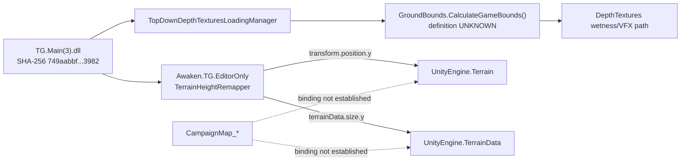

# DR-TH-004 — Campaign Terrain Source Binding

Research date: 31 August 2026, Europe/London

Research ID: `DR-TH-004`

Execution status: `COMPLETED`

Overall evidentiary outcome: `INSUFFICIENT_EVIDENCE`

Primary lanes used: supplied `STATIC_ASSEMBLY` evidence from DR-TH-001; `STATIC_ASSET_METADATA`; `ADDRESSABLES_METADATA`; `PUBLIC_DOCUMENTATION`; public GitHub/repository metadata

New decompilation of underlying commercial DLLs: `NOT_RUN — binaries not available through the authorised research surface`

Live runtime: `NOT_RUN`

Private-installation inspection: `NOT_RUN`

Commercial scene/bundle extraction: `NOT_RUN`

Repository mutation: `NOT_RUN`

## Executive conclusion

DR-TH-004 does not establish an exact continuous-base-ground object for `CampaignMap_HOS`, `CampaignMap_Cuanacht`, `CampaignMap_Forlorn`, or `CampaignMap_Sarras`. The correct decision remains `INSUFFICIENT_EVIDENCE` for all four maps.

The unresolved chain is specifically the missing join between a `CampaignMap_*` identity and a serialized Unity source object:

```text
CampaignMap_*
    ↓
exact Unity scene / source scene
    ↓
?────────────────────────────────────?
│                                    │
Terrain                         base-ground GameObject(s)
    ↓                                ↓
TerrainData                    MeshFilter / MeshRenderer
    ↓                                ↓
GUID/fileID                    Mesh GUID/fileID
resolution/size                transform/bounds/collider
    │                                    │
    └────────────── ? ───────────────────┘
                       ↓
           continuous base-ground owner
```

The accepted DR-TH-001 static report gives a genuine project-specific `Terrain`/`TerrainData` reference through `Awaken.TG.EditorOnly.TerrainHeightRemapper`. First-party developer documentation independently proves that important FOA landscape content is authored as ordinary Unity `LODGroup` + `MeshRenderer` geometry and baked into Medusa. Neither lane supplies a `CampaignMap_* -> Terrain/TerrainData` reference or an exact `CampaignMap_* -> continuous-ground mesh set` reference.

The current public depot still exposes map-scoped derived identities—most clearly `PathfindingCache/CampaignMap_{HOS,Cuanacht,Forlorn,Sarras}.bytes` and the corresponding Leshy `CampaignMap_*_Static` directories—plus a global `StreamingAssets/Medusa/medusa.arch`. It does not expose semantic TerrainData names, scene GUIDs, Terrain component records, source mesh object IDs, or terrain transforms.

`GroundBounds.CalculateGameBounds()` remains unresolved at its definition. The supplied CIL report proves a call from `TopDownDepthTexturesLoadingManager` into `GroundBounds.CalculateGameBounds()` and proves that the returned `Bounds` drives the DepthTextures world grid, but the report does not contain the method body or enough type-definition metadata to establish which assembly defines `GroundBounds`.

Likewise, the supplied report proves that `TerrainHeightRemapper` reads a `Terrain` transform and `TerrainData.size.y`, but it supplies no caller, editor-window registration, campaign-scene filter, serialized Terrain assignment, or map-specific TerrainData asset. Public exact-term searches for `TerrainHeightRemapper`, `GroundBounds.CalculateGameBounds`, and `CampaignMap_* + TerrainData` produced no useful public results. That is a bounded negative-search result, not evidence that the objects do not exist.

The per-map decision is:

| Campaign map | Exact base-ground object | TerrainData binding | Exact mesh-base binding | Decision |
| --- | --- | --- | --- | --- |
| `CampaignMap_HOS` | `UNKNOWN` | `UNKNOWN` | `UNKNOWN` | `INSUFFICIENT_EVIDENCE` |
| `CampaignMap_Cuanacht` | `UNKNOWN` | `UNKNOWN` | `UNKNOWN` | `INSUFFICIENT_EVIDENCE` |
| `CampaignMap_Forlorn` | `UNKNOWN` | `UNKNOWN` | `UNKNOWN` | `INSUFFICIENT_EVIDENCE` |
| `CampaignMap_Sarras` | `UNKNOWN` | `UNKNOWN` | `UNKNOWN` | `INSUFFICIENT_EVIDENCE` |

No deterministic vanilla `TerrainHeightmapDocumentV1` provider can be specified yet. The missing source metadata remains provider-side and must not be surfaced to users or replaced by guessed defaults.

## Static source-binding results

### GroundBounds

The strongest exact static chain preserved by DR-TH-001 is:

```text
ASSEMBLY:
    TG.Main(3).dll
    SHA-256:
    749aabbfbec121bb69bda0ae226223154406d2c990df3312ad12365d513fa982

TYPE:
    Awaken.TG.Graphics.VFX.TopDownDepthTexturesLoadingManager

CALL PATH:
    Start()
        ↓
    ResetState()
        ↓
    InitializeConstantData()
        ↓
    GroundBounds.CalculateGameBounds()
        ↓
    SetConstantParams(bounds)
```

The consequential downstream behavior is:

```text
_gameBounds2d =
    new MinMaxAABR(
        bounds.min.xz,
        bounds.max.xz
    );

_chunksMaxCountXY =
    ceil(
        _gameBounds2d.Extents
        / chunkTextureSizeInUnits
    );

NearPlane = 0.01

FarPlane =
    bounds.max.y
    - bounds.min.y

CameraWorldPosY =
    bounds.max.y
```

Thus `CalculateGameBounds()` unquestionably supplies map/world-space bounds consumed by the wetness-depth system. It still does not identify the component(s) from which those bounds originate.

| GroundBounds item | Result | State |
| --- | --- | --- |
| direct known consumer assembly | `TG.Main(3).dll` | FACT — supplied static report |
| consumer assembly SHA-256 | `749aabbf...3982` | FACT — supplied static report |
| consumer | `Awaken.TG.Graphics.VFX.TopDownDepthTexturesLoadingManager` | FACT |
| direct invocation | `GroundBounds.CalculateGameBounds()` | FACT |
| defining namespace | `UNKNOWN` | UNKNOWN |
| defining assembly | `UNKNOWN` | UNKNOWN |
| method body/CIL | `UNKNOWN` | BLOCKED |
| direct callees | `UNKNOWN` | BLOCKED |
| Terrain-based bounds | not proved | UNKNOWN |
| Collider-based bounds | not proved | UNKNOWN |
| Renderer-based bounds | not proved | UNKNOWN |
| authored/config bounds | not proved | UNKNOWN |
| custom-world-system bounds | not proved | UNKNOWN |
| terminal classification | `GROUNDBOUNDS_SOURCE_UNKNOWN` | evidence assessment |

Assigning `GroundBounds` itself to `TG.Main(3).dll` would overstate the supplied evidence: the caller is proven there; the definition is not.

### TerrainHeightRemapper

The second direct static lead is:

```text
ASSEMBLY:
    TG.Main(3).dll

SHA-256:
    749aabbfbec121bb69bda0ae226223154406d2c990df3312ad12365d513fa982

TYPE:
    Awaken.TG.EditorOnly.TerrainHeightRemapper
```

with getter semantics equivalent to:

```csharp
CurrentLow =
    Terrain.transform.position.y;

CurrentHigh =
    CurrentLow
    + Terrain.terrainData.size.y;
```

This is project-specific evidence that FOA code directly references `UnityEngine.Terrain`, its transform, and its associated `TerrainData`.

Unity's TerrainData API defines the categories that would matter if a CampaignMap binding were found: `heightmapResolution`, `heightmapScale.x/z`, `heightmapScale.y`, `size`, holes resolution, and height access. None of those generic facts creates the missing FOA binding.

The required caller/tool result remains:

| `TerrainHeightRemapper` question | Result |
| --- | --- |
| project-specific type exists | FACT — supplied static report |
| reads `Terrain.transform.position.y` | FACT |
| reads `Terrain.terrainData.size.y` | FACT |
| full field list | BLOCKED |
| full method list | BLOCKED |
| constructor/caller graph | BLOCKED |
| custom inspector/editor window | UNKNOWN |
| menu command | UNKNOWN |
| CampaignMap scene filtering | UNKNOWN |
| TerrainData mutation (`SetHeights`, etc.) | UNKNOWN |
| specific Terrain object assignment | UNKNOWN |
| campaign-authoring usage | UNKNOWN |
| terminal result | `USAGE_UNKNOWN` |

An unsuccessful public search for this project-specific type cannot be converted into `GENERIC_TERRAIN_TOOL_ONLY` or `NON_CAMPAIGN_USE_CONFIRMED`.

### Direct Terrain references and call graph

On the available static evidence, `TerrainHeightRemapper` is the only positively confirmed FOA-specific Terrain/TerrainData consumer recovered in the supplied report. That is not proof that it is the only consumer in all assemblies; a complete TypeRef/MemberRef/field-signature sweep was not available.



Solid edges come from the supplied static report; dotted edges are the missing evidence.

## Scene, Medusa, and Addressables findings

### CampaignMap scene identity

Current public package metadata preserves all four `CampaignMap_*` strings in PathfindingCache and Leshy map-scoped products. These are robust source-scoped identities but remain auxiliary/derived systems rather than terrain source evidence.

No lawfully available public result found during DR-TH-004 supplies any exact `.unity` scene path, scene GUID/file ID, build index, Addressables scene key, additive-scene dependency, or SubScene GUID for the campaign maps.

This does not prove a CampaignMap scene has no Terrain. It means the serialized scene inventory was not exposed by the authorised research surface.

### Medusa

First-party developer evidence establishes:

```text
Unity scene source objects
    LODGroup
    MeshRenderer
        ↓
Medusa IProcessSceneWithReport bake
        ↓
derived Medusa runtime file
```

Medusa began as a cliff renderer and evolved into a renderer for fully static meshes. Colliders remain scene-side. The runtime product is downstream of scene-authored objects and must not be treated as the editable terrain source.

Current public package metadata exposes a global `StreamingAssets/Medusa/medusa.arch`. Earlier research also records historical map-scoped Medusa products for HOS and Cuanacht. No source-object membership or archive-entry-to-GameObject join was recovered.

| Medusa binding property | Result |
| --- | --- |
| source object class | `LODGroup + MeshRenderer` — FACT |
| fully static requirement | FACT |
| collider remains scene-side | FACT |
| build callback family | `IProcessSceneWithReport` — FACT |
| marker component | UNKNOWN |
| layer/tag predicates | UNKNOWN |
| static-flag implementation | UNKNOWN |
| scene filter implementation | UNKNOWN |
| source GameObject ID | UNKNOWN |
| mesh GUID/file ID | UNKNOWN |
| archive entry ID | UNKNOWN |
| archive entry -> source-object join | UNKNOWN |
| base-ground vs cliff rule | UNKNOWN |
| Forlorn semantic membership | UNKNOWN |
| Sarras semantic membership | UNKNOWN |

### Addressables

The package exposes an Addressables surface with `StreamingAssets/aa/AddressablesLink/link.xml` and many opaque bundle names. FOA developer documentation independently establishes semantic Addressables usage for streamed renderer meshes/materials.

The required terrain join remains absent:

```text
CampaignMap_HOS
    ↓
semantic scene/asset key             UNKNOWN
    ↓
IResourceLocation.PrimaryKey         UNKNOWN
    ↓
asset GUID / internal ID             UNKNOWN
    ↓
TerrainData or base-ground Mesh      UNKNOWN
    ↓
bundle                               UNKNOWN
```

Hash-like bundle names must not be promoted into semantic terrain identities.

### Serialized scene metadata

No public serialized component inventory was located for any `CampaignMap_*` scene. Obtaining it by private-installation scan or commercial scene/bundle extraction would cross the authority boundary of this research.

```text
SERIALIZED_CAMPAIGNMAP_COMPONENT_METADATA:
    BLOCKED
```

## Per-map source inventory and decision

### Horns of the South

| Required property | Result |
| --- | --- |
| source key | `CampaignMap_HOS` |
| exact scene path/GUID/file ID | UNKNOWN |
| build index / Addressables scene identity | UNKNOWN |
| additive/SubScene relations | UNKNOWN |
| Terrain count/objects/transforms | UNKNOWN |
| TerrainData GUID/file ID | UNKNOWN |
| resolution/scale/size/holes | UNKNOWN |
| TerrainCollider/neighbours | UNKNOWN |
| continuous-ground mesh set | UNKNOWN |
| mesh IDs/transforms/bounds/colliders | UNKNOWN |
| Medusa membership | historical map-scoped product known; exact source membership UNKNOWN |
| current Medusa archive | global `medusa.arch` |
| GroundBounds source/value | UNKNOWN |
| decision | `INSUFFICIENT_EVIDENCE` |

### Cuanacht

| Required property | Result |
| --- | --- |
| source key | `CampaignMap_Cuanacht` |
| exact scene path/GUID/file ID | UNKNOWN |
| build/Additive/SubScene identity | UNKNOWN |
| Addressables identity | UNKNOWN |
| Terrain count/objects/transforms | UNKNOWN |
| TerrainData GUID/file ID | UNKNOWN |
| resolution/scale/size/holes | UNKNOWN |
| TerrainCollider/neighbours | UNKNOWN |
| continuous-ground mesh set | UNKNOWN |
| mesh IDs/transforms/bounds | UNKNOWN |
| Medusa membership | historical map-scoped data known; source objects UNKNOWN |
| GroundBounds source/value | UNKNOWN |
| decision | `INSUFFICIENT_EVIDENCE` |

### Forlorn Swords

| Required property | Result |
| --- | --- |
| source key | `CampaignMap_Forlorn` |
| exact scene path/GUID/file ID | UNKNOWN |
| build/Additive/SubScene identity | UNKNOWN |
| Addressables identity | UNKNOWN |
| Terrain/TerrainData inventory | UNKNOWN |
| TerrainCollider/topology | UNKNOWN |
| base-ground mesh set | UNKNOWN |
| mesh IDs/transforms/bounds | UNKNOWN |
| exact Medusa membership | UNKNOWN |
| GroundBounds source/value | UNKNOWN |
| decision | `INSUFFICIENT_EVIDENCE` |

### Sanctuary of Sarras

| Required property | Result |
| --- | --- |
| source key | `CampaignMap_Sarras` |
| exact scene path/GUID/file ID | UNKNOWN |
| build/Additive/SubScene identity | UNKNOWN |
| Addressables identity | UNKNOWN |
| Terrain/TerrainData inventory | UNKNOWN |
| TerrainCollider/topology | UNKNOWN |
| base-ground mesh set | UNKNOWN |
| mesh IDs/transforms/bounds | UNKNOWN |
| exact Medusa membership | UNKNOWN |
| GroundBounds source/value | UNKNOWN |
| decision | `INSUFFICIENT_EVIDENCE` |

“No” or missing confirmation here means not confirmed by evidence, not disproved.

## Highmap reconstruction implications

No map reaches the threshold for applying a concrete TerrainData reconstruction formula because no CampaignMap-bound TerrainData object has been identified.

If a binding is established later, the generic Unity source-grid contract would expose:

```text
width = TerrainData.heightmapResolution
height = TerrainData.heightmapResolution
sampleSpacingX = TerrainData.heightmapScale.x
sampleSpacingZ = TerrainData.heightmapScale.z
native vertical span = TerrainData.heightmapScale.y
```

The FOA helper supplies project-consistent evidence for a candidate vertical interval:

```text
minY = Terrain.transform.position.y
maxY = Terrain.transform.position.y + Terrain.terrainData.size.y
```

Neither formula may be applied to a CampaignMap until the exact Terrain object is bound.

### TerrainHeightmapDocumentV1 resolution

| Field | HOS | Cuanacht | Forlorn | Sarras | Classification |
| --- | --- | --- | --- | --- | --- |
| map identity | resolved | resolved | resolved | resolved | catalogue-derived |
| authoritative source kind | UNKNOWN | UNKNOWN | UNKNOWN | UNKNOWN | unknown |
| source object identifier | UNKNOWN | UNKNOWN | UNKNOWN | UNKNOWN | unknown |
| scene GUID/file ID | UNKNOWN | UNKNOWN | UNKNOWN | UNKNOWN | unknown |
| TerrainData GUID/file ID | UNKNOWN | UNKNOWN | UNKNOWN | UNKNOWN | unknown |
| width/height | UNKNOWN | UNKNOWN | UNKNOWN | UNKNOWN | unknown |
| sample spacing | UNKNOWN | UNKNOWN | UNKNOWN | UNKNOWN | unknown |
| minimum/maximum world Y | UNKNOWN | UNKNOWN | UNKNOWN | UNKNOWN | unknown |
| terrain transform | UNKNOWN | UNKNOWN | UNKNOWN | UNKNOWN | unknown |
| row orientation/sample semantics | UNKNOWN | UNKNOWN | UNKNOWN | UNKNOWN | unknown |
| tile topology/neighbours | UNKNOWN | UNKNOWN | UNKNOWN | UNKNOWN | unknown |
| source-to-canonical transform | UNKNOWN | UNKNOWN | UNKNOWN | UNKNOWN | unknown |
| final source provenance | UNKNOWN | UNKNOWN | UNKNOWN | UNKNOWN | unknown |
| research/map provenance | available | available | available | available | catalogue/research-derived |

These fields cannot safely be derived from DepthTexture dimensions, Leshy matrices, Pathfinding extents, Medusa archive size, or Addressables bundle names.

No mesh-base case is confirmed. Were a mesh base later proved, a provider would need explicit policy for raster resolution, vertical sample direction, authoritative-surface selection, overlaps, holes, bridges, caves, overhangs, LOD choice, and edge/topology handling.

## Evidence register

| Claim ID | Claim | State | Evidence lane | Limitation |
| --- | --- | --- | --- | --- |
| `TH4-GB-01` | loader calls `GroundBounds.CalculateGameBounds()` | FACT | supplied static report | caller known |
| `TH4-GB-02` | returned bounds define DepthTextures world extent/camera range | FACT | supplied static report | derived consumer only |
| `TH4-GB-03` | GroundBounds definition/assembly identified | UNKNOWN | static | method body absent |
| `TH4-GB-04` | GroundBounds derives from Terrain | UNKNOWN | static | unresolved join |
| `TH4-THR-01` | TerrainHeightRemapper reads Terrain/TerrainData | FACT | supplied static report | project-specific |
| `TH4-THR-02` | TerrainHeightRemapper is campaign authoring infrastructure | UNKNOWN | static | no caller/map binding |
| `TH4-SCENE-01` | all four map keys occur in current map-scoped products | FACT | package metadata | identity only |
| `TH4-SCENE-02` | exact Unity scene path/GUID/build index known | UNKNOWN | package/public | blocking |
| `TH4-TERR-01` | project code knows Terrain/TerrainData | FACT | supplied static report | no map binding |
| `TH4-TERR-02` | any specific campaign base is TerrainData | UNKNOWN | — | blocking |
| `TH4-MED-01` | Medusa uses static LODGroup/MeshRenderer authoring | FACT | first-party developer | system-level |
| `TH4-MED-02` | Medusa is baked during scene processing | FACT | first-party developer | derivative product |
| `TH4-MED-03` | Medusa runtime data is editable source | CONTRADICTED | first-party developer | runtime derivative |
| `TH4-MED-04` | Medusa selection predicates/source join known | UNKNOWN | — | implementation unavailable |
| `TH4-MESH-01` | exact continuous-ground mesh set identified | UNKNOWN | — | no map resolved |
| `TH4-ADDR-01` | package has Addressables metadata/bundles | FACT | package metadata | semantic identity absent |
| `TH4-ADDR-02` | campaign terrain key -> GUID -> bundle known | UNKNOWN | Addressables metadata | blocking |
| `TH4-SERIAL-01` | public serialized CampaignMap inventories located | not located | public search | absence not proved |
| `TH4-SERIAL-02` | private/commercial extraction performed | CONTRADICTED | execution record | explicitly not run |
| `TH4-HM-01` | deterministic vanilla Highmap reconstruction currently possible | CONTRADICTED as current capability | combined assessment | critical source fields absent |

## Terminal disposition

```text
DR-TH-004:
    COMPLETED

Overall result:
    INSUFFICIENT_EVIDENCE

CampaignMap_HOS:
    INSUFFICIENT_EVIDENCE

CampaignMap_Cuanacht:
    INSUFFICIENT_EVIDENCE

CampaignMap_Forlorn:
    INSUFFICIENT_EVIDENCE

CampaignMap_Sarras:
    INSUFFICIENT_EVIDENCE

GroundBounds.CalculateGameBounds:
    caller relationship CONFIRMED
    definition/body BLOCKED
    bounds source UNKNOWN

TerrainHeightRemapper:
    Terrain/TerrainData access CONFIRMED
    caller/editor/campaign use UNKNOWN

Campaign scene source asset:
    UNKNOWN

Campaign Terrain inventory:
    UNKNOWN

Campaign TerrainData identity:
    UNKNOWN

Campaign continuous-ground mesh inventory:
    UNKNOWN

Medusa source selection:
    system-level authoring contract CONFIRMED
    exact predicates/object join UNKNOWN

Addressables:
    project/package presence CONFIRMED
    campaign terrain semantic mapping UNKNOWN

Serialized CampaignMap scene metadata:
    NOT FOUND on public surface
    private/commercial extraction NOT AUTHORISED
    therefore BLOCKED

TerrainHeightmapDocumentV1 vanilla reconstruction:
    BLOCKED
```

The single highest-value future evidence item is one lawful static record containing either:

```text
CampaignMap_X
    -> Terrain component file ID
    -> TerrainData GUID/file ID
```

or:

```text
CampaignMap_X
    -> exact continuous-ground GameObject set
    -> Mesh GUID/file IDs + transforms + colliders
```

Without one of those joins, source dimensions, spacing, vertical range, topology, and source-to-canonical transform cannot be filled from evidence.
